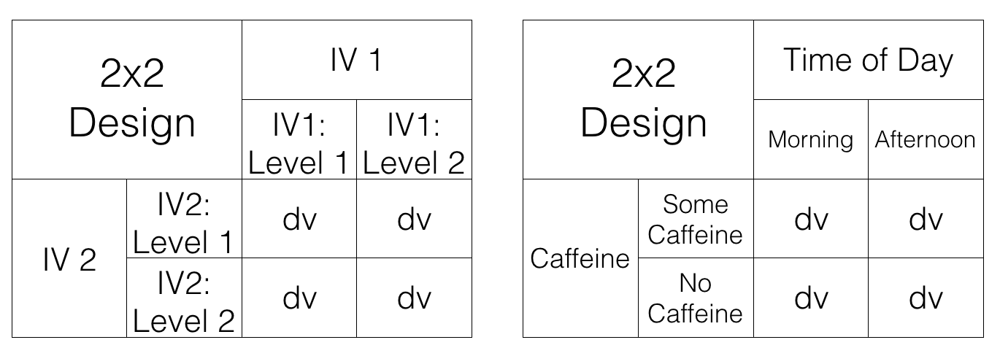
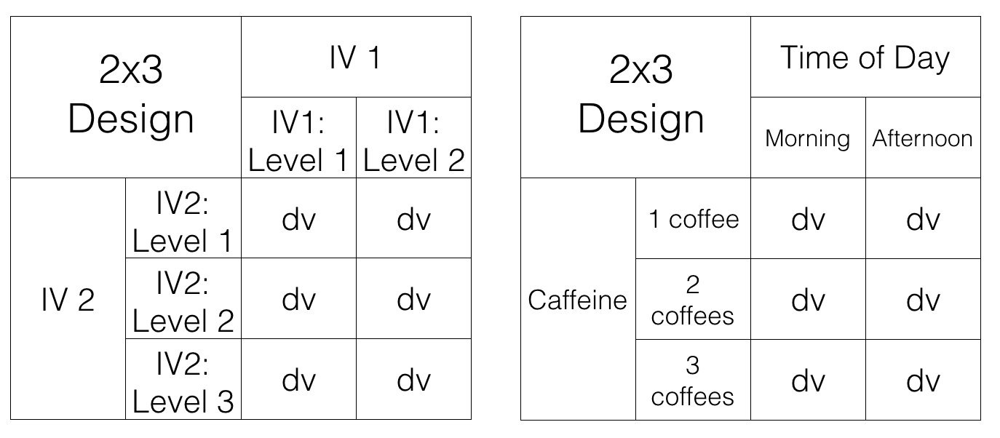

# Factorial ANOVA

```{r}
library(dplyr)
library(ggplot2)
library(xtable)
library(ggpubr)
```


We have arrived to the most complicated thing we are going to discuss in this class. Unfortunately, we have to warn you that you might find this next stuff a bit complicated. You might not, and that would be great! In our experience teaching these next concepts, we often find that students find the concepts complicated, so that is why we are pointing this out to you. We will try our best to present the issues in a few different ways, so you have a few different tools to help you understand the issue.

What's this so very complicated issue? Well, the first part it isn't that complicated. For example, up until now we have been talking about experiments. Most every experiment has had two important bits, the independent variable (the manipulation), and the dependent variable (what we measure). In most cases, our independent variable has had two levels, or three or four; but, there has only been one independent variable.

What if you wanted to manipulate more than one independent variable? If you did that you would at least two independent variables, each with their own levels. The rest of the book is about designs with more than one independent variable, and that statistical tests we use to analyze those designs. 

Let's go through some examples of designs so can see what we are talking about. We will be imagining experiments that are trying to improve student's grades. So, the dependent variable will always be grade on a test.

1. 1 IV (two levels)

We would use a t-test for these designs, because they only have two levels.

    a. Time of day (Morning versus Afternoon): Do students do better on tests when they take them in the morning versus the afternoon? There is one IV (time of day), with two levels (Morning vs. Afternoon)
    b. Caffeine (some caffeine vs no caffeine): Do students do better on tests when they drink caffeine versus not drinking caffeine? There is one IV (caffeine), with two levels (some caffeine vs no caffeine)
    
2. 1 IV (three levels):

We would use an ANOVA for these deign, because they have more than two levels

    a. Time of day (Morning, Afternoon, Night): Do students do better on tests when they take them in the morning, the afternoon, or at night? There is one IV (time of day), with three levels (Morning, Afternoon, and Night)
    b. Caffeine (1 coffee, 2 coffees, 3 coffees): Do students do better on tests when they drink 1 coffee, 2 coffees, or three coffees? There is one IV (caffeine), with three levels (1 coffee, 2 coffees, and 2 coffees)
    
3.**2 IVs, IV1 (two levels), IV2 (two levels)**

We haven't talked about what kind of test to run for this design (hint it is called a factorial ANOVA)

    a. IV1 (Time of Day: Morning vs. Afternoon); IV2 (Caffeine: some caffeine vs. no caffeine): How does time of day and caffeine consumption influence student grades? We had students take tests in the morning or in the afternoon, with or without caffeine. There are two IVs (time of day & caffeine). IV1 (Time of day) has two levels (morning vs afternoon). IV2 (caffeine) has two levels (some caffeine vs. no caffeine)
    
OK, let's stop here for the moment. The first two designs both had one IV. The third design shows an example of a design with 2 IVs (time of day and caffeine), each with two levels. This is called a **2x2 Factorial Design**. It is called a **factorial** design, because the levels of each independent variable are fully crossed. This means that first each level of one IV, the levels of the other IV are also manipulated. "HOLD ON STOP PLEASE!" Yes, it seems as if we are starting to talk in the foreign language of statistics and research designs. We apologize for that. We'll keep mixing it up with some plain language. and some pictures.

## 2x2 Designs

We've just finished talking about a **2x2 Factorial design**. We said this means the IVs are crossed. To illustrate this, take a look at the following table. We show an abstract version and a concrete version using time of day and caffeine as the two IVs, each with two levels in the design:

```{r}

```

Let's talk about this crossing business. Here's what it means for the design. For the first level of Time of Day (morning), we measure test performance when some people drank caffeine and some did not. So, in the morning we manipulate whether caffeine is taken. Also, in the second level of the Time of Day (afternoon), we also manipulate caffeine. Some people drink or don't drink caffeine in the afternoon as well, and we collect measures of test performance in both conditions.

We could say the same thing, but talk from the point of view of the second IV. For example, when people drink caffeine, we test those people in the morning, and in the afternoon. So, time of day is manipulated for the people who drank caffeine. Also, when people do not drink caffeine, we test those people in the morning, and in the afternoon, So, time of day is manipulated for the people who did not drink caffeine. 

Finally, each of the four squares representing a DV, is called a **condition**. So, we have 2 IVs, each with 2 levels, for a total of 4 conditions. This is why we call it a 2x2 design. 2x2 = 4. The notation tells us how to calculate the total number of conditions.

### Factorial Notation

Anytime **all of the levels** of each IV in a design are fully crossed, so that they all occur for each level of every other IV, we can say the design is a **fully factorial** design. 

We use a notation system to refer to these designs. The rules for notation are as follows. Each IV get's it's own number. The number of levels in the IV is the number we use for the IV. Let's look at some examples:

2x2 = There are two IVS, the first IV has two levels, the second IV has 2 levels. There are a total of 4 conditions, 2x2 = 4.

2x3 =  There are two IVs, the first IV has two levels, the second IV has three levels. There are a total of 6 conditions, 2x3 = 6

3x2 = There are two IVs, the first IV has three levels, the second IV has two levels. There are a total of 6 conditions, 3x2=6.

4x4 = There are two IVs, the first IV has 4 levels, the second IV has 4 levels. There are a total of 16 condition, 4x4=16

2x3x2 =  There are a total of three IVs. The first IV has 2 levels. The second IV has 3 levels. The third IV has 2 levels. There are a total of 12 condition. 2x3x2 = 12.

## 2 x 3 designs

Just for fun, let's illustrate a 2x3 design using the same kinds of tables we looked at before for the 2x2 design. 

```{r}

```

All we did was add another row for the second IV. It's a 2x3 design, so it should have 6 conditions. As you can see there are now 6 cells to measure the DV.

## Purpose of Factorial Designs

Factorial designs let researchers manipulate more than one thing at once. This immediately makes things more complicated, because as you will see, there are many more details to keep track of. Why would researchers want to make things more complicated? Why would they want to manipulate more than one IV at a time.

Before we go on, let's clarify what we mean by manipulating more than one thing at once. When you have one IV in your design, by definition, you are manipulating only **one** thing. This might seem confusing at first, because the IV has more than one level, so it seems to have more than one manipulation. Consider manipulating the number of coffees that people drink before they do a test. We could have one IV (coffee), with three levels (1, 2, or 3 coffees). You might want to say we have three manipulations here, drinking 1, 2, or 3 coffees. But, the way we define manipulation is terms of the IV. There is only one coffee IV. It does have have three levels. Nevertheless, we say you are only doing one coffee manipulation. The only thing you are manipulating is the amount of coffee. That's just one thing, so it's called one manipulation. To do another, second manipulation, you need to additionally manipulate something that is not coffee (like time of day in our previous example).

Returning to our question: why would researchers want to manipulate more than one thing in their experiment. The answer might be kind of obvious. They want to know if more than one thing causes change in the thing they are measuring! For example, if you are measuring people's happiness, you might assume that more than one thing causes happiness to change. If you wanted to track down how two things caused changes in happiness, then you might want to have two manipulations of two different IVs. This is not a wrong way to think about the reasons why researchers use Factorial designs. They often interested in questions like this. However, we think this is an unhelpful to first learn about factorial designs.

We present a slightly different way of thinking about the usefulness of Factorial designs, and we think it is so important, it get's its own section.

### Factorials manipulate an effect of interest

Here is how researchers often use factorial designs to understand the things the cause the effects they are interested in measuring. Notice we didn't say the dependent variables they are measuring, we are now talking about something called effects. Effects are the change in a measure caused by a manipulation. You get an effect, any time one IV causes a change in a DV.

Here is an example. We will stick with this one example for a while, so pay attention...In fact, the example is about paying attention. Let's say you wanted to measure something like paying attention. You could something like this:

1. Pick a task for people to do that you can measure. For example, you can measure how well they perform the task. That will be the dependent measure

2. Pick a manipulation that you think will cause differences in paying attention. For example, we know that people can get distracted easily when there are distracting things around. You could have two levels for your manipulation: No distraction versus distraction.

3. Measure performance in the task under the two conditions

4. If your distraction manipulation changes how people perform the task, you may have successfully manipulated **how well people can pay attention** in your task.


### Spot the difference

Let's do this with another fake example. First, we pick a task. It's called **spot the difference**. You may have played this game before. You look at two pictures side-by-side, and then you locate as many differences as you can find. here is an example:

```{r}
knitr::include_graphics("figures/spot_dif.png")
```

How many differences can you spot? When you look for the differences, it feels like you are doing something we would call "paying attention". If you pay attention to the clock tower, you will see that the hands on the clock are different. Ya! One difference spotted.

We could give people 30 seconds to find as many differences as they can. Then we give them another set of pictures and do it again. Every time we will measure how many differences they can spot. So, our measure of performance, our dependent variable, could be the mean number of differences spotted.

### Distraction manipulation

Now, let's think about a manipulation that might cause differences in how people pay attention. If we people need to pay attention to spot differences, then presumably if we made it difficult to pay attention, people would spot less differences. What is a good way to distract people? I'm sure there are lots of ways to do this. How about we do the following:

1. No distraction condition: Here people do the task with no added distractions. They sit in front of a computer, in a quiet, distraction-free room, and find as many differences as they can for each pair of pictures

2. Distraction condition: Here we blast super loud ambulance sounds and fire alarms and heavy metal music while they spot the difference. We also randomly turn the sounds on and off, and make them super-duper annoying and distracting. We make sure that the sounds aren't loud enough to do any physical damage to anybody's ear-drums. But, we want to make them loud enough to be super distracting. If you don't like this, we could also tickle people with a feather, or whisper silly things into their ears, or surround them by clowns, or whatever we want, it just has to be super distracting.

### Distraction effect

If our distraction manipulation is super-distracting, then what should we expect to find when we compare performance at spot-the-difference between the no-distraction and distraction conditions? We should find a difference!

If our manipulation works, then we should find that people find more differences when they are not distracted, and less differences when they are distracted. For example, the data might look something like this:

```{r}
df <- data.frame(Distraction = c("No distraction","Distraction"),
                 Mean_diffs = c(10,5))
ggplot(df, aes(x=Distraction, y=Mean_diffs))+
  geom_bar(stat="identity")+
  theme_classic()+
  ylab("Mean differences spotted")+
  xlab("Distraction Condition")+
  ggtitle("The distraction effect")

```

The figure shows a big difference in the mean number of difference spotted. People found 5 differences on average when they were distracted, and 10 differences when they were not distracted. We labelled the figure, "The distraction effect", because it shows a big effect of distraction. The effect of distraction is 5 spot the differences. It's the difference between performance in the Distraction and No-Distraction conditions. In general, it is very common to use the word **effect** to refer to the differences caused by the manipulation. We manipulated Distraction, it caused a difference, so we call this the "distraction effect".

### Manipulating the Distraction effect

This is where factorial designs come in to play. We have done the hard work of finding an effect of interest, in this case the distraction effect. We think this distraction effect actually measures something about your ability to pay attention. For example, if you were the kind of person who had a small distraction effect (maybe you find 10 differences when you are not distracted, and 9 differences when you are distracted), that could mean you are very good at ignoring distracting things while you are paying attention. On the other hand, you could be the kind of person who had a big distraction effect (maybe you found 10 differences under no distraction, and only 1 difference when you were distracted); this could mean you are not very good at ignoring distracting things while you are paying attention.

Overall now, we are thinking of our distraction effect (the difference in performance between the two conditions) as the important thing we want to measure. Now, we might want to know how to make people better at ignoring distracting things. Or, we might want to know what makes people worse at ignoring things. 

Maybe there is a special drug that helps you ignore distracting things. People taking this drug should be less distracted, and if they took this drug while completing our task, they should have a smaller distraction effect compared to people not taking the drug.

Maybe rewarding people with money can help you pay attention and ignore distracting things better. People receiving 5 dollars every time they spot a difference might be able to focus more because of the reward, and they would show a smaller distraction effect in our task, compared to people who got no money for finding differences. Let's see what this would look like.

We are going to add a second IV to our task. The second IV will manipulate reward. In one condition, people will get 5 dollars for every difference they find (so they could leave the study with lots of money if they find lots of differences). In the other condition, people will get no money, but they will still have find differences. Remember, this will be a factorial design, so everybody will have to find differences when they are distracted and when they are not distracted.

The question we are now asking is: Will manipulating reward cause a change in the size of the distraction effect. We could predict that people receiving rewards will have a smaller distraction effect than people not receiving rewards. If that happened, the data would look something like this:


```{r}
df <- data.frame(Distraction = c("No distraction","Distraction","No distraction","Distraction"),
                 Mean_diffs = c(10,5,11,9),
                 Reward = rep(c("No Reward","Reward"),each=2))
ggplot(df, aes(x=Distraction, y=Mean_diffs, group=Reward, fill=Reward))+
  geom_bar(stat="identity", position="dodge")+
  theme_classic()+
  ylab("Mean differences spotted")+
  xlab("Distraction Condition")+
  ggtitle("The distraction effect as a function of reward")

```

Now, I've just shown you a new kind of graph. I apologize right now for showing this to you first. It's more unhelpful than the next graph. What I did was keep the x-axis the same as before (to be consistent). So, we have distraction vs. no distraction on the x-axis. In the distraction condition, there are means for spot-the-difference performance in the No-reward (red), and Reward (aqua) conditions. The same goes for the No-distraction condition, a red and an aqua bar for the No-reward and Reward conditions. We can try to interpret this graph, but the next graph plots the same data in a different way, which makes it easier to see what we are talking about.

```{r}

ggplot(df, aes(x=Reward, y=Mean_diffs, group=Distraction, fill=Distraction))+
  geom_bar(stat="identity", position="dodge")+
  theme_classic()+
  ylab("Mean differences spotted")+
  xlab("Reward Condition")+
  ggtitle("The distraction effect as a function of reward")

```

All we did was change the x-axis. Now the left side of the x-axis is for the no-reward condition, and the right side is for the reward condition. The red bar is for the distraction condition, and the aqua bar is for the no distraction condition. It is easier to see the distraction effect in this graph. The distraction effect is the difference in size between the red and aqua bars. For each reward condition, the red an aqua bars are right beside each other, so can see if there is a difference between them more easily, compared to the first graph.

**No-Reward condition**: In the no-reward condition people played spot the difference when they were distracted and when they were not distracted. This is a replication of our first fake study. We should expect to find the same pattern of results, and that's what the graph shows. There was a difference of 5. People found 5 differences when they were distracted and 10 when they were not distracted. So, there was a distraction effect of 5, same as we had last time.

**Reward condition**: In the reward condition people played spot the difference when they were distracted and when they were not distracted. Except, they got 5 dollars every time they spotted a difference. We predicted this would cause people to pay more attention and do a better job of ignoring distracting things. The graph shows this is what happened. People found 9 differences when they were distracted and 11 when they were not distracted. So, there was a distraction effect of 2.

If we had conducted this study, we might have concluded that reward can manipulate the distraction effect. When there was no reward, the size of the distraction effect was 5. When there was reward, the size of the distraction effect was 2. So, the reward manipulation changed the size of the distraction effect by 3 (5-2 =3).

This is our description of why factorial designs are so useful. They allow researchers to find out what kinds of manipulations can cause changes in the effects they measure. We measured the distraction effect, then we found that reward causes changes in the distraction effect. If we were trying to understand how paying attention works, we would then need to explain how it is that reward levels could causally change how people pay attention. We would have some evidence that reward does cause change in paying attention, and we would have to come up with some explanations, and then run more experiments to test whether those explanations hold water.

## Graphing the means

In our example above we showed you two bar graphs of the very same means for our 2x2 design. Even though the graphs plot identical means, they look different, so they are more or less easy to interpret by looking at them. Results from 2x2 designs are also often plotted with line graphs. Those look different too. Here are four different graphs, using bars and lines to plot the very same means from before. We are showing you this so that you realize **how you graph your data** matters, and it makes it more or less easy for people to understand the results. Also, how the data is plotted matters for what you need to look at to interpret the results. 

```{r}

b1 <- ggplot(df, aes(x=Reward, y=Mean_diffs, group=Distraction, fill=Distraction))+
  geom_bar(stat="identity", position="dodge")+
  theme_classic()+
  ylab("Mean differences spotted")+
  xlab("Reward Condition")+
  ggtitle("The distraction effect as a function of reward")

b2 <- ggplot(df, aes(x=Distraction, y=Mean_diffs, group=Reward, fill=Reward))+
  geom_bar(stat="identity", position="dodge")+
  theme_classic(base_size=8)+
  ylab("Mean # spotted")+
  xlab("Distraction Condition")+
  ggtitle("The distraction effect \n as a function of reward")+
  theme(legend.position="bottom")

l1 <- ggplot(df, aes(x=Reward, y=Mean_diffs, group=Distraction, color=Distraction))+
  geom_line()+
  geom_point()+
  theme_classic(base_size=8)+
  ylab("Mean # spotted")+
  xlab("Reward Condition")+
  ggtitle("The distraction effect \n as a function of reward")+
  theme(legend.position="bottom")

l2 <- ggplot(df, aes(x=Distraction, y=Mean_diffs, group=Reward, color=Reward))+
 geom_line()+
  geom_point()+
  theme_classic(base_size=8)+
  ylab("Mean # spotted")+
  xlab("Distraction Condition")+
  ggtitle("The distraction effect \n as a function of reward")+
  theme(legend.position="bottom")

ggarrange(b1,b2,l1,l2, ncol=2, nrow=2)

```

## Knowing what you want to find out

When you conduct a design with more than one IV, you get more means to look at. As a result, there are more kinds of questions that you can ask of the data. Sometimes it turns out that the questions that you can ask, are not the ones that you want to ask, or have an interest in asking. Because you ran the design with more than one IV, you have the opportunity to ask these kinds of extra questions.

What kinds of new things are we talking about? Let's keep going with our distraction effect experiment. We have the first IV where we manipulated distraction. So, we could find the overall means in spot-the difference for the distraction vs. no-distraction conditions (that's two means). The second IV was reward. We could find the overall means in spot-the-difference performance for the reward vs. no-reward conditions (that's two more means). We could do what we already did, and look that the means for each combination, that is the mean for distraction/reward, distraction/no-reward, no-distraction/reward, and no-distraction/no-reward (that's four more means, if you're counting). There's even more. We could look at the mean distraction effect (the difference between distraction and no-distraction) for the reward condition, and the mean distraction effect for the no-reward condition (that's two more). I hope you see here that there are a lot of means to look. And they are all different means. Let's look at all of them together in one graph with four panels.

```{r}

df1 <- data.frame(Distraction = c("No distraction","Distraction","No distraction","Distraction"),
                 Mean_diffs = c(10,5,11,9),
                 Reward = rep(c("No Reward","Reward"),each=2))

df1gg <- ggplot(df1, aes(x=Reward, y=Mean_diffs, group=Distraction, fill=Distraction))+
  geom_bar(stat="identity", position="dodge")+
  theme_classic(base_size=8)+
  ylab("Mean # spotted")+
  xlab("Reward Condition")+
  ggtitle("Means for each condition")+
  theme(legend.position="bottom")

df2 <- data.frame(Distraction = c("No distraction","Distraction"),
                 Mean_diffs = c(10.5,7))

df2gg <- ggplot(df2, aes(x=Distraction, y=Mean_diffs))+
  geom_bar(stat="identity", position="dodge")+
  theme_classic(base_size=8)+
  ylab("Mean # spotted")+
  xlab("Distraction Condition")+
  ggtitle("Overall means for Distraction IV1")+
  theme(legend.position="bottom")

df3 <- data.frame(Reward = c("No Reward","Reward"),
                 Mean_diffs = c(7.5,10))

df3gg <- ggplot(df3, aes(x=Reward, y=Mean_diffs))+
  geom_bar(stat="identity", position="dodge")+
  theme_classic(base_size=8)+
  ylab("Mean # spotted")+
  xlab("Reward Condition")+
  ggtitle("Overall means for Reward IV2")+
  theme(legend.position="bottom")

df4 <- data.frame(Distraction = c("No-Reward","Reward"),
                 Mean_diffs = c(5,2))

df4gg <- ggplot(df4, aes(x=Distraction, y=Mean_diffs))+
  geom_bar(stat="identity", position="dodge")+
  theme_classic(base_size=8)+
  ylab("Distraction Effect")+
  xlab("Reward Condition")+
  ggtitle("Overall means for Distraction effect \n by Reward Condition")+
  theme(legend.position="bottom")

ggarrange(df1gg,df2gg,df3gg,df4gg, ncol=2, nrow=2)

```


The purpose of showing all of these means is to orient you to your problem. If you conduct a 2x2 design (and this is the most simple factorial that you can conduct), you will get all of these means. You need to know what you want to know from the means. That is you need to be able to connect the research question to the specific means you are interested in analyzing. 

For example, in our example, the research question was whether reward would change the size of the distraction effect. The top left panel gives us some info about this question. We can see all of the condition means, and we can visually see that the distraction effect was larger in the No-reward compared to the reward condition. But, to "see" this, we need to do some visual subtraction. You need to look at the difference between the red and aqua bars for each of the reward and no-reward conditions. 

Does the top right panel tell us about whether reward changed the size of the distraction effect? NO, it just shows that there was an overall distraction effect (this is called the **main effect** of distraction). **Main effects** are any differences between the levels of one independent variable.

Does the bottom left panel tell us about whether reward changed the size of the distraction effect? NO! it just shows that there was an overall reward effect, called the main effect of reward. People who were rewarded spotted a few more differences than the people who weren't, but this doesn't tell us if they were any less distracted.

Finally, how about the bottom left panel. Does this tell us about whether the reward changed the size do the distraction effect? YES! Notice, the y-axis is different for this panel. The y-axis here is labelled "Distraction Effect". You are looking at two difference scores. The distraction effect in the no-reward condition (10-5 = 5), and the distraction effect in the Reward condition (11-9 = 2). These two bars are different as a function of reward. So, it looks like reward did produce a difference between the distraction effects! This was the whole point of the fake study. It is these means that were most important for answering the question of the study. As a very last point, this panel contains what we call an **interaction**. We explain this in the next section.

> Pro tip: Make sure you know what you want to know from your means before you run the study, otherwise you will just have way too many means, and you won't know what they mean.

## Simple analysis of 2x2 repeated measures design

Normally in a chapter about factorial designs we would introduce you to Factorial ANOVAs, which are totally a thing. We will introduce you to them soon. But, before we do that, we are going to show you how to analyze a 2x2 repeated measures ANOVA design with paired-samples t-tests. This is probably something you won't do very often. However, it turns out the answers you get from this method are the same ones you would get from an ANOVA.

Admittedly, if you found the explanation of ANOVA complicated, it will just appear even more complicated for factorial designs. So, our purpose here is to delay the complication, and show you with t-tests what it is that the Factorial ANOVA is doing. More important, when you do the analysis with t-tests, you have to be very careful to make all of the comparisons in the right way. As a result, you will get some experience learning how to know what it is you want to know from factorial designs. Once you know what you want to know, you can use the ANOVA to find out the answers, and then you will also know what answers to look for after you run the ANOVA. Isn't new knowledge fun!

The first thing we need to do is define **main effects** and **interactions**. Whenever you conduct a Factorial design, you will also have the opportunity to analyze **main effects** and **interactions**. However, the number of **main effects** and **interaction** you get to analyse depends on the number of IVs in the design.

### Main effects

Formally, main effects are the mean differences for a single Independent variable. There is always one main effect for each IV. A 2x2 design has 2 IVs, so there are two main effects. In our example, there is one main effect for Distraction, and one main effect for Reward. We will often ask if the main effect of some IV is significant. This refers to a statistical question: Were the differences between the means for that IV likely or unlikely to be caused by chance (sampling error).

If you had a 2x2x2 design, you would measure three main effects, one for each IV. If you had a 3x3x3 design, you would still only have 3 IVs, so you would have three main effects. 

### Interaction

We find that the interaction concept is one of the most confusing concepts for factorial designs. Formally, we might say an interaction occurs whenever the effect of one IV has an influence on the size of the effect for another IV. That's probably not very helpful. In more concrete terms, using our example, we found that the reward IV had an effect on the size of the distraction effect. The distraction effect was larger when there was no-reward, and it was smaller when there was a reward. So, there was an interaction.

We might also say, an interaction occurs when the difference between the differences are different! Yikes. Let's explain. There was a difference in spot-the-difference performance between the distraction and no-distraction condition, this is called the distraction effect (it is a difference measure). The reward manipulation changed the size of the distraction effect, that means there was difference in the size of the distraction effect. The distraction effect is itself a measure of differences. So, we did find that the difference (in the distraction effect) between the differences (the two measures of the distraction effect between the reward conditions) were different. When you start to write down explanations of what interactions are, you find out why they come across as complicated. We'll leave our definition of interaction like this for now. Don't worry, we'll go through lots of examples to help firm up this concept for you.

The number of interactions in the design also depend on the number of IVs. For a 2x2 design there is only 1 interaction. The interaction between IV1 and IV2. This occurs when the effect of say IV2 (whether there is a difference between the levels of IV2) changes across the levels of IV1. We could write this in reverse, and ask if the effect of IV1 (whether there is a difference between the levels of IV1) changes across the levels of IV2. However, just because we can write this two ways, does not mean there are two interactions. We'll see in a bit, that no matter how do the calculation to see if the difference scores--measure of effect for one IV-- change across the levels of the other IV, we always get the same answer. That is why there is only one interaction for a 2x2. Similarly, there is only one interaction for a 3x3, because there again we only have two IVs (each with three levels). Only when we get up to designs with more than 2 IVs, do we find more possible interactions. A design with three IVS, has four interactions. If the IVs are labelled A, B, and C, then we have three 2-way interactions (AB, AC, and BC), and one three-way interaction (ABC). But hold this new stuff for much later

### Looking at the data

It is most helpful to see some data in order to understand how will will analyze it. Let's imagine we ran our fake attention study. We will have three people in the study, and they will participate in all conditions, so it will be a fully repeated-measures design. The data could look like this:

```{r}
spotted<-c(10,8,11, 5,4,3, 12,13,14, 9,8, 10)
distraction<-rep(rep(c("No Distraction","Distraction"),each=3),2)


```


