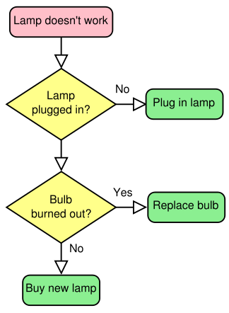
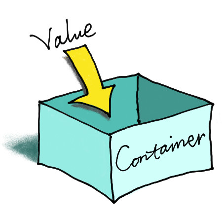
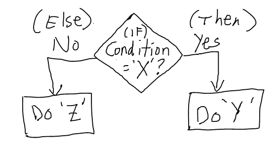

---
author:
- Matthew Crump
title: 'Programming for Psychologists: Data creation and analysis'
...

  Copyright ©  

*This manuscript is in a working draft format. Please do not cite or circulate without permission from the author*

*CURRENT DRAFT VERSION,*

# 1. Fundamentals of Computer Programming Languages

## Why should Psychologists learn to program?

The benefits of learning to program for Psychologists are numerous. Programming makes data-analysis more efficient, accurate, and transparent; and, opens new doors for new analyses that would not be practical or possible without programming. Experiments are often run on computers, so programming is important for designing, creating, and implementing experiments themselves. Programs can be written to formally express psychological theories, so programming can also help a researcher iron out and clearly express their own ideas about psychological processes.

Computing technology plays an important role in psychological research, and there are many kinds of proprietary software developed specifically for psychologists. For example, experiments can be created using experiment builder programs such as E-prime, Presentation, and Superlab. Similarly, statistical analysis can be conducted using proprietary software like SPSS, SAS, JMP, and many others. These kinds of canned software packages can be very useful. They are generally user-friendly, require little programming knowledge, and tasks can be completed in relatively small amounts of time using click-and-drag interfaces. However, in many cases the code driving these programs is private (versus open-source where the code is public). So, it can be difficult and sometimes impossible to determine if the program is accomplishing a task that needs to be accomplished in a specific way. Not infrequently the program may simply be incapable of completing a particular kind of statistical analysis, or running a particular kind of experiment. At this point it becomes helpful (necessary) to learn programming so that solutions to unique research problems can be solved by the researcher directly.

Learning how to program experiments from scratch and how to analyze data using your own code allows **control** over every detail of design and analysis. This level of control is invaluable for creating flexible and customizable experimental designs, and for being confident that the intended design is actually being implemented (after all if you right the code, you can check that it works). Although we will not be learning to program with proprietary software packages, these packages often include their own scripting language, so learning general programming techniques will also allow you to exert more fine grained control over canned software packages.

Another merit worth mentioning is **time-savings**. Becoming fluent in programming enables researchers to rapidly implement their designs, making experiment building take days, afternoons, or sometimes even a half-hour or so. As well, many monotonous, tedious, and time-consuming aspects of data-analysis can be automatized with scripts, saving researchers copious amounts of time in analyzing their data, and opening new doors for understanding the data that was collected.

Finally, computer programming is a valuable skill in general and may open doors in the larger workforce outside of Psychology.

## Learning to program

Learning how to program a computer is a skill and requires an initial investment. It takes practice, time, and effort. There is no easy way out. There are many layers to individual programming languages, and there are many programming languages out there to learn that could be useful. Where to begin?

The purpose of this chapter is to give a broad overview of basic elements common to most every programming language. It is intended for complete novices who have no experience with programming.

### Some Preliminaries

Let’s get started with what might be a golden rule of programming: **Try to figure it out yourself**. Before beginning to learn to code, it is important to recognize that the underlying skill of computer programming is problem-solving, which is the ability to solve new problems by yourself. So, the super-keen student of programming might stop reading here, generate a list of things they need to learn to solve their own particular research problems, and then go learn all of those things themselves by whatever clever means they can. If you are trying to learn to code, and you aren’t coding something, then you aren’t learning how to code. Or, you could skip ahead to the programming challenges in Chapter 3 and spend your time working on those.

Of course, for a complete novice the big question is to figure out what **it** is? From the perspective of applying computer programming techniques to experimental psychology, there are three major aspects to learning programming. These are:

1.  Understanding the **tools** available to you

2.  Applying the tools to the **problems** you want to solve

3.  Being a **good coder**

### Chicken and Egg Problem

What should you learn first? What should be taught first? This is the chicken and egg problem in learning and teaching programming. Should a student learn about how to organize their code at the beginning or after they have learned some of the basic aspects of the language? Should they learn seemingly random tidbits of programming languages before learning how to apply those tidbits to solving a problem, or should they be given a problem first? This is a dilemma for a student, because they must decide where to start, and for a teacher, because they decide where to begin. From the perspective of teaching, it is particularly troubling because it is fairly obvious that regardless of order some knowledge of the tools, the problems, and good coding practice are all helpful. So, for students entering the arena it is important to build meta-cognitive awareness about these three things: what are the tools, how do I apply them to my problems, and am I being a good-coder. Students should also be prepared to lift themselves up by their own bootstraps.

### Understanding the tools available to you

The major portion of this chapter will be devoted to outlining the basic building blocks of programming languages. This outline will take place in the abstract, without examples from specific programming languages. Later chapters go into details about coding in specific languages like R and Livecode. Fortunately, most programming languages use the same basic concepts forming the building blocks for making all sorts of programs. However, although the concepts are the same across languages, they are expressed with different syntax (just like spoken languages have different words for the same concept). So, part of understanding the tools available to you are, 1) understanding the conceptual tool, and then 2) understanding how to implement the tool using the specific syntax of the language you are working in.

### Applying the tools to the problems you want to solve

Coding is writing a recipe for solving a problem. More specifically, it is writing the solution to a problem in a highly detailed manner that forces a computer to follow the directions to solve your problem. These code-based recipes are also known as algorithms. Learning how to create algorithms involves first determining the problem, and then converting the solution into a fully articulated, step-by-step series of instructions. These step-by-step series of instructions make use of the tools, or building blocks, of the programming language.

The easiest part of teaching programming is the description of tools that are available. The hardest, and perhaps most impossible part of teaching programming is how to apply the tools to solve problems. This is because it is difficult to teach people how to think, how to become better at thinking, and how to think carefully, deeply, and creatively. Yet, all of this kind of thinking is part of learning how to develop algorithms. Finally, it is important to note that the thinking really is in the doing. If you aren’t attempting to apply programming tools to solve your problems, then you aren’t thinking or doing.

### Being a good coder

Without knowing what code looks like, or how it can be used to solve problems, it is difficult to discuss what it means to be a good coder. A fuller discussion of these issues will be delivered in later chapters. Nevertheless, for students beginning to code it is worth keeping a few things in mind.

1.  Readability: Can I understand my code? Could someone else understand my code? Is there anyway that I could make my code easier to read? Do that.

2.  Elegance: Is there a shorter way to write this code?

3.  Reusability: Can I find this code again if I need to use it? Can I write this code in a more general way so that it can be used in more than one situation?

## Foundational concepts in computer programming

The purpose of this guide is to provide a roadmap for psychologists to learn how to apply programming techniques to solve problems relevant for research in Psychology (e.g., creating experiments and analyzing data). To this end, only a thin slice of foundational concepts will be discussed. Fortunately, only a few concepts are needed to get started, and to solve many different problems that arise in research.

The following concepts are fundamental to any programming language. These are **Algorithms**, **Variables**, **Logic**, **Loops**, **Functions**, and **Intrinsics**. Each are discussed separately below.

Readers interested in learning to program should take an active approach to learning, and develop meta-cognitive awareness of the content they are trying to learn during the learning process. This simply means that you should ask yourself questions about what you already know, and what you need to learn, and then focus your efforts on learning what you don’t already know, and identifying aspects of these concepts that should receive further self-study. To encourage this approach, some good questions that you should keep in mind are discussed below for each topic.

### Algorithms

Here are some questions you should have about algorithms. What are algorithms? What is algorithmic thinking/ what is an algorithmic approach to problem solving? How do you combine the programming concepts in the next sections to write algorithms for solving problems with code? How would you explain the concept of an algorithm to another person? And, can the problem I am trying to solve be answered with an algorithmic approach.

An algorithm is simply a set of detailed instructions for accomplishing a task, or the infallible recipe for solving a problem. If the step-by-step instructions are followed exactly, the algorithm will always provide the answer to the problem it was intended to solve. Real-world examples of algorithms are recipes for preparing food, or IKEA instructions for putting together furniture.

[0in] 

[fig:Simple algorithm]

These kinds of algorithms often leave much to be desired in terms of their specificity. A home cook might get halfway through a recipe and find a next step unclear (what temperature should the oven be? How much is add some salt?). When a step in a list of instructions is unclear in the real world people have to problem solve and come up with a workable solution (e.g., keeping adding salt and tasting the dish).

Algorithms for controlling computers are similar, they are also a list of step-by-step instructions for the computer to take to solve a problem. But, unlike real-world algorithms that can be interpreted by creative people when an instruction is unclear, computer algorithms require each instruction to be precise. The computer is not creative. If the instructions do not specify each step precisely, the computer will fail to implement the algorithm.

Perhaps the most important skill for computer programming is learning to think algorithmically. This is the ability to transform the solution to a problem into a series of step-by-step instructions that a computer can perform. There are two critically important levels to algorithms, the conceptual level, and the syntax level. The conceptual level involves breaking down a problem into component steps and understanding how the order of each step combines together to produce a final solution. This is similar to writing an outline for a draft of a paper, or creating a story-board for a movie. Here, the steps of an algorithm might be jotted down on paper before they are implemented on a computer. The syntax level involves using a specific programming language to implement each of the conceptual steps of the algorithm. This would be similar to choosing the english language to write an entire paper, in all of its gory detail. However, in a programming language, this would involve writing a script using terminology supplied by the language of choice. A practical understanding of algorithms involves a blend of conceptual and syntax levels, which inform each other. A conceptual understanding will help guide a novice to the appropriate terminology to write a script, and experience with writing scripts in a specific language will help clarify the conceptual steps necessary to code a desired algorithm.

Throughout the remaining chapters algorithms will be used to create and run experiments, and to analyze and report data. As well, as a part of introducing the syntax of languages covered here (R, LIVECODE, HTML, JAVAVASCRIPT, etc.), the reader will be encouraged to create algorithms to solve many different kinds of problems. This problem-based approach will build confidence in your ability to write your own algorithms from scratch, and will orient you to the syntax of each language.

Mastering the skill of algorithmic thinking is challenging, however it is not difficult to give examples of simple algorithms, especially at the conceptual level. Let’s consider the problem of finding the median of a set of numbers, which is the exact middle number in the set. Here is the set of numbers: 8,3,6,2,7,4,9.

[0in] 

[fig:Median]

##### Median: A conceptual algorithm

1.  Identify your set of numbers

2.  Sort them from smallest to largest

3.  Count the number of total numbers

4.  Divide the count by 2 to find the midway point.

5.  If the count is an even number, then follow these instructions, otherwise following the next set of instructions. The midway point will be an integer, and will indicate two ranges of numbers. The first range is the first number to the number occupying the midway point. The second range is the number occupying the midway point plus one, to the last number. Add the number occupying midway point and the next number (number occupying midway point plus one), then divide the sum by two to find the median.

6.  If the count is an odd number, then follow these instructions. Round the midway point up to the nearest integer. The median is the number occupying this integer value position in the list.

Let’s work through each of these steps to find the median of our set of numbers:

1.  Set of numbers is: 8,3,6,2,7,4,9

2.  Sort numbers: 2,3,4,6,7,8,9

3.  Count total numbers: 7

4.  Divide count by 2: 3.5

5.  count is odd, round up: 4

6.  find the 4th number in the list: 6 is the median number

Taken together these steps to compute the median form a complete algorithm. If we were to implement this algorithm in a programming language we would make use of the remaining fundamental programming concepts including use of: variables, logic, loops, functions, and intrinsics.

For example, in step 1 we would store our set of numbers in a variable. For step 2, we could use a loop to sort our numbers. For steps 5 and 6 we would make use of logic statements to tell the computer to follow either set of instructions. We could write a generalizable script that would compute the median for any set of numbers that we wanted to input, and this would make use of writing a function. Or, if we used a statistical programming language like R, we could simply use the built-in function (intrinsic) for finding the median already provided in that language.

Most readers will already know how to compute the median, and in this case algorithmic thinking simply involves stating all of the steps in the process in an explicit fashion. Many problems that can be solved with algorithms are similar in that they involve making already known steps fully explicit. In these situations, the main difficulty will not be in understanding the algorithm at the conceptual level, but instead at the syntax level where specific commands are needed to accomplish each step in a particular language. Other problems will involve algorithms that are not immediately obvious. Here, developing a conceptual level algorithm prior to implementing it can be helpful in identifying the important steps needed to solve the problem.

### Variables

Here are some questions you should have about variables. What are programming variables? What different forms do they take? How are they declared? How are they changed and updated? What kind of variables does your programming language support?

[0in] 

[fig:Median]

Variables are simply containers. They hold stuff. To be more precise, variables hold information in computer memory. The stuff that they hold partly defines the type or form of the variable. For example, a variable could hold a number or a character, or several numbers, or several characters, or several numbers and characters. The fact that variables “hold stuff” is important because this property of variables allows us to save information in the computer. Another important property of variables is the ability to “get stuff back”, or retrieve information for later use.

One aspect of variables that is very important, but which will receive limited treatment in this guide, is their relation to computer memory. Computers are limited in their ability to represent information. Information is stored in two primary ways, on the hard-drive (traditionally read-only memory or ROM), or in memory (traditionally random-access memory or RAM). A given computer only has so much room, defined by the limits on the hard-drive or RAM, and they can not store information beyond these limits.

Different programming languages support different kinds of variables, and you will have to learn the details for storing and retrieving information using those variables. The important questions to be asking when learning about different variables are:

1.  How do I store stuff into this variable?

2.  How do I get back what I stored in this variable?

Once you can verify how storage and retrieval works for your variable type, then you should be well on your way to understanding the basics of using that kind of variable.

Here are some common variable types for numbers. Integer variables store numbers without decimal places. Real number variables store numbers (including integers) with decimals. Vectors store lists of numbers. Matrices and arrays store two-dimensional lists of numbers.

Here are some common variable types for characters (letters etc). String variables store text. Arrays can store multiple sections of text.

At this point it is not particularly helpful to go on listing all of the different kinds of variables. They won’t make much sense anyway until you have to use them, and the programming language that you choose will implement each variable type differently. The take home message here is that you can store and retrieve information (numbers and letters etc.) in variables. More importantly, you can also manipulate and change the state of variables, and this process of storing, changing, and retrieving information from variables is, in the abstract, how problems are solved by computation.

### Logic

Here are some questions you should have about logic statements. What are logical statements? How are logical statements implemented in your programming language? What are some examples of how they are used? How are they used to identify the contents of a variable? How are they used to create different conditions depending on the contents of variable?

[0in] 

[fig:If/Then Logic]

Consider the following scenario. You walk into a room full of screaming children. You immediately assess the situation to find out what is going on. You decide that if what is going on is really, really, bad, you might need to call 911; or, if what is going on is just kids being kids, then you might need to ask them to calm down, or perhaps just leave them room. Logic statements help accomplish these kinds of goals when writing algorithms. They generally involve two steps. Identifying the current situation, and then creating conditions to act accordingly.

Logic statements are used to assess the current situation. For example, is the information in the variable I am looking at the information that I want it to be? The answer will be yes, or no.

Logic statements are used to create conditions, and then allow different actions to occur depending on the condition. If the answer is yes, do one thing, but if the answer is no, do another thing.

How logical statements are implemented depends on the syntax of the programming language. Get to know the logical operators, and how to use IF/THEN statements.

Some common logical operators are: equals, greater than, less than, greater than or equal to, less than or equal to, not, and, or, etc. These operations are used to compare the value of one variable to another. The result of these comparisons when should yield one of two values, TRUE or FALSE (also referred to as Boolean Logic). When these comparisons are implemented in a programming language, a third result can also occur. This is known as an error, and errors occur when a comparison is not possible. Most programming languages will produce an error if you try to compare two variables that can not logically be compared. For example, what is the answer to the question: is 2 greater than forest? The word forest is not a number, and thus is not greater or less than two. Attempting such a comparison can result in an error.

### Loops

Here are some questions you should have about loops. What is the concept of a repeat loop in programming? Why is this useful? What is the syntax for looping? Are their different kinds of looping methods available in your language, such as while loops? How can a loop be stopped?

[0in] 

[fig:Loops]

Consider the following scenario. An insane pirate captures you and gives you two choices. Walk the plank and be eaten by hungry eels, or write down all of the numbers from 1 to 1 billion no matter how long it takes. The pirate also says you can print out all of the numbers from 1 to 1 billion if you learn how to use a programming language to do it. Obviously you should the learn programming language. This will allow you to make the computer do the tedious work of starting at the number 1, printing it, adding 1 to the number to get to 2, printing it, adding 1 to the number to get to 3, printing it, and so on to a billion.

Looping is the ability to do something over and over. It is a powerful tool in the toolkit. Here is some good advice. If you are coding and feel like you are trapped on a pirate ship because you are writing tedious code to do basically the same thing over and over again, then you should consider how you might be able to rewrite your code in a loop so the computer does the tedious part.

As with variables and logic, how loops are implemented depends on the syntax of the programming language. Oftentimes there are more than one ways to implement loops, so be on the lookout for the different forms. One form or another may come in handy down the road.

### Functions

Here are some questions you should have about functions? What are functions? Why are they used? What is the syntax for writing functions?

Consider the following scenario. You go to McDonald’s and order a quarter pounder with cheese meal, regular size fries, and coke. You give the attendant some cash. You wait. You get your McDonald’s. This is the procedure for turning your money into a McDonald’s hamburger. You go to McDonald’s, you give them your money, then they give you a hamburger.

[0in] 

[fig:Functions]

This situation highlights the important aspects of functions in programming. Functions are simply a collection of procedures (or an algorithm) for transforming some input into some output. They typically have a name (Quarter pounder with cheese meal), take some value as an input (regular fries, coke,your money), process the input in some manner to produce an output (your meal is made in the back), and then provide the output (your meal is handed to you). Functions are also general, so in our example, you can go to most any McDonald’s and say the name of the function (Quarter pounder with cheese please), and you will get your McDonald’s meal as the output.

In programming functions are a convenient way to wrap together all of the step-by-step instructions for one algorithm in one place, typically so the same algorithm can be used again and again whenever it is needed. For example, if you wrote some code to find the median of a set of numbers, it would be nice if you didn’t have to write the same code over and over again whenever you wanted to compute the median. Instead, it would be much easier if you could simply use the word Median, or something like that name, to call upon the algorithm that you have already written. Functions provide this possibility. They allow you to write an algorithm once, and call for its use by using its name as many times as you want.

Writing functions in particular programming languages involve special syntax for combining your algorithm and identifying it as a function that can be called upon later. Writing functions also involves making your code more general so that it can be used in more than one situation. For example, you could write an algorithm that would find the median of these numbers: 1,2,3,4,5. The answer would be 3. It is possible to write the code for the median in a specific way that would only solve the problem for this one set of numbers. It is also possible to write the code in a more general way so that it could be used to find the median for any set of numbers. This will become more clear as you progress in your coding ability. But, it is worth keeping the notion of making your code more general in your head, as it is a skill that will serve you well in the long run.

### Intrinsics

Here are some questions you should have about intrinsics. What are the functions that are already written for you in your language? What kinds of functionality does your programming language supply that you do not need to duplicate by writing your own functions? Do you have the manual for your programming language? Have you read it? Which websites provide helpful tips for programming in your language?

[0in] 

[fig:Intrinsics]

Intrinsics are simply pre-existing functions in your programming language of choice. They are tools already in the toolbox that you don’t have to write. For example, the ability to make the computer run in a loop is almost always provided as an intrinsic, you do not need to write your own function to create loops. Modern programming languages have laundry lists of intrinsic functions that you can use when making your own algorithms to solve your own problems. It is worth reading the manual of any given programming language to learn about the syntax for that language. This will show you how to define variables of various types, implement logical statements, run loops, and call various other functions to solve common programming tasks. For example, the R language is at once a general-purpose programming language, but it has been written more specifically for conducting statistical analysis. Thus, it is many intrinsic functions for computing common descriptive statistics (e.g., mean, mode, median, standard deviation, range), and many kinds of inferential statistics (t-tests, ANOVAs, correlations, linear regression, multiple regression, non-linear regression, etc.). R, like many other open-source programming languages (which are free), also has an active community of developers who make freely available libraries of functions for solving specific problems encountered by those communities. These libraries can be downloaded and added to extend the functionality of your programming language.

## What is the computer actually doing? A view from the top

This chapter outlined some of the foundational concepts of programming, and discussed algorithms, variables, logic, loops, functions, and intrinsics. A basic understanding of how these concepts are used together can help psychologists solve a vast array of problems in almost any programming language. This discussion has not yet delved into a specific language, and it has avoided many underlying details of computing technology that often form the basis of whole introductory courses in the computer sciences. The surface has been skimmed in order to speed along the process of getting your hands dirty with actual coding. Nevertheless, it is worth describing, again in fairly general terms, the underbelly of the computing process. Interested readers should seek out more information on these topics independently.

Computing is generally accomplished by two processes: an instruction process, and a memory process. The instruction process is called the central processing unit, and the memory process could be the hard-drive or computer memory. At the lowest level, all information is represented by the memory process in terms of binary values, or 1s and 0s. Computer memory is literally composed of physical slots that allow 1s and 0s to be represented by the presence or absence of electrical signals. The central processing unit is capable of evaluating individual slots to determine whether they contain a 1 or 0, and is capable of changing the value of any given slot. Algorithm are implemented by joining these two processes. The central processing unit receives instructions (code prepared by the programmer) for taking an input (which is represented by 1s and 0s in specific slots), and through a series of step-by-step transformations changes the input into a desired output pattern (again represented by a series of 1s and 0s). In the programming activities for this guide we will never directly see any of this. All of the code that we write will be at a much higher level, and the programming language will compile our higher level instructions into lower-level operations that actually meddle with 1s and 0s.

# 2. Programming in R

Students already familiar with one programming language should find R fairly easy to pick up. Students not familiar any programming language may find learning R more challenging. Learning your first programming language is always challenging, and takes time, effort, practice, persistence, trial and error, and lots of googling. Don’t worry, you’ll get there.

[0in] 

[fig:R Logo]

All programming languages involve the same basic building blocks described in the previous chapter. You will be introduced to these building blocks first in R. Learning the building blocks in any programming language will help you the next time you have to learn a different language.

R is primarily a programming language for statistical analysis. It is a powerful language that can be used for all sorts of mathematical operations, data-processing, analysis, and graphical display of data. Because our goal as researchers is to produce and analyze data, we will begin learning R, which is well-suited to this purpose. First, we will learn how to work with basic programming concepts in R (this chapter), then you will learn handle and analyse data in R (next chapter).

The basic building blocks of any programming language in short order are Variables, Logic, Loops, Functions, Algorithms, and Intrinsics. In this course, we won’t go much beyond learning how to use these aspects of programming languages. The rest will be left to self-study. This chapter provides only a cursory overview of the building blocks, look at the resources page for this course for more in-depth tutorials on using R. Also, Google is your friend. Use it.

## Installing R and R Studio

Download and install R onto your computer. The R website is: <http://www.r-project.org>

Find the download R link. This will take you to a page with many different mirror links. You can click any of these links to download a version of R that will work on your computer. After you have installed R you can continue.

After you have installed R on your computer, you might want to install another program called R studio. This program provides a user-friendly interface for using R. You must already have installed R before you perform this step. The R-studio website is: <http://www.rstudio.com>

Find the download link on the front-page, and then download R studio desktop version for your computer. After you have installed R studio you will be ready to start using R.

### R studio notes and tips


[fig:Rstudio workspace]

##### Console

When you open up R studio you will see three or four main windows (the placement of each are configurable). In the above example, the bottom left window is the command line (terminal or console) for R. This is used to directly enter commands into R. Once you have entered a command here, press enter to execute the command. The console is useful for entering single lines of code and running them. Oftentimes this occurs when you are learning how to correctly execute a line of code in R. Your first few attempts may be incorrect resulting in errors, but trying out different variations on your code in the command line can help you produce the correct code. Pressing the up arrow while in the console will scroll through the most recently executed lines of code.

##### Script Editor

The top left corner contains the script editor. This is a simple text editor for writing and saving R scripts with many lines. Several tabs can be opened at once, with each tab representing a different R script. R scripts can be saved from the editor (resulting in a .r file). Whole scripts can be run by copy and pasting them into the console and pressing enter. Alternatively, you can highlight portions of the script that you want to run (in the script editor) and press command-enter to automatically run that portion in the console (or press the button for running the current line/section: green arrow pointing right).

##### Workspace and History

The top right panel contains two tabs, one for the workspace and another for history. The workspace lists out all of the variables and functions that are currently loaded in R’s memory. You can inspect each of the variables by clicking on them. This is generally only useful for variables that do not contain large amounts of information. The history tab provides a record of the recent commands executed in the console.

##### File, Plot, Packages, Help

The bottom-right window has four tabs for files, plots, packages, and help. The files tab allows browsing of the computers file directory. An important concept in R is the **current working directory**. This is file folder that R points to by default. Many functions in R will save things directly to this direct, or attempt to read files from this directory. The current working directory can be changed by navigating to the desired folder in the file menu, and then clicking on the more option to set that folder to the current working directory. This is especially important when reading in data to R. The current working directory should be set to the folder containing the data to be inputted into R. The plots tab will show recent plots and figures made in R. The packages tab lists the current R libraries loaded into memory, and provides the ability to download and enable new R packages. The help menu is an invaluable tool. Here, you can search for individual R commands to see examples of how they are used. Sometimes the help files for individual commands are opaque and difficult to understand, so it is necessary to do a google search to find better examples of using these commands.

## Getting started

The remaining portion of this chapter provides examples of foundational programming concepts in R. These include declaring variables, using logic and loops, algorithms, writing functions, and some cursory introduction to R intrinsics. Students should read through this chapter and follow along with the examples by running them in R. The tools presented here provide the basic building blocks for solving the programming challenges in the next section, which is where the real fun begins.

In the examples below R code is presented in the light gray code blocks. Inside these code blocks, lines that do not begin with two number signs (\#\#) refer to lines of code that have not yet been run in the console. Lines with two number signs refer to the output from the console after the preceding lines of code have been executed.

## Basic Math

The R terminal (or console, the area containing a \>) can be used like a calculator for simple math. Here are some examples:

`  `

    ## [1] 2

`  `

    ## [1] 2

`  `

    ## [1] 48

    ## [1] 1.5

    ## [1] 4

<span>`%%`</span>

    ## [1] 0

<span>`%%`</span>

    ## [1] 1

More info on using these arithmetic operators (plus, minus, times, divide, exponent, modulus) can be found in R help.

### Precedence

R can be used to express much more complicated mathematical formulas. For anyone unfamiliar with writing out formulas on computers, it is important to recognize that R will make assumptions about which parts of the formula to compute first. This is called precedence. Consider how you might ask R to compute the mean of the numbers 1, 2, and 3. The answer should be 2. First, we sum the numbers (6), then divide by the number of numbers (3). To get 2.

`    `

    ## [1] 4

`    `

    ## [1] 2

Google the words operator precedence and R if you would like an indepth treatment of the topic. Otherwise, use parentheses to group parts of your formulas that need to be computed separately.

## Variables

Variables are used to store and manipulate data. They have a few important properties. They can be named by the programmer. They can be filled with different kinds of information. They can be called to bring back stored data. They can be changed and manipulated. R has many types of variables that store different kinds of data in different ways. Here are some examples:

`  `\
`  `\
`     `\
`    `

Try creating your own variables like these ones. Typing the names of these variables into the terminal and pressing enter will return the contents of the variables.

    ## [1] 1

    ## [1] "Hello World"

    ## [1] 1 2 3 4

    ## [1] "a" "b" "c"

### Numbers

Some notes about different kinds of number formats

### Integers

Integer values do not have decimal places. They are commonly used for counting or indexing. Let’s define a few integer variables.To learn more about anything in R, including integers, check out the R help. If you search for integer you will find an R help file on integer types.

`  `\
`  `\
`    `

As before, we can type the letter names into the terminal to see that they hold the value we just assigned to each variable. If you are using RStudio, you should also be able to see the contents of each variable by using the workspace, which lists all of the current variables.

    ## [1] 1

    ## [1] 2

    ## [1] 3.4

Now, it would seem that variables i and j are integers, but k is not an integer. This is true in the sense that i and j do not have decimals. However, R is not treating i and j as integers. We can see this by using the following **is.integer()** function. This evaluates variables placed between the parentheses, and returns a TRUE if the variable is an integer, otherwise it returns FALSE.

    ## [1] FALSE

    ## [1] FALSE

Querying the variables i and k both return FALSE\< indicating they are not integers. What’s going on? It makes sense that k is not an integer, but why is i not an integer. The answer is that R automatically assigns numbers to the numeric type, rather than the integer type. The numeric type is described in the next section. You can use the **class()** function to query the current class or type of variable.

    ## [1] "numeric"

It is often possible to convert between (coerce in R-speak) variable classes. To convert a number to an integer, we use the **as.integer()** function.

`  `\

    ## [1] TRUE

    ## [1] 3

Notice that k has now been turned into a 3, which and is converted to the integer class.

We have looked at putting single numbers into variables, and have discovered some small nuances. R will automatically assign numbers to the numeric class unless told otherwise. One important message here is to recognize that R has different kinds of classes for variables. This knowledge will become important later as you code in R, as you will discover that in some circumstances it will be necessary for your variables to be of a particular class.

### Numeric

The numeric class holds the set of real numbers, or more simply, numbers with decimal places. The numeric class is more general than the integer class, and includes the integer numbers. Here are some variable assignment examples.

`  `\
`  `

We don’t have to tell R in advance that the number will contain digits, and therefore must be of the numeric type.

### Vector

Often times we want to store lists of numbers all in one place. One way to do this is using vectors in R. Vectors store several numbers. Take a look at some examples for creating vectors:

`      `\
`     `

The syntax uses the **c()** function, which is short for combine. In plain english, we are combining all of the numbers together into one container. Notice that all of the individual numbers are separated with a comma. The comma is reffered to as an item-delimiter. It allows R to hold each of the numbers separately. This is extremely important, because without the item-delimiter, R would view the numbers as one big, unseperated, number.

##### Indexing an element in a vector

Once a vector is defined, it is possible to extract individual elements in the vector. This process is known as indexing. This is acccomplished using square brackets as follows:

    ## [1] 1234

    ## [1] 2345

##### Indexing a range of elements in a vector

The square bracket notation is extremely powerful, as will become apparent in following sections on subsetting data. For now, it is worth mentioning that ranges of numbers in the vector can also be pulled out using the colon.

    ## [1] 1234 2345 3456

##### Replacing an element in a vector

It is possible to reassign elements of an existing vector. Here is an example:

`      `\
`  `\

    ## [1] 44 32 65 34 78

##### Adding an element to the end of a vector

It is possible to add numbers to the end of a vector. Here is an example:

`      `\
`   `\

    ## [1] 24 32 65 34 78 99

In plain language, the above statements are accomplishing these tasks. First, combine the five numbers and put them in the variable a. Next, combine a with an extra number. Finally, print a. We see a now contains 6 numbers. How would you use the same ideas to put a new number before the first number in the vector?

##### Finding the number of elements in the vector

R has lots of built in functions for asking questions about variables. One question you might have is, how many elements are in my vector? The answer can be found using the **length()** function. The above a variable should have a length of 6. let’s find out

    ## [1] 6

### Matrices

R supports matrices of numbers. The matrix class is a two-dimensional structure, with rows and columns, much like a spreadsheet in excel. The notation for creating matrices can seem opaque for novice users. Here is a simple example:

`          `\
`     `\

    ##      [,1] [,2] [,3]
    ## [1,]    1    2    3
    ## [2,]    1    2    3
    ## [3,]    1    2    3

We created the vector a, which contains 9 numbers. This is a single row of numbers. We then created a matrix b, by converting the row of numbers into a matrix with 3 rows. R will automatically split the vector into the appropriate sections to create the matrix. Note that the first three values (1s) have been assigned to column 1. This is the default. The values can be assigned by row by changing the byrow option in the matrix function.

`          `\
`        `\

    ##      [,1] [,2] [,3]
    ## [1,]    1    1    1
    ## [2,]    2    2    2
    ## [3,]    3    3    3

##### Indexing values in a matrix

Square bracket notation is again used to index values in a matrix. The first value defines the row, the second value defines the column. An empty value on either side of the comma print the entire row or column.

` `

    ## [1] 1

` `

    ## [1] 1

    ## [1] 1 1 1

` `

    ## [1] 1 2 3

### Strings

R variables can also hold characters and letters, and these are generally termed string variables. String variables are declared by putting quotes around the characters to store as a string.

`  `\
`  `\
`  `\

    ## [1] "character"

    ## [1] "character"

Try adding a number to the variable c. It won’t work. This is because the contents of c, which is a 1, being treated as the character 1, and not the number 1. How would you convert the variable c to a number so that it can be used for arithmetic?

R has several built-in functions (intrinsics) for manipulating strings. These are covered in the intrinsics section.

### Arrays, Lists, Dataframes, Factors and other classes

There are several other variables classes in R, and R even allows you to create your own classes. This chapter will not cover many of these other classes, and the reader is left to their own devices to learn about them. That said, when appropriate, some of these other classes will mentioned as needed.

## Logic

The ability to use logic statements is a fundamental building block of all programming languages. Here are some examples of using logic statements in R. The first two lines place a 1 into a, and a 2 into b. Then a series of logic statements are written that evaluate relationships between a and b. If the relationship is TRUE, then R returns the value TRUE. If the relationship is FALSE, then R returns the value FALSE. These values are of the class logical.

`  `\
`  `\
`  `

    ## [1] TRUE

`  `

    ## [1] FALSE

`  `

    ## [1] TRUE

`  `

    ## [1] FALSE

`  `

    ## [1] TRUE

`  `

    ## [1] FALSE

`  `

    ## [1] TRUE

### IF statements

Logic statements are commonly used to control aspects of an algorithm. They allow conditional actions to occur: If X is true, then do one thing, else if X is not true, then do another thing. Here’s a strange problem to illustrate. Let’s say we want to evaluate a variable called myNumber. If the variable myNumber is a 1, then we want to add 5 to the variable, otherwise do nothing.

`  `\
`   `<span>`) {`</span>\
`        `\
\

    ## [1] 0

The original value of myNumber was 0, so nothing should happen. We see that the final value of myNumber is still 0, so our logic statement worked. Let’s set the original value to 1 and see what happens.

`  `\
`   `<span>`) {`</span>\
`        `\
\

    ## [1] 2

Let’s take a closer look at the syntax for the IF statement. The general form is:

if(Logic statemtent here) {do something}

The “do something” will be executed only if the conditions of the logic statement are satisfied. Otherwise, in this case nothing will happen.

Often you may want one thing to happen if the logical condition is satisfied, and another thing to happen if the logical condition is not satisfied. For example, we could add 1 to the number is the statement is satisfied, or add 2 to the number if the statement is not satisfied. This is accomplished using the else statment.

`  `\
`   `<span>`) {`</span>\
`        `\
`  `<span>`{`</span>\
`        `\
\

    ## [1] 2

##### Nested IF statements

IF statements can be nested within other IF statements. This is useful because sometimes the actions you might want to take require more complicated conditions. Let’s try using nested logic statements to produce actions that depend on the situation. Consider that you could be inside or outside, and it could be raining or not raining. Do you need an umbrella for your current situation? How can this problem be represented with variables and logic statements?

`  `\
`  `\
`   `<span>`) {`</span>\
`       `<span>`) {`</span>\
`          `\
`      `<span>`{`</span>\
`          `\
`    `\
`  `<span>`{`</span>\
`      `\
\

    ## [1] TRUE

The purpose of the above statements is to create a variable that tells us whether we need an Umbrella. If Umbrella contains TRUE, then we need an umbrella because we are outside and it is raining. If Umbrella contains FALSE, then it is either not raining, or we are not outside. Let’s verify our statement a bit to see if it checks out. Let’s set the CurrentLocation to inside. Umbrella should return FALSE, and as you can see it does.

`  `\
`  `\
`   `<span>`) {`</span>\
`       `<span>`) {`</span>\
`          `\
`      `<span>`{`</span>\
`          `\
`    `\
`  `<span>`{`</span>\
`      `\
\

    ## [1] FALSE

##### AND

The above series of conditions can be written more compactly. The essence of the statment is: if we are outside AND it is raining, set Umbrella to TRUE, else set to FALSE. The AND operator can involves two ampersands &&.

`  `\
`  `\
`       `<span>`) {`</span>\
`      `\
`  `<span>`{`</span>\
`      `\
\

    ## [1] TRUE

The above statement can be compressed even further. Here, we create the variable Umbrella outside of the logic statement, and give it an initial value of FALSE. It will remain in this state unless the conditions of the IF statement are satisfied

`  `\
`  `\
`  `\
`       `<span>`) {`</span>\
`      `\
\

    ## [1] TRUE

##### OR

Besides the AND operator, you can also use the OR operator. AND is more restrictive, it means, if condition 1 and condition 2 are TRUE then do something. OR is less restrictive, it means if either condition 1 or 2 is TRUE then do something. OR uses two straight lines. Notice, that Umbrella now returns TRUE, even though the CurrentLocation is set to “inside”.

`  `\
`  `\
`  `\
`       `<span>`) {`</span>\
`      `\
\

    ## [1] TRUE

## Loops

Looping is used to force R to repeat actions over and over again. They are incredibly useful for automating tasks in R, and have wide range of application. Let’s start with the FOR loop

### FOR Loops

Here is an example FOR loop. It has a similar syntax to the IF statement.

for(range){do something}

In the example, the statement “i in 1:5” means repeat five times. More formally, for each round of the loop, the variable i will take the next value in the range of number between 1 to 5, starting with 1. It’s easier to look at the example and see what happens. Notice, that the “do something” has the result in the value of i being printed to the terminal on each round of the loop. So, the output of this loop should be a series of numbers from 1 to 5.

`   `<span>`) {`</span>\
`    `\

    ## [1] 1
    ## [1] 2
    ## [1] 3
    ## [1] 4
    ## [1] 5

Loops can be used in combination with the other building blocks. For example, consider how you would use a loop to create a vector with 10 ones in it.

`  `\
`   `<span>`) {`</span>\
`       `\
\

    ##  [1] 1 1 1 1 1 1 1 1 1 1

There are several ways to skin a cat in R. Consider this next example that accomplishes the exact same job, but with a different approach.

`    `\
`   `<span>`) {`</span>\
`      `\
\

    ##  [1] 1 1 1 1 1 1 1 1 1 1

### WHILE loops

The FOR loop is used when a known number of loops are required. Sometimes the number of loops required is not known, and you would like R to keep looping until a specific logical condition is satisfied. WHILE loops allow this functionality. Conside the following silly problem. You want R to keep adding 57 to a variable, but you want to stop after the variable reaches 1000. You also want to count the number of loops that R took to get past 1000. Consider the following code:

`  `\
`  `\
`   `<span>`) {`</span>\
`        `\
`        `\
\

    ## [1] 1026

    ## [1] 18

##### Counters

The above code uses an important device, the counter. The counter is simply a variable that was created, and it’s sole purpose is to increment by one for each pass of the loop. It simply keeps a count of the number of loops that took place. The insight here is that you can create your own tools like counters to keep track of information states that you want to track. Counters are a very basic tool that will often be helpful in solving coding problems.

## Algorithms

Some of the examples above are examples algorithms. Algorithms are simply a series of well-specified steps for solving a problem. Algorithms in R are created by combining the basic building blocks we have discussed so far. These are Variables, Logic, and Loops. Simple algorithms may only need one or two of the building blocks. More complicated Algorithms may need all of them and even more building blocks. Developing skill in writing Algorithms in R requires practice. The programming challenges in the following chapter are a good spot to begin. Write algorithms in R to solve those problems. When you are done, you will have a better idea of what algorithms are. Then, you can email me with your definition of algorithms, and how to teach them with example code, and I will replace this section with your thoughts.

Many people learn to code by working off of example code. Looking at example code provides examples of syntax that work, and can provide insight into the logic and strategy for solving the problem. The following tidbits are example code for solving a simple, but multi-component problem.

The problem is: Find the sum of all even numbers between 1 and 100. The first step is to think about the parts of this problem. For example, we could list all of the numbers from 1 to 100 in a variable. Then, loop through each of the numbers to determine if it is an even number. If it is an even number, then we want to store that number in another variable. Then, when finished, add up all of the numbers in the variable holding the even numbers. Here is some example code that takes this approach:

`  `\
`   `<span>`) {`</span>\
`      `\
\
`  `\
`   `<span>`AllNumbers) {`</span>\
`     `<span>`%%`</span>`  `<span>`) {`</span>\
`          `\
`    `\
\
`  `\
`   `<span>`EvenNumbers) {`</span>\
`        `\
\

    ## [1] 2550

A keen observer might notice that the above code can be shortened. For example, the loop generating all of the numbers from 1 to 100 is redundant. Here’s a shortened version:

`  `\
`   `<span>`) {`</span>\
`     `<span>`%%`</span>`  `<span>`) {`</span>\
`          `\
`    `\
\
`  `\
`   `<span>`EvenNumbers) {`</span>\
`        `\
\

    ## [1] 2550

Here’s an even shorter version. We can compute the TotalSum variable inside the first loop.

`  `\
`  `\
`   `<span>`) {`</span>\
`     `<span>`%%`</span>`  `<span>`) {`</span>\
`          `\
`            `\
`    `\
\

    ## [1] 2550

Let’s take a look at the contents of the variable EvenNumbers. It should contain all of the even numbers between 1 an 100.

    ##  [1]   2   4   6   8  10  12  14  16  18  20  22  24  26  28  30  32  34
    ## [18]  36  38  40  42  44  46  48  50  52  54  56  58  60  62  64  66  68
    ## [35]  70  72  74  76  78  80  82  84  86  88  90  92  94  96  98 100

You might have guessed that R has it’s own function to compute the sum of a vector. It’s called sum.

    ## [1] 2550

So the above code can be shortened even further:

`  `\
`   `<span>`) {`</span>\
`     `<span>`%%`</span>`  `<span>`) {`</span>\
`          `\
`    `\
\

    ## [1] 2550

R has many more built-in functions that can be used for a variety of tasks. These are discussed in the intrinsics section. These kinds of functions can be used to solve the above problem with even less code. This example uses the **seq** function, which creates an ordered series of numbers between a starting value and an ending value. The by option sets the step size.

`    `

    ## [1] 2550

Here’s another one-liner that solves the same problem in a different way.

`  `<span>`%%`</span>`  `

    ## [1] 2550

Learning how to create algorithms to solve problems will take time and practice. Start now. The above examples show that the same algorithm can be implemented in many different ways. Some code is longer than others. Some is easier to read than others. Learning how to create code that is readable and short will take time and practice. Another thing to note is that R is highly flexible, and the same problem can be solved in multiple ways. This becomes important later on as you realize that you can bring many different kinds of tools to the table to solve your problem.

## Functions

Functions are generally input/transform/output engines. They take some input, apply some algorithm to manipulate the input in some fashion to produce the desired output, then they return the output. R comes prepackaged with many built-in functions. As well, because R is open-source, you can download functions that other folks have written (usuall in the form of packages). You can also write your own functions. Let’s take a look at the syntax for writing a function. We will write a function to calculate the sum of a vector of numbers.

`  `<span>`) {`</span>\
`      `\
`       `<span>`x) {`</span>\
`            `\
`    `\
`    `\
\
`      `\

    ## [1] 15

    ## [1] 15

Functions are useful for solving problems that keep popping up during programming. Instead of re-writing the algorithm to solve the problem time and time again, just write one function for the algorithm, then call the function the next time you need it.

When you write your own functions in R, they need to be loaded in memory before you attempt to use them.

## Intrinsics

R has many built-in functions that can be used for a great variety of tasks. As has already been mentioned, these can be supplemented by packages which contain even more functions for solving other kinds of problems. When you want to accomplish some task in R, there might be an intrinsic that you can use. Try googling your problem, “how do I do X in R”, and you might get lucky and find the name of the intrinsic you are looking for. Below is a very short list of common functions that are useful in R.

-   rep - repeats a value some number of times to make a list

-   seq - creates a sequence of values between a start and end number

-   c - creates a vector, can be used to list numbers or characters

-   aggregate - used to bin data by condition

-   table - used to summarize data

-   plot - graphical plots of data

-   hist - histogram function

-   mean - compute arithmetic mean

-   sum - compute sum

-   length - count number of elements in a vector

-   sd - compute standard deviation

This list is too short to be remotely meaningful. The main way that you will learn about what R has to offer is by using R to solve problems. As you work through problems you will engage yourself in a process of discovery, and through that process you will become aware of the many more tools at your disposal.

One tip is to google R cheatsheets. These will contain lists of common and useful R commands all in one or two handy documents. See also the course resources.

## R Libraries

There are many different freely available libraries for R that extend its functionality. These libraries are also known as repositories or packages. They contain groups of functions that can be loaded into R. RStudio can be used to download and install these libaries. Navigate to the packages tab, and choose install package, then type the name of the package you want to install. RStudio will automatically install the package. To make sure that R loads the package into memory, click the package on, after it has been installed. Here is a list of helpful R packages:

-   ggplot2 - amazing graphics package

-   plyr - very helpful for transforming data-sets

# 3. Programming Challenges I: Learning the fundamentals

What is the purpose of these problems, and why should you try to solve them? An important overarching goal in learning to code is to become justifiably confident in your ability to write scripts to solve problems. At the end of the day you will be applying your skills to new problems without textbook answers, and your ability to solve these problems rests in learning how to write new code that works. This is not an abstract problem, and instead requires practice with writing code to solve new problems. The following problem sets are designed primarily with this aim in mind. Solving these problems will simultaneously develop your ability to write scripts to solve new problems, as well as give you hands on exposure to learning the syntax of the R language. These problems are not written specifically for the R language, and the solving the same problems in another language is a useful strategy for learning the syntax of another language.

The problems are roughly ordered in terms of difficulty, with easier problems first and harder problems second. All of the problems can be solve by combining the foundational programming concepts already discussed. That is, they can be solved by declaring variables, using logic statements, and for loops to create algorithms that solve each problem. Some of the problems require writing functions, which is a more formal and general way of writing algorithms. Many of the problems can be solved very quickly and efficiently by writing only a few lines of code, and by using intrinsic functions already supplied by the R programming language. For each of the problems you might consider writing different solutions to explore different syntax options.

## Tips for Approaching the Problems

Before you begin solving each of the problems it is worth considering how you will organize your solutions. This is important, as the code that you write now may become useful as a reference later, and to use the reference you will want to be able to find your code quickly and easily in the future. An example of bad practice here is to save your solutions to your desktop or other random folder on your computer. Instead, create a programming folder (or something similar), and organize your progress by saving informatively named files to appropriately named subfolders.

### Rstudio’s Text editor

You should be making use of R studio’s text editor to complete the problem sets. It is important to establish good coding practices from the very beginning. Make sure that your code is easy to read. This will help you understand your own code later, and help other people understand your code when sharing it or when asking for help.

##### Use informative variable names.

You will be declaring many different kinds of variables. R usually will not care what name you give to any variable. Oftentimes scripts can be written very quickly when variables are declared with names like a, b, i, or x (which are common variable names in algebra). These kinds of variable names are not very informative, and it is preferable to give names that represent the meaning of the data stored in each variable.

##### Use comments.

You can insert comments into your scripts. In R, all text following the number sign \# will turn to green (become commented out), and will not be compiled by R when the code is run. Comments are useful for explaining to yourself and to others what various parts of the script are accomplishing (or attempting to accomplish). Clear and easy follow code generally contains useful (and non-redundant comments).

##### R Markdown.

R studio’s text editor allows for the creation of markdown files. Markdown is a very simple short-form language for creating HTML documents that can be viewed in a web-browser, or printed as a .pdf. This is an extremely powerful tool because it combines the power of a simple word-processor, with the power of R. In practice, this means that you can write documents with titles, headings, paragraphs, and sentences, and include in these documents the R-scripts that you are writing, and the output of these scripts. Thinking ahead, when you are using R to transform and analyse your own data, it is possible to create a data-journal to combine all of your efforts into one document. For example, a data-journal could include notes on the design of the experiment, links to the data, notes about pre-processing considerations, code use to pre-process the data, notes on statistical tests, code to run them along with the output from the tests, thoughts on how to present the data along with journal-quality figures formatted to specific sizes, and so on.

To make use of Markdown, it is recommended that you create a single markdown document, that will list each of the problems and your solutions.

## Easier Problems

1.  Do simple math with numbers, addition, subtraction, multiplication, division

2.  Put numbers into variables, do simple math on the variables

3.  Write code that will place the numbers 1 to 100 separately into a variable using for loop. Then, again using the seq function.

4.  Find the sum of all the integer numbers from 1 to 100.

5.  Write a function to find the sum of all integers between any two values.

6.  List all of the odd numbers from 1 to 100.

7.  List all of the prime numbers from 1 to 1000.

8.  Generate 100 random numbers

9.  Generate 100 random numbers within a specific range

10. Write your own functions to give descriptive statistics for a vector variable storing multiple numbers. Write functions for the following without using R intrinsics: mean, mode, median, range, standard deviation

11. Count the number of characters in a string variable

12. Count the number of words in a string variable

13. Count the number of sentences in a string variable

14. Count the number of times a specific character occurs in a string variable

15. Do a logical test to see if one word is found within the text of another string variable.

16. Put the current computer time in milliseconds into a variable

17. Measure how long a piece of code takes to run by measuring the time before the code is run, and after the code is run, and taking the difference to find the total time

18. Read a .txt file or .csv file into a variable

19. Output the contents of a variable to a .txt file

20. Create a variable that stores a 20x20 matrix of random numbers

21. Output any matrix to a txt file using commas or tabs to separate column values, and new lines to separate row values

## Harder Problems

1.  **The FizzBuzz Problem.** List the numbers from 1 to 100 with the following constraints. If the number can be divided by three evenly, then print Fizz instead of the number. If the number can be divided by five evenly, then print Buzz instead of the number. Finally, if the number can be divided by three and five evenly, then print FizzBuzz instead of the number. The answer could look something like this:

        1, 2, Fizz, 4, Buzz, Fizz, 7, 8, Fizz, Buzz, 11, Fizz, 13, 14, FizzBuzz, 16, 17, Fizz, 19, Buzz, Fizz, 22, 23, Fizz, Buzz, 26, Fizz, 28, 29, FizzBuzz, 31, 32, Fizz, 34, Buzz, Fizz, 37, 38, Fizz, Buzz, 41, Fizz, 43, 44, FizzBuzz, 46, 47, Fizz, 49, Buzz, Fizz, 52, 53, Fizz, Buzz, 56, Fizz, 58, 59, FizzBuzz, 61, 62, Fizz, 64, Buzz, Fizz, 67, 68, Fizz, Buzz, 71, Fizz, 73, 74, FizzBuzz, 76, 77, Fizz, 79, Buzz, Fizz, 82, 83, Fizz, Buzz, 86, Fizz, 88, 89, FizzBuzz, 91, 92, Fizz, 94, Buzz, Fizz, 97, 98, Fizz, Buzz

2.  **Frequency Counts** Take text as input, and be able to produce a table that shows the counts for each character in the text. This problem is related to the earlier easy problem asking you to count the number of times that a single letter appears in a text. The slightly harder problem is the more general version: count the frequencies of all unique characters in a text.

3.  **Test the Random Number Generator** Test the random number generator for a flat distribution. Generate a few million random numbers between 0 and 100. Count the number of 0s, 1s, 2s, 3s, etc. all the way up to 100. Look at the counts for each of the numbers and determine if they are relatively equal. For example, you could plot the counts in Excel to make a histogram. If all of the bars are close to being flat, then each number had an equal chance of being selected, and the random number generator is working without bias.

    [0in] 

    [fig:Histogram of Random Numbers]

4.  **Create a multiplication table** Generate a matrix for a multiplication table. For example, the labels for the columns could be the numbers 1 to 10, and the labels for the rows could be the numbers 1 to 10. The contents of each of the cells in the matrix should be correct answer for multiplying the column value by the row value.

5.  **Encrypt and Decrypt the Alphabet** Turn any normal english text into an encrypted version of the text, and be able to turn any decrypted text back into normal english text. A simple encryption would be to scramble the alphabet such that each letter corresponds to a new randomly chosen (but unique) letter.

6.  **Snakes and Ladders**

    

    [fig:Snakes and Ladders]

    Your task here is to write an algorithm that can simulate playing the above depicted Snakes and Ladders board. You should assume that each roll of the dice produces a random number between 1 and 6. After you are able to simulate one played game, you will then write a loop to simulate 1000 games, and estimate the average number of dice rolls needed to successfully complete the game.

7.  **Dice-rolling simulations.** Assume that a pair of dice are rolled. Using monte carlo-simulation, compute the probabilities of rolling a 2, 3, 4, 5, 6, 7, 8, 9, 10, 11, and 12, respectively.

8.  **Monte Hall problem.** The monte-hall problem is as follows. A contestant in a game show is presented with three closed doors. They are told that a prize is behind one door, and two goats are behind the other two doors. They are asked to choose which door contains the prize. After making their choice the game show host opens one of the remaining two doors (not chosen by the contestant), and reveals a goat. There are now two door remaining. The contestant is asked if they would like to switch their choice to the other door, or keep their initial choice. The correct answer is that the participant should switch their initial choice, and choose the other door. This will increase their odds of winning. Demonstrate by monte-carlo simulation that the odds of winning is higher if the participant switches than if the participants keeps their original choice.

9.  **100 doors problem.** Problem: You have 100 doors in a row that are all initially closed. You make 100 passes by the doors. The first time through, you visit every door and toggle the door (if the door is closed, you open it; if it is open, you close it). The second time you only visit every 2nd door (door 2, 4, 6, etc.). The third time, every 3rd door (door 3, 6, 9, etc.), etc, until you only visit the 100th door.

    Question: What state are the doors in after the last pass? Which are open, which are closed?

10. **99 Bottles of Beer Problem** In this puzzle, write code to print out the entire “99 bottles of beer on the wall” song. For those who do not know the song, the lyrics follow this form:

    X bottles of beer on the wall X bottles of beer Take one down, pass it around X-1 bottles of beer on the wall

    Where X and X-1 are replaced by numbers of course, from 99 all the way down to 0.

# 4. Dealing with Data


[fig:The research cycle]

## Data

### Experiments are data machines

Researchers create experiments to answer questions. Ideally, the literature has been consulted to define a well-formed question that has not yet been addressed by the literature. Identifying a gap in current knowledge motivates the need to pursue the question, because providing an answer would contribute new knowledge to the field.


[fig:Transformations of data]

The process of answering the question involves conducting an experiment. Ideally, the question has at least two plausible answers, and the experimenter can create a suitable design to test predictions made by either answer. The predictions are tested by analyzing the results of the experiment. Other times a research has an exploratory question and creates an experiment to measure a new phenomena of interest.

Data is needed to answer questions, and experiments are conducted to produce the needed data. Experiments are data creation machines, and computer programming is a tool to create the machine. The experiment machine is part of the assembly line in the experimenters data-creation factory.

Consider a crayon factory. The goal of the factory is to create and sell crayons. The factory takes in raw materials, transforms and combines them, and outputs boxes of crayons. The entire process from beginning to end is focused on the end goal of making a high-quality and standardized box of crayons that children around the world can rely on for their drawings.

Experiments are similar. They take in subjects as raw materials, transform the subject into quantifiable measures of behavior in different experimental conditions, and output a data file recording the events of the experiment. The entire process is focused on the end goal of producing data that can be analyzed to address the research question. Experiments begin with a need for data, they are conducted to produce the data, and they end with an analysis and report of the data. **Research is the skill of producing, analyzing, and communicating data.**

### What is Data?

Data is information that we possess about the world around us. For practical purposes, we will consider data as records of measurements that have been taken and the conditions in which those measurements were taken. In Psychology there are numerous measurements: reaction times, accuracy, likert scales, physiological responses, emotional responses, vocal responses, written responses, electrophysiological recordings, to list a few. Regardless of content, the most important feature of data that makes it useful is organization. Data that can be organized can be submitted to analysis and described and communicated in meaningful ways to produce knowledge.

Organization is important for the production and analysis of data. During production, choices are made that determine which events of an experiment are recorded (the content), and how they are stored (the format). A typical experiment has independent variables of interest (what is manipulated) and dependent variables of interest (what is measured). The data should minimally provide records of each. The record of content should be precise enough to allow the researcher to reconstruct the sequences of events of interest that took place during the experiment. The format of the data should be organized so that any event of interest from the experiment can be retrieved with precision from the record. There are many ways to format data, and we will be introduced to some of them in due course.


[fig:Raw Data]

During analysis the raw data is already in hand. Raw data is often lengthy, bulky, and seemingly complex. Imagine conducting an experiment with one hundred subjects that measured reaction times in 2 conditions with 1000 trials each. The raw-data could be 100 individual text files each containing 2000 lines of text, with each line coding measurements taken on each trial. The experimenter might want to know if reaction times were faster in condition one than condition two. The raw-data holds the answer to this question, but does not provide the answer. Instead, the raw-data must be summarized and submitted to statistical analysis. For example, one might find the mean reaction times for each subject in each condition. This would be 100 mean reaction times in condition 1, and 100 reaction times in condition 2. From this point, a t-test could be used to determine if there were any significant differences between the conditions. Moving from the raw-data to the t-test requires transformation of the raw-data, which codes performance on individual trials, to estimates of mean performance in each condition across trials. Computer programming techniques can be used to make the transformation fairly effortless. However, the amount of pre-processing (or getting the data ready for analysis) can depend on how the data is formatted in the first place.

### Practical issues with data in Psychology

As the saying goes, the devil is in the details. One of the most devilish and annoying problems is dealing with data-formatting issues. The issue often becomes most apparent during data analysis. For example, consider the student who has just finished running their first experiment. Like the example above, they now possess tens or hundreds of files coding the experimental events for every subject. Let’s imagine the next step is to find individual means for each subject in each condition. If the student does not know basic programming techniques how should they proceed? The most tedious approach would be to open each individual data-file, and calculate by hand the means for each condition. This quickly becomes extremely onerous, and is highly prone to human error. Another student might instead use a spreadsheet program to speed some of the calculations. Even here the format of the data can be a problem. For example, what should the student do if they can’t figure out how to load the raw-data into the spreadsheet? Depending on how the raw data is stored, it may copy easily into the spreadsheet, or it may not. After the means are calculated it is usually necessary to conduct inferential statistical tests. Here again, different statistical software packages require the means to formatted in different ways for the program to complete the analysis. Without basic computer programming techniques, the student may have to reformat the data by hand. Formatting data by hand is a valuable experience, because it invites a closer look at the formatting and data itself. But, it quickly becomes tedious, time-consuming, and is prone to human error.

Even when computer programming techniques are applied to data-analysis, the devil remains in the formatting, and here even more so. This is because programming languages are extremely literal, and if the script used to analyze the data does not follow the format precisely it will fail. In addition, programming language themselves are detail oriented and store data in different formats. So, applying computer programming techniques requires familiarity with the format of the data, the format of how the program stores the data, and algorithms for transforming data between formats.

By hand or by programming, dealing with data requires the drudgery of dealing with it’s format. Learning to solve these problems with programming is valuable because it allows the process to be automated (saving time), and transparent (errors can be identified and fixed).

### Data Transformation Skills

**Research is the skill of producing, analyzing, and communicating data.** Acquiring expertise in research skills unfolds in the same way that expertise is acquired in other domains like music, sport, and the arts: with lots of deliberate practice. In other skilled domains, performers practice specific components of their skill. So, it is helpful to outline important components of research skills that should be practiced.

##### Producing Data

[1.4in]  [fig:Producing Data]

Learning how to save the data that you are interested in analyzing is an important skill. Sometimes the decisions about what is recorded and how it is recorded are made by the program used to run the experiment. If you did not make the program to run the experiment, then you may not be free to choose how the data will be stored. This restriction can become apparent when attempting to run more complicated designs than allowed by the experiment builder program. Most builder programs allow scripting, which can serve to modify how the experiments runs and how the data is saved. Learning how to program a experiment from scratch is also insightful. It requires the programmer to make explicit decisions about the storage of experimental events. These decisions become important later on because the simplicity of analyzing the data can depend on the format in which it is stored.

##### Pre-Processing Data

[1in]  [fig:Pre-processing Data]

In the next section we will look at a few different standard formats commonly used to store data. Often times it is necessary to convert from one format to another prior to analyzing the data with statistics software (or with your own scripts). These transformations can be easily accomplished with computer programming techniques. An important skill is to be comfortable with receiving data in any format, and converting it to a preferred and familiar format that is comfortable to work with. Pre-processing can be a tedious step, so learning this skill can lead to major savings in time down the road.

##### Analyzing Data

[1in]  [fig:Analyzing Data]

The number of ways in which raw-data can be transformed and submitted to statistical analysis is way beyond the scope of this guide. Some common transformation are finding means for each condition for each subject, and then doing inferential statistics on those means. Programming languages like R can be used to accomplish both of these transformations in a couple lines of code. R can also be used to explore data in endless and exciting ways.

##### Communicating Data

Ultimately, the data collected from a successful research project will be written up, submitted, and accepted for publication. Most journals have standards for figures and graphs showing patterns of data. So, another important skill is learning how to produce journal-quality figures. There are many ways to accomplish this goal. The programming language R again provides many powerful tools for creating journal-quality figures.

[-1in]  [fig:Communicating Data]

## Standard Data Formats

There are many ways that data can be formatted to preserve the same information. Two common standards are known as wide and long format. Both formats can be used to preserve the same kind of information. Consider a simple data set involving mean accuracy scores for each subject in two conditions.

##### Wide Format

[1in] 

[fig:Wide Format Data]

Wide format data involves a table or matrix of information, involving rows and columns. Each line or row in this example represents means from an individual subject. The columns represent means from each condition. With this format, the data for any subject in any condition can be found by searching through the table and finding the appropriate row and column corresponding to the subject and condition of interest.

##### Long Format

[0.5in] 

[fig:Wide Format Data]

Long format data again uses a table or matrix of information, involving rows and columns. The first column codes the subject number, the second column codes mean accuracy, and the third column codes the experimental condition. Notice, that each subject has two lines in this format, one for each measurement of the dependent variable (accuracy) for each level of the independent variable (condition). As with the wide format, the data for any subject in any condition can be found by searching through the table and finding the appropriate subject number, condition, and mean. Long-format has more lines than wide-format, hence the name.

##### Practical importance of format

Wide and long format are formally equivalent, they both preserve the same information about the data, and one is not necessarily better than the other. Depending on the amount of data, wide-format can often be more useful than long because the entire data-set may be visualized on a single screen.

Data format can become an issue when using statistical software packages, as the program may demand that the data be formatted in a particular way for a particular statistical test. For example, wide-format can be used in SPSS for repeated-measures ANOVAs, but long-format is used for between-subjects ANOVAs, and a combination of formats is used for mixed design ANOVAs. In R, many of the statistics packages require the data to be in long-format. It is important to become comfortable with either format, and with techniques for transforming data between formats.

## Examples Using Excel

[1in] 

[fig:Transformation Steps]

So far we have not discussed many concrete examples of data, or of techniques for transforming it. One tried and true method for getting a feel for the problem is to work with data in a spreadsheet program, such as Microsoft Excel. Ultimately, we will be moving away from these methods, but they are nevertheless an important tool, and can often solve problems very quickly without the need for more complicated programming techniques. Last, working with data in a spreadsheet program will develop your sense of where important features of the data are located, and the operations that must be conducted on the data in order to transform it into a desired state.

### A simple detection experiment

Consider a simple detection experiment with 20 subjects. In this experiment, subjects practice responding the onset of an X as quickly as possible. On each trial, the subject sees a fixation cross providing a warning that a stimulus is about to appear, then they wait for a short or long delay before the X appears. The short delay is 100 ms, and the long delay is 500 ms. There are 100 trials in each condition. Typically, in this sort of experiment, reaction times will be longer for the short than long delay. This effect of delay is usually attributed to preparation. The longer delay allows a subject to be more prepared, and as a result their responses are made more quickly than for short delay when they are less well prepared.

The raw data for this experiment happens to be stored in a single file. The file is coded in long-format. The first column codes the subject number, the second column codes the trial number (from 1 to 100), the third column codes the delay (100 or 500 ms), and the fourth column codes the reaction time. As well, each of the values on each line are separated by a tab character.

The data file used in this example can be generated with the following R code. It will result in the creation of a file called DetectionData.txt. This file will be created in R’s current working directory.

``` {.r language="R"}
Subjects<-c(rep(seq(1:20),each=200))
Trial<-c(rep(seq(1:200),20))
DelayA<-rep(c("100","500"),each=100)
Delay<-c()
for(i in 1:20){
  Delay<-c(Delay,sample(DelayA))
}
RTs<-c()
for(i in 1:4000){
  if(Delay[i]=="100"){
    RTs<-c(RTs,rnorm(1,350,50))
  } else {
    RTs<-c(RTs,rnorm(1,250,50))
  } 
}
AllData<-data.frame(Subjects,Trial,Delay,RTs) 
write.table(AllData, "DetectionData.txt", sep="\t")
```

Here is a snippet of the data-file.

``` {.r language="R"}
"Subjects"  "Trial" "Delay" "RTs"
"1" 1   1   "500"   203.717273996492
"2" 1   2   "500"   181.979406770222
"3" 1   3   "100"   367.477194783578
"4" 1   4   "500"   180.092387295604
"5" 1   5   "100"   464.85308356188
"6" 1   6   "500"   273.797084225413
"7" 1   7   "100"   377.050544972311
"8" 1   8   "100"   368.745100165061
"9" 1   9   "500"   248.854487219306
"10"    1   10  "500"   246.525796202374
"11"    1   11  "500"   264.587480508185
"12"    1   12  "500"   187.00546363546
"13"    1   13  "500"   259.536440367878
"14"    1   14  "500"   251.831957663314
"15"    1   15  "500"   260.152767712989
"16"    1   16  "500"   224.443566487175
"17"    1   17  "500"   199.506051376675
"18"    1   18  "500"   186.622563446674
"19"    1   19  "500"   239.922482835083
...
```

The next step is to open the file in Excel. Here is a screenshot. Notice that the headers are slightly out of alignment. The Subjects, Trials, Delay, and RTs need to be moved over by one. This is accomplished by hand in the screenshot below.

[0in] 

[fig:Loading into Excel]

[0in] 

[fig:Changing the headers]

Scrolling through the excel file will show that it is very long, it should have 4001 lines. 4000 lines of data and one line at the top for the headers. Each subject has 200 lines, coding their reaction time for each of the delay conditions. Notice also that the values in the Delay column (100 or 500) vary randomly from trial. This poses a problem for finding the means for each subject in each of the delay conditions.

The problem of finding the means for each subject in each delay condition is a problem of binning the data. For each subject we want to collect all of the individual reaction times from one delay condition, place them somewhere, then add them all up, and divide by the number of items in the bin. Then, this process is repeated for the second condition. And the whole process is repeated again for all of the subjects. If you are thinking about doing this by hand, you should stop now. Excel has an excellent tool suited for just this purpose.

##### Pivot Tables


[fig:Pivot Table]

Pivot tables can be used to produce summary statistics of data that is arranged in long-format. Luckily, our data is already formatted in long-format. One issue with pivot-tables in Excel is that their implementation changes slightly depending on the version of excel that you have. For this reason, and because self-study is important, this tutorial will not go through the nitty-gritty of using a pivot-table on your data. If you can’t figure it out, google it. There are plenty of tutorials out there. Nevertheless, here are the basic steps.

Select all of the data, including the headers. Then, in the excel menu choose Data, and select pivot table report. You will have options to place various aspects of your data into the pivot table. In this example, we place the subjects in the rows, the Delay condition in the columns, and ask for the average of the RTs column for the values of the Pivot Table. The resulting pivot table is shown below.

Notice that the pivot-table function has allowed use to not only find the means of each subject in each condition, but it has also transformed the data from long to wide format. The pivot table also provides summary statistics. The grand total column shows the average reaction time across conditions for each subject. And the grand total row at the bottom of the pivot table shows the average reaction across subjects for each condition.

The prediction for this experiment was that reaction times would be slower in the short than long delay conditions. Looking at the averages across subjects in the pivot table, we see that this pattern did emerge in the data. The next step would be to determine if this difference is statistically significant. You could check this yourself using the **TTEST** function in Excel.

# 5. Simulating and Analyzing Data in R

The previous chapters have introduced foundational programming concepts, examples of using these concept in R programming language, and have discussed general and practical aspects of data and data-management common to psychological research. This chapter and the next bring these ideas together and provide a tutorial on using R to solve data-analysis problems. R was specifically developed with these aims in mind, and we will see that R is well-suited to the task. In the following sections we will dig deeper into the intrinsic functions provided by R to quickly and efficiently solve many kinds of problems involved in data-analysis.

We will use R first to create our own data. Learning how to simulate data is an important skill. It encourages a more formal understanding of how data can be structured and formatted, and can also be used to better understand statistical techniques used to analyze data. In the first simulation sections we will be creating artificial data with known properties, and then learn how to apply statistical functions to analyze the simulated data. Following these sections we will look at how R can be used to load in raw data, and then pre-process that data into appropriate formats so that statistical tests can be run on the data. The following chapter then discusses a few R tools for visualizing data and creating journal-ready figures.

## Creating a sample distribution

R has several built-in functions for sampling from different kinds of distributions. This makes it very easy to create simulated data. You can access these functions by typing “distribution” into R’s help. Because all of the examples involving simulating data will also involve sampling from distributions, it is worth spending some time on sampling from different distributions.

### Sampling random numbers (uniform distribution)

R generate lists of random numbers between a minimum and maximum value. One definition of a random number is the idea of a uniform distribution. In a uniform distribution, all of the possible numbers in the range have an equal chance of occurrence. The following code samples 100 numbers from the range between 0 and 100, using the runif function.

The syntax for runif is:

`      `

n is the number of samples. The min and max are the lower and upper limits of the distribution. Here is the runif function in action.

`        `

Typing the above line into the terminal will sample 100 numbers betwen 0 and 100 and place them into the variable named RandomNumbers. If you then type RandomNumbers into the terminal and press enter, you will see the contents (all of the 100 numbers) displayed in the R terminal. By changing the values in the function you can make your sample of numbers any size, and make the range any size.

    ##   [1] 99.94109 71.90495 69.64621 24.85409 75.63549 22.10158 62.82675
    ##   [8] 29.27314 34.58321 49.79892 78.35329 90.55987 89.93595 38.06815
    ##  [15] 81.91308 90.70922  4.12752 70.05794 70.86920 73.03169  7.15737
    ##  [22] 28.60752 26.15920 60.97540 56.66494 32.38579 71.72151 95.08569
    ##  [29] 70.53982 61.40230 29.77394 48.13482 74.17131 92.45448 59.96765
    ##  [36] 67.66330 95.03527 52.07584 88.98205  7.66493 73.00369 95.35789
    ##  [43] 61.36327 75.12171 36.77001 31.34719 26.62099  9.66105 13.75218
    ##  [50]  6.99035  2.65680 62.56456 53.45234 18.25721 66.05207 70.98535
    ##  [57] 50.40029 17.63056  4.07780 81.05909 89.90888 99.43235 57.45054
    ##  [64] 16.45258 86.91746 58.22742 93.13833 58.84866 54.60410 34.65027
    ##  [71] 55.14609 50.37497 61.92255 25.06544 37.24282 66.02135 29.18622
    ##  [78] 61.16542 58.50370 27.23152  0.98246 11.85635  0.09578  0.49768
    ##  [85]  2.94917 76.16279 26.26041 19.63259 44.07908 22.69049 35.94220
    ##  [92] 81.51588 26.36167 83.02771 60.32687 10.07284 58.34931 90.01353
    ##  [99] 43.42493 12.01493

It is also very easy to view these numbers graphically. For example, you might to see if your sample actually looks like a uniform distribution. One way to do this would be to create a histrogram that shows the frequency of each number according to different bin sizes (e.g., frequency of numbers between 0 and 10, 11 and 20, and so on). If the sample is a uniform distribution, then the bars of the histogram ought to be approximately the same height (e.g., flat and uniform). A histogram can be created using the function hist.


Notice that some of the bars are higher than others, but overall the distribution is relatively flat and uniform. The fact that the distribution is not perfectly uniform shows that a sample distribution does not always look exactly like the parent distribution. This variability in the sample is due to chance. The effect of chance can be reduced by taking a larger sample. For example, the above code could be modified to sample 10,000 numbers rather than 100 numbers. This larger sample ought to produce a histogram that shows a more flat and uniform distribution. An example of a histogram for such a sample is shown below:

`        `\


There is still some variability in the height of the bars, but overall this larger sample appears to have a more flat and uniform distribution. Again, this means that each of the numbers in the distribution have an equal chance occurrence. All of the other distributions covered here involve non-uniform distributions, where each value in the population has different likelihoods of occurrence.

### Sampling from a normal distribution

The normal distribution (or bell-curve) can be sample by using the function rnorm. The syntax for rnorm is:

`      `

n is the number of samples, the mean is center of the distribution, and sd is the standard deviation of the distribution.

Let’s take 100 samples from a normal distribution with mean =100, and sd = 50, and plot the result in a histogram.

`        `\


The above histogram shows a bell-like curve typical of a normal distribution. If we take a much larger sample of 10,000 numbers, the bell-like curve will become even more apparent.

`      `


### Other distributions

R has functions for many other different kinds of distributions, including exponential, power, weibull, and many others. You can find the functions for these distributions in the help section. We will use the normal distribution for the tutorials here.

## Simulating a coin toss

If you flip a fair coin 10 times, what are chance that you get 5 heads and 5 tails? What are the chances that you get 4 heads and 6 tails? What are the chances of the other possible combinations? We could figure out the answer mathematically, or we could use R to simulate the results of a coin toss. This simulation will demonstrate the use of loops in R. If you want to give yourself a challenge, which you should, then stop here and try to figure out how to solve this problem yourself before reading on.

The strategy for the simulation will involve the following steps. 1) flip a coin 10 times, 2) count the number of heads, and save the result, 3) repeat steps 1 and 2 several thousand times. Step 3 will produce a distribution showing how many times 1 heads, 2 heads, 3 heads, and so on occurred when a coin is flipped 10 times.

We already know how to sample from a uniform distribution, so let’s apply this knowledge to simulate flipping a coin 10 times. We can sample 10 numbers from a distribution between 0 and 1. Then we can evaluate each number. If it is \<=.5 we will call it a tails, and \>.5 a heads.

`        `

Then, we can use the round function to convert the decimal values into 0s or 1s.

`  `

Then, we can use the sum function to yield the total number of heads.

`  `

In fact, all of these operations could be done on one line in R.

`        `

The next step is to use a loop in R to simulate a large number of cases where a coin is flipped 10 times, store the results of each set of flips, and then plot the histogram.

`  `\
`   `<span>`) {`</span>\
`            `\
`      `\
\


The above histogram shows the frequency of getting 0, 1, 2, 3 and so on heads out of 10 coin flips for 10,000 simulations.

The histogram function has an option to graph a probability density function as follows:

`   `


The hist function has several options that you can configure. Notice that the two histograms above have gaps between the bars. For this histogram, R has automatically created bins of size .5. So, it is attempting to produce a bar at 0, .5, 1, 1.5, 2, and so on. The size of the bin is called breaks and can be set by the user. In this simulation there are 11 possible outcomes (0,1, 2, 3, 4,5 6, 7, 8, 9, or 10 heads), so it makes sense to set the breaks to 11.

`      `


A few other points are worth mentioning about the hist function. It is possible to save the results of the hist function to a variable or object. For example, we could use:

`        `


This line creates a variable x, and saves the results of the hist function to x. The variable x now contains the numerical details of the histogram. You can inspect these by typing x into the terminal and pressing enter. You should see a result like following:

    ## $breaks
    ##  [1]  0  1  2  3  4  5  6  7  8  9 10
    ## 
    ## $counts
    ##  [1]  115  472 1204 2006 2379 2040 1189  484  103    8
    ## 
    ## $density
    ##  [1] 0.0115 0.0472 0.1204 0.2006 0.2379 0.2040 0.1189 0.0484 0.0103 0.0008
    ## 
    ## $mids
    ##  [1] 0.5 1.5 2.5 3.5 4.5 5.5 6.5 7.5 8.5 9.5
    ## 
    ## $xname
    ## [1] "allHeads"
    ## 
    ## $equidist
    ## [1] TRUE
    ## 
    ## attr(,"class")
    ## [1] "histogram"

Each of the variables with a \$ represent different components of the histogram. We can see that the breaks or bins are divided equally between 0 and 10, we can see the raw counts of number of heads in each bin, and we can see the probabilities for each number of heads in the density variable. Each of these variables can be listed individually.

\
\

The above lines of code show how to output each of the variables contained within the object x that is storing the results of the histogram. This basic idea will apply to data frames that will be encountered later when simulating more complex experimental designs.

## t-test:Data Simulation and Analysis

### Simulating a one-sample t-test

The purpose of a one-sample t-test is to determine whether the mean of a sample is statistically different from a population mean. Simulating the data simply involves taking some number of samples from a distribution, and then running a t-test to determine if the mean of the sample if different some other mean.

Consider simulating the test scores from a class of 10 students who completed a true/false quiz. Each of the students will have a percentage on their test. So, their test scores could range between 0 and 100%. One question to ask of these test scores is whether they are on average different from chance. If all of the students were guessing, the mean of all of the test scores should be not be statistically different from 50. If the students performed above chance then the mean of their scores should be significantly above 50. If we assume that the test scores are distributed normally, then it is possible to simulate 10 scores using the now familiar rnorm function (to sample from the normal distribution.

Let’s create a sample that assumes the students were guessing. This sample will have 10 scores, with a mean of 50. Let’s set the standard deviation to 20.

`        `

The above line of code will sample 10 numbers from the normal distribution above. However, there is a potential problem that needs to be addressed. It is possible for the rnorm function to sample numbers larger than 100 and smaller 0. These would be unlikely extreme values that are several standard deviations away from the mean, nevertheless they could be included in the sample. To address this problem, we can use logical operators in R to find and replace any numbers larger than 100 with the value 100, and any number smaller than 0 with the value 0.

`    `\
`    `

Now the variable testScores will only contain numbers between the range 0-100.

One first question is to determine the mean of sample. Use the mean function.

    ## [1] 44.06

The next step is to perform a one-sample t-test to determine if the mean of the sample if statistically different from 50. A one-sample t-test can be computed using the t.test function.

`   `

    ## 
    ## 	One Sample t-test
    ## 
    ## data:  testScores
    ## t = -0.8237, df = 9, p-value = 0.4314
    ## alternative hypothesis: true mean is not equal to 50
    ## 95 percent confidence interval:
    ##  27.75 60.37
    ## sample estimates:
    ## mean of x 
    ##     44.06

In the above, mu refers to the population mean. Most likely the t-test will return a non-significant p-value. This makes sense because the sample was taken from a distribution with a mean of 50, so the sample mean should not be different from 50. However, because the number of samples was small (only 10), it is possible by chance alone to find a significant result. Let’s create a different sample of test scores with a mean of 80, and run a one-sample t-test.

`        `\
`    `\
`    `\
`   `

    ## 
    ## 	One Sample t-test
    ## 
    ## data:  testScores
    ## t = 4.701, df = 9, p-value = 0.001118
    ## alternative hypothesis: true mean is not equal to 50
    ## 95 percent confidence interval:
    ##  64.45 91.26
    ## sample estimates:
    ## mean of x 
    ##     77.86

In this case, the t-test will usually return a significant result, and this makes sense because the sample was drawn from a distribution with a mean of 80, not 50. However, even though we sampled from a distribution with mean 80, it is possible by chance alone that the t-test will return a non-significant result. The main factors that influence whether or not a one-sample test returns a significant result are: 1) the size of the difference between the sample and population mean, 2) the number of subjects or scores in the sample, 3) the variance of the sample. Larger differences, larger number of subjects, and smaller variances all lead to significant differences. Smaller differences, smaller number of subjects, and larger variance all lead to non-significant differences.

### Simulating an independent samples t-test (two groups, between-subjects)

The independent samples t-test is used to compare the differences between two groups of scores, specifically for between-subjects designs.

Consider a simple reaction time experiment where participants are asked to detect the onset of a light as fast as possible. In this experiment one group of 20 subjects performs the task after drinking alcohol. As well, a control group of 20 different subjects performs the task without drinking alcohol. The prediction is that mean reaction time should be slower for the alcohol group than the control group.

To simulate the data we need to create two samples of 20 fictitious reaction times, one for the alcohol group and one for the control group, and then perform an independent samples t-test. When creating the samples for each group it is important to set the means of the sample distribution to reflect the predictions of the design. The choice of means and standard deviations is somewhat arbitrary, and requires educated guessing. When simulating the data from an existing experiment, a good educated guess is the means and standard deviations reported in the manuscript. In this case, the particular numbers are chosen based on the fact that normal reaction times in a simple detection task are around 150 ms. We will use the rnorm function to create simulated reaction times.

`        `\
`        `

Reaction times have a lower limit of 0ms, and no upper limit. So, it is important to ensure that none of the numbers in each of the reaction time samples are smaller than zero.

`    `\
`    `

The next step is to conduct the independent samples t-test. This is done again using the t.test function (note: the syntax is slightly different from the one-sample test).

    ## 
    ## 	Welch Two Sample t-test
    ## 
    ## data:  Alcohol and Control
    ## t = 2.512, df = 35.78, p-value = 0.01664
    ## alternative hypothesis: true difference in means is not equal to 0
    ## 95 percent confidence interval:
    ##   17.96 168.50
    ## sample estimates:
    ## mean of x mean of y 
    ##     261.0     167.8

Note the title of the t-test is called the Welch Two Sample t-test. This is the default t-test in R. If you were to run a t-test on the same scores in excel or SPSS, you find slightly different values. This is because the Welch test involves a statistical correction. It is possible to get the standard student’s t-test by setting the var.equal parameter as follows:

`   `

    ## 
    ## 	Two Sample t-test
    ## 
    ## data:  Alcohol and Control
    ## t = 2.512, df = 38, p-value = 0.01636
    ## alternative hypothesis: true difference in means is not equal to 0
    ## 95 percent confidence interval:
    ##   18.11 168.35
    ## sample estimates:
    ## mean of x mean of y 
    ##     261.0     167.8

As you can see the results of the different versions of the t-tests are small. But, it is still a good idea to know which t-test you are performing. For all future t-tests in this tutorial, we will use the standard version, and always remember to set var.equal = TRUE. The t.test function has several other parameters that can be set (e.g., running a one vs. two-tailed test). These options can be found by looking up t.test in R help.

### Simulating a paired samples t-test (two conditions, within-subjects)

A paired samples t-test is used for comparing data from two conditions in a within-subjects design (the same subjects contribute data to both of the conditions).

Imagine a learning experiment where 20 participants are asked to learn to type on a new computer keyboard with all of the keys re-arranged. They spend 1 hour practicing on day 1, and then 1 hour practicing on day 2. The prediction is that typing speeds will become faster with practice. So the mean typing speeds should be slower on day 1 than day 2. One measure of typing speed is words per minute. Skilled typists can type on average 65 WPM and up to over 100-200 WPM. The participants in this experiment will be starting from scratch, so let’s assume the mean WPM on day 1 will be around 20, and that they will make modest improvements to around 30 WPM on day 2. First, create two samples of 20 scores reflecting these predictions using rnorm.

`        `\
`        `

These scores both have a lower limit of 0, so let’s ensure that all negative numbers are set to 0.

`    `\
`    `

Next, look at the means.

    ## [1] 19.13

    ## [1] 30.99

Finally, compute the paired-samples t-test using the t.test function. This will be the same as before, except the option for a paired test will be set to TRUE.

`      `

    ## 
    ## 	Paired t-test
    ## 
    ## data:  day1 and day2
    ## t = -8.166, df = 19, p-value = 1.233e-07
    ## alternative hypothesis: true difference in means is not equal to 0
    ## 95 percent confidence interval:
    ##  -14.893  -8.816
    ## sample estimates:
    ## mean of the differences 
    ##                  -11.85

### Generality of the t-test examples

The above examples illustrate specific cases of simulating and analyzing data for one-sample, independent sample, and paired-sample t-tests. The code can be extended to simulate data for any kind of experiment or set of data that should be analyzed by these tests. The only changes that need to be made are the names of the variables, and the predictions for the number of subjects, and means, standard deviations, or other parameters of the sampling distribution chosen to model the data.

## Formatting data in R for more complex designs

The remaining portion of this tutorial covers simulating and analyzing data for between and within-subjects single factor designs, multi-factor designs, and mixed designs. All of these simulations will use the aov function to run ANOVAs on the simulated data. The aov function, like many other statistical functions in R, requires the data to be formatted in a specific fashion known as long-format. The data should also be stored in a particular kind of variable known in R as a data frame. Before continuing, it is worth discussing this kind of data formatting because it is fundamental to all of the remaining simulations. A complete understanding of formatting data in R will allow the user to create simulated data for most any design and conduct appropriate analyses on the simulated data.

Experimental designs involve manipulations and measurements. The manipulations are described by independent variables, and the measurements refer to dependent variables. Every independent variable has at least two levels, and possibly many more. In balanced designs there is one measurement (DV) for each of the levels of the independent variables. Thus, in order to represent the results of an experiment, it is necessary to organize the data so that the measurement for each level of each independent variable can be identified. Data is typically organized either in wide or long-format.

Here is an example of a wide-format organization for a single-factor design with 3 levels. It is a within-subjects design with 5 subjects.

`Subjects  L1` `L2` `L3`\
`1` `5` `5` `10`\
`2` `7` `6` `10`\
`3` `10` `8` `10`\
`4` `9` `10` `9`\
`5` `9` `6` `8`

The wide-format has four columns. The first column is for Subjects, and the remaining columns are for each of the levels of the independent variable. Each of the rows under the Subjects column refer to each of the 5 subjects, and the numbers under the columns Level 1 to 3 represent the measurements or dependent variable. This format perfectly preserves each of the measurements and assigns each measurement to a particular subject in a particular condition.

Here is an example of the same data organized in long-format.

`Subjects  IV` `DV`\
`1` `L1` `5`\
`2` `L1` `7`\
`3` `L1` `10`\
`4` `L1` `9`\
`5` `L1` `9`\
`1` `L2` `5`\
`2` `L2` `6`\
`3` `L2` `8`\
`4` `L2` `10`\
`5` `L2` `6`\
`1` `L3` `10`\
`2` `L3` `10`\
`3` `L3` `6`\
`4` `L3` `9`\
`5` `L3` `8`

A defining feature of long-format data is that the DV is stored down the rows of a single column. This can lead to very long tables of data, especially when the design has many subjects and IVs with numerous levels.

In the above example, there is a single column for the subjects factor, a single column for the IV factor, and a single column for the DV. There is an important difference between the columns representing factors (Subject and IV) and the column representing the data or DV. The difference is that all of the numbers in the DV represent unique observations in each of the conditions. However, notice that terms in the rows of the subject and IV columns repeat. For the subject column, the numbers 1 to 5 are repeated three times. This is necessary because each of the subjects participates in each of the three conditions of the IV. Notice also that the terms for Level1, 2 and 3 are repeated 5 times each (once for each subject).

For each of the following simulations we will be constructing our own sets of data in long format. For each simulation it will be necessary to determine the total number of subjects, the total number of levels for each IV, and the total number of observations of the DV. These constraints will be used to create and organize each of the simluated data sets.

### Dataframes

There are a couple other important points to mention regarding R and long-format data. First, many functions provided by R to conduct statistical tests require that the data is formatted in long-format. The long-format requirement is the general rule, but there are some exceptions and R provides functions to transform between long and wide data formats.

More specifically, many R functions require that the long-format data is contained in a special kind of variable called a dataframe. Dataframes are simply tables of information. They are organized by columns and rows. Each column represents a particular kind of data (e.g., Subject number, IV condition, DV measurement), and each row represents one data point (with corresponding condition information). The dataframe variable also includes header information to give sensible names to each of the columns.

The requirement to use dataframes reveals an underlying strategy for data-analysis that is encouraged by the developers of R. The strategy acknowledges common steps to all data analysis. The first step is to obtain the raw data. The second step is to transform the raw data into a format that can be anlayzed by a statistical test. The third step is to perform the statistical test. The issue of format is very critical when it comes to programming a computer to accomplish these tasks. In principle, it should be possible to program customized code to perform statistical tests on any variety of data formats, including raw-data. A major problem with this approach is that the code for the statistical test would be developed only for a specific format, and would not need to be rewritten for data in other formats. So, rather than writing multiple different versions of the statistical test, R requires that raw data be transformed into a dataframe, and generally ensures that most statistical functions can be computed on the dataframe format.

From a practical perspective, every time you analyze data in R, you will acquire the raw data, input the raw data into R, transform the raw data in R into dataframe that codes the raw data in long format, then conduct statistical tests on the dataframe that you created. As we will see in the following sections on simulating data for standard single-factor and multi-factor designs, we can even create our own data directly and store it in a dataframe for subsequent analysis. Also, in the sections describing how raw data can be loaded into R, we will see that some raw data (depending on its format) can be read directly into R as a dataframe object (skipping the transformation step). These formatting issues become important when thinking about efficient handling of data, especially when you begin creating your experiments to collect data. If you ensure that your experiment stores data in a format that is easy to read into a program like R, then you will have to spend less time pre-processing your data when you are ready to analyse it.

## Single Factor ANOVAs: Data-Simulation and Analysis

### Simulating data for a one-way within subjects ANOVA with 3 levels

Let’s continue with the example of a simple practice study having participants learn to type on a new keyboard. In the paired sample t-test, participants practiced for one hour on day 1 and day 2. Let’s extend this design by including a day 3. Imagine the design involves 20 participants, and the DV is words per minute (WPM).

The first question is to determine the number of observations of the DV. The design has one IV with 3 levels, and 20 participants. Each participant contributes data to each of the levels. Thus, the number of observations is 3 x 20 = 60. This means that the column representing the DV will have 60 total numbers, one for each subject in each condition.

The first step is to simulate the data for each of the days. We can use the same formulas used from the paired sample t-test.

`        `\
`        `\
`        `

Don’t forget to set the negative numbers to 0.

`    `\
`    `\
`    `

We now have three variables representing the mean words per minute for each subject for each day of practice. We can assume that the first number in each variable represents subject 1, the second number subject 2, and so on.

The next step is to combine each of these variables into a single variable that will eventually become a column representing all of the observations for the DV. This is simple in R.

`  `

If you type the newly created variable WPM into the terminal and press enter, you will see a single list of 60 numbers. As the programmer, you know that the first 20 numbers represent the DV values for subjects 1-20 on day1, the 21-40th numbers represent the DV values for subjects 1-20 on day 2, and the 41-60th numbers represent the DV values for subjects 1-20 on day 3.

The next step is to create a variable that represents the subject factor. This variable should list the numbers 1-20 three times in a row. The R function seq is a convenient tool

` `

    ##  [1]  1  2  3  4  5  6  7  8  9 10 11 12 13 14 15 16 17 18 19 20

Use \`seq\` to make the list of 1-20 repeat three times.

`       `

If you type Subjects into the terminal you will see the numbers 1-20 listed three times. Alternatively, you could combine the \`rep\` and \`seq\` functions.

`    `

The Subjects variable is currently composed of 60 numbers. We will eventually be using the aov function to perform an ANOVA on our simulated data, and this function requires that the subject variable be treated as a factor in the ANOVA. This requires that we transform the Subjects variable into a different type of variable, that has the factor class. The current class of Subjects is integer. You can determine the class of a variable by:

    ## [1] "integer"

We can change Subjects into a factor class by:

`  `

Now if you look at \`class(Subjects)\`, you should see that is \`“factor”\`. If a variable in R contains numbers it is not automatically given the factor class, so that class must be assigned in the script.

We now have a variable called WPM that represents the DV, and a variable Subjects that represents the subject factor. The remaining factor is the IV for practice. This has three levels, day1, day2, and day3. Given the way we have organized the data in the WPM variable, we know that the first 20 numbers are for day1, the second 20 numbers are for day 2, and the final set of 20 numbers are for day 3. Thus, we need to create a variable with the term day1 listed 20 times, followed by the term day2 listed 20 times, and then the term day3 listed 20 times. It is easy to do this using the function rep.

` `

    ##  [1] "day1" "day1" "day1" "day1" "day1" "day1" "day1" "day1" "day1" "day1"
    ## [11] "day1" "day1" "day1" "day1" "day1" "day1" "day1" "day1" "day1" "day1"

The Practice factor can be created in the following way:

`       `

If you now type Practice into the terminal you should see a list of 60 items, with day1 20 times, day2 20 times, and day3 20 times.

We have now created variables for every aspect of the design (Subjects, Practice, WPM). The next step is to combine these variables into a long-format table. This is done using the data.frame function. Data needs to be converted into a data frame format before using the aov function to compute the ANOVA. Fortunately, this is very easy. Let’s create the data frame and put it into a new variable called AllData

`  `

If you type AllData into the terminal, then you should see all of the simulated data presented in a long-format table. The first column will show the subject variable, with the numbers 1-20 repeated three times. The second column should show the Practice variable, with the names of each of the levels repeated 20 times each, and the third column should show the WPM variable, with 60 total observations.

The final step is to perform the one-way ANOVA. This will provide a test to determine whether there is a significant difference between the levels of the practice factor. Luckily, once the data has been formatted into a data frame, the ANOVA can be computed in one line of code using the aov function. Just like we did with the hist function, let’s store the results of aov function into a variable called ANOVAresults.

`      `

Next, use the summary function to print the results of ANOVA to the terminal.

    ## 
    ## Error: Subjects
    ##           Df Sum Sq Mean Sq F value Pr(>F)
    ## Residuals 19    485    25.5               
    ## 
    ## Error: Subjects:Practice
    ##           Df Sum Sq Mean Sq F value  Pr(>F)    
    ## Practice   2   4024    2012     106 2.7e-16 ***
    ## Residuals 38    719      19                    
    ## ---
    ## Signif. codes:  0 '***' 0.001 '**' 0.01 '*' 0.05 '.' 0.1 ' ' 1

` `

    ## Tables of means
    ## Grand mean
    ##       
    ## 30.59 
    ## 
    ##  Practice 
    ## Practice
    ##  day1  day2  day3 
    ## 19.77 32.45 39.57

Here is all the code for the simulation in one complete script:

`        `\
`        `\
`        `\
`    `\
`    `\
`    `\
`  `\
`       `\
`  `\
`       `\
`  `\
`      `\
\
` `

This code can also be rewritten in a more compact form, for example:

`      `\
`    `\
`      `\
`     `\
`  `\
`      `\
\
` `

### Simulating data for a one-way between subjects design with 3 levels

Consider the following between-subjects design with 60 subjects. The task is a memory experiment. Participants in the encoding phase read a list of 20 words, and are given a later test to recall as many words from the list as possible. The IV is the amount of time between the encoding phase and the test phase, and termed Delay. Group 1 is given the memory test immediately after reading the word list. Group 2 is given the memory test 1 hour after reading the word list. Group 3 is given the memory test 2 hours after reading the word list. Each group is composed of 20 different subjects. The prediction is that memory recall performance should decrease with longer delays. Group 1 should perform better than Group 2. And Group 2 should perform better than Group 3.

The DV could be the number of words recalled, this number would range between 0 and 20. There are 20 subjects and 2 conditions, so the DV should have 60 observations. The variables for the DV, and Subjects and Delay factors can be constructed in a similar manner to the previous example. The major difference being that the Subjects factor will contain the numbers 1-60, reflecting the fact that 60 different subjects completed the experiment. The following code creates the complete data frame and runs the ANOVA.

`                `\
`         `\
`    `\
`    `\
`   `\
`       `\
`  `\
`    `\
\
` `

## Using the aov function for within or between-subjects designs

The aov function is used for within, between and mixed design ANOVAs. The aov formula has the following syntax:

dataframe refers to the name of the variable containing the data. The formula parameter defines the nature of the ANOVA. Here are some examples of the formula for different single and multi-factor between subject designs. The term DV will refer the name of the dependent variable, and IV for the name of the independent variable.

### Between subjects ANOVA formulas

##### Single-factor design

`  `

##### 2 IVs

`    `

##### 3 IVs

`      `

The main differences between these formulas are the additional IV variables. Each additional variable is multiplied to the others.

The aov formula changes in an important way for within-subjects designs. This is because within-subjects designs use an error term that incorporates the Subjects variable. This error term needs to be explicitly defined in the aov formula. It is also important that the subjects variable in the dataframe is defined as a factor. Here are some examples:

### Within subjects ANOVA formulas (all factors within)

##### Single-factor design

`    `

##### 2 IVs

`        `

##### 3 IVs

`            `

### Mixed design ANOVAs with between and within factors

For these examples IVB will refer to between subject variables, and IVW will refer to within subjects variables

##### One between IV and one within IV

`      `

##### One between IV and two Within IVs

`(DV IVB*IVW1*IVW2 + (Subjects/(IVW1*IVW2), dataframe)`

##### Two between IVs and two Within IVs

`(DV IVB1*IVB2*IVW1*IVW2 + (Subjects/(IVW1*IVW2)+(IVB1*IVB2), dataframe)`

note: in this last example an additional error term is added for the interaction between the two between subject variables.

## Simulating data for multi-factor designs

### 2x2 between subjects design

The following code assumes 20 subjects per group (80 total). IV1 has two levels. IV2 has two levels.

`         `\
`       `\
`       `\
`  `\
`      `\
\
` `

### 2x2 within subjects designs

The following code assumes 20 subjects participating in each condition. IV1 has two levels. IV2 has two levels.

`      `\
`         `\
`       `\
`       `\
`  `\
`          `\
\
` `

### 2x2 mixed design (1 within, 1 between)

The following code assumes 40 total subjects. 20 participate in each level of IVB, and all participate in each level of IVW. IVB has two levels, IVW has two levels

`      `\
`         `\
`       `\
`       `\
`  `\
`        `\
\
` `

# 6. Visualizing the Data

## Graphing results in R

R can be used to produce graphs for the results of your simulation and other data-analysis. The graphics engine is very powerful, and there are several packages available for producing many different kinds of graphical representations of data. This tutorial will focus on a package called ggplot2.

### Install the ggplot2 package

If you are using Rstudio, then you can install the ggplot2 package from the lower right hand window. Click the tab for Packages. Then click Install packages, and type in ggplot2. You should see ggplot2 autocomplete, indicating that Rstudio has found the package. Make sure that “Install Dependencies” is checked, then press install. Wait a few moments, and you will see evidence in the terminal that R installed ggplot2. Next, go back to the packages tab, find ggplot2, and check it to make sure the package is loaded to the memory.

##### Help for ggplot2

As with all things R, there are many useful resources on the web for using ggplot2 to make different kinds of plots. The ggplot2 website is a good resource: http://docs.ggplot2.org/current/

## Simulating, analyzing, and graphing the results from a 2x4 within-subjects design

This example will go through all of the steps from creating a design with specific predictions for performance in each condition, simulating and analyzing the data, producing a graph of the data.

Consider a simple sequence learning experiment. 20 participants are given the opportunity to practice sequences of random strings of letters. There are two within-subjects independent variables. The first is Sequence length, half of the sequences are 5 letters long, and half are 10 letters long. The second is Practice. Participants practice the sequences over 4 blocks of 100 trials each (50 short sequences, 50 long sequences). The dependent variable will be mean inter-keystroke interval (IKSI), which is a measure of the time taken to type each letter in the sequence.

The predictions are that typing speed should increase with practice, and that typing speed should be faster for the short than long sequences. We will also predict an interaction, where the effect of practice is larger for the short than long sequences.

Using the concepts from the previous section we can build the simulated data using the following code. Note that we need to simulate data for 8 different conditions of the DV (it’s a 2x4 design). We could do this on a single line of code, but for clarity we will break up the code.

`    `\
`        `\
`        `\
`        `\
`        `\
`        `\
`        `\
`        `\
`        `\
`  `\
`    `\
`     `\
`         `\
`  `

Now that we have the data frame constructed, we can run the within-subjects ANOVA, and look at the means for each condition.

`         `\
`    `\
\
` `

The next step is use ggplot2 to graph the results of the simulation. We have a 2x4 design, so we have 8 different means to graph. We have IKSIs for each of the practice blocks for each of the short and long sequences. The goal will be to produce a line graph with two lines indicating the learning curves for the short and long sequences across the practice blocks. We already have the means in each condition from the model.tables code above. However, we will find the means a different way that will work better with the ggplot2 package.

`      `\
`     `

The above uses the aggregate function to create a new dataframe. The aggregate function takes a forumula just like the aov function. The formula says IKSI Practice\*Sequence. In English, this means take all of the observations of the dependent variable IKSI and group them by the independent variables Practice\*Sequence. The data=AllData statement points R to the dataframe containing the results to aggregate. The final statement mean, tells R to use the mean function when aggregating the data. If the function was sd instead of mean, then R would use the standard deviation formula. The above line of code should produce a data frame in long format that looks similar to:

    ##   Practice Sequence  IKSI
    ## 1       b1     Long 412.7
    ## 2       b2     Long 393.3
    ## 3       b3     Long 395.8
    ## 4       b4     Long 359.3
    ## 5       b1    Short 308.7
    ## 6       b2    Short 220.1
    ## 7       b3    Short 186.3
    ## 8       b4    Short 168.5

You should see what happens when you change the formula to IKSI Practice, or IKSI Sequence. The first should produce only the means across the levels of the Practice variable, and the second should produce only the means across the the levels of the Sequence variable. You could also try the formula IKSI Subjects, and then you would see the mean IKSI for each subject collapsed across the Practice and Sequence length variables.

## Graphing the data using ggplot2

The next step is to use ggplot2 to graph the results of the new dataframe IKSImeans. Entering the following code should produce the line graph. Note that the ggplot2 package needs to be loaded in order for the following to work.

`     `\
`            `\
`      `


This is nice looking graph, and shows an example of the standard look and feel of a figure made with ggplot2. The fancy grey background is not standard for figures in Psychological research, and the background can be set to white using an additional statement. For example:

`     `\
`            `\
`          `


ggplot2 is a very powerful package for visualizing data. The commands for using ggplot2 can appear complex and mysterious. New users of ggplot2 can expect to use trial and error when attempting to change the look and feel of graphs. The next few examples provide a closer look at the syntax for creating graphs in ggplot2, and provide example code for many common options that you might wish to change in your graphs.

### The ggplot2 layer metaphor for graphing data

ggplot2 uses layers to build graphs. Imagine starting with a blank canvas as the first layer. The second layer could be to draw and x and y axis. The third layer could be to add lines to the graph. The fourth layer could be to add points to the lines. ggplot2 uses a similar kind of layer system to build graphs by adding new visual elements on top of existing elements. The layering is reflected in the code itself. Let’s look at the code from the previous graph again:

`     `\
`            `\
`          `

Notice there are 4 lines of code. Each corresponds to a new layer. The first layer is:

`(data=IKSImeans, (x=Practice, `\
`      y=IKSI, group=Sequence, color=Sequence))+`

This line calls the function ggplot() and establishes the first layer. The code inside the () set the properties of the first layer. The first statement data=IKSImeans tells ggplot2 to use the dataframe called IKSImeans. The second statement is aes(). Aes is short for aesthetics. The statements inside aes() set up the important dimensions of the graph. The x=Practice statement tells ggplot2 to use the levels of the Practice variable for the x-axis. The y=IKSI statement tells ggplot2 that the y-axis will reflect the range of numbers in the IKSI variable (which holds all of the means). The group=Sequence statement tells ggplot2 that the IKSI means are split by the factor Sequence (remember this codes for the short and long sequences in the example. The color=Sequence statement causes all of the later visual elements representing the means for each level of the Sequence variable to be drawn in different colors. Note that if you type just this one line of code (without the + at the end), ggplot2 will not produce a graph. You need to add more layers.

The second line of code represents the second layer, it adds lines.

`(size=1) +`

The statement geom\_line() is used to add line elements to the graph. It is possible to change the look and feel of the lines that are drawn by editing parameters inside the geom\_line() statement. For example, size=1 sets the thickness of the lines. Because the color option has been set in the first line, the lines will automatically be drawn in different colors for each level of the Sequence variable. The syntax for ggplot2 is somewhat flexible so options like color can be placed in different locations. The two examples below produce the same graph. The second example shows that the color option can be set by placing an aes(color=Sequence) statement into the geom\_line() statement.

`     `\
`           `

`     `\
`           `

Three main options for changing line graphs are size, color, and linetype. The size option takes a numeric value. The color and linetype options are usually set to the name of an independent variable. Here is an example that uses all three:

`     `\
`           `\
`     `

The third line of code represents the third layer, it draws points on top of the lines.

`(size=3) +`

The main options for changing points are size, color, and shape. The size option takes a numeric value. The color, fill, and shape options are usually set to the name of an independent variable. Here is an example that uses all four:

`     `\
`           `\
`     `

Note that if you run the above code, you will not produce a graph with lines. This is because a line layer has not been added. To have both you need to combine all of the layers.

`     `\
`           `\
`           `\
`     `

The final line of code in the very first example sets some global properties of the theme of the graph. This removes the grey background, and produces the classic themed graph. Here are all of the four lines again with the new options for lines and points added.

`     `\
`           `\
`           `\
`         `

The option base\_size=15 in the theme\_classic() statement sets the size of the largest font in the figure.

### Changing labels and making a journal-ready figure

There are many considerations that go into making figures. Whether or not you include color in your graph depends on whether the final graph will be used in a publication that produces colored graphs. Many psychology journals do not produce colored graphs, so color can not be used to identify different conditions in your figure. Let’s create a final version of the graph that we have been working on that uses different shapes and linetypes printed in black. The dimensions of shape and linetype will serve to indicate the differences between conditions. We will also add a title the graph, show how to change the labels of the x and y axis, and show how to change the scale of the y-axis.

This makes a black and white graph, with linetype and shape indicating the different levels of the sequence condition.

`     `\
`            `\
`            `


Let’s add a title, change the x and y-axis labels, and change the scale of the y-axis.

`     `\
`            `\
`           `\
`       `\
`         `


Now we have an almost journal-ready figure. Often times it is a good idea to add error bars to the figure. In this example, the error-bars will not be informative about patterns of significance because the design is within-subjects. However, it still common to add error bars. The next page covers adding error bars using ggplot2.

## Adding error bars to figures in ggplot2

ggplot2 has a special function called geom\_errorbar() that adds error bars to figures. A few extra steps are needed before using the function. Namely, the function needs the range for error bars. This example will show how to calculate standard errors of the mean, and then make error bars based of the standard error of the mean.

Remember the aggregate function used to find the means for each the conditions:

`      `\
`     `

We can use aggregate function to compute the standard errors of the mean as well. All that needs to be changed is the function from mean, to a function for the standard error. R does not have a built in function for standard error. However, it is easy to write our own.

`   `

The above code creates the function for the standard error and gives it the name stde. We can now use the stde function inside the aggregate function to produce the standard errors.

`        `\
`    `

IKSIserr is a new dataframe that lists all of the 8 standard error of the means for each condition. The error bars that we draw will depict one standard error above and below the mean. The next step is to create a single data frame that contains the IVs and the means and standard errors. Let’s call is IKSIall.

`    `

IKSIall should now contain something like the following:

    ##   Practice Sequence  IKSI   stde
    ## 1       b1     Long 412.7  8.543
    ## 2       b2     Long 393.3 12.203
    ## 3       b3     Long 395.8 11.373
    ## 4       b4     Long 359.3  9.517
    ## 5       b1    Short 308.7 10.069
    ## 6       b2    Short 220.1  7.056
    ## 7       b3    Short 186.3  9.575
    ## 8       b4    Short 168.5  9.615

As mentioned earlier, ggplot2 uses the geom\_errorbar() statement to draw error bars. The statement requires some information about the upper and lower limits of the error bars for each mean. The first step is to create a variable called limits, that holds the minimum and maximum y values for the error bars. The limits variable is created before calling the ggplot2 function. Following the limits statement we can run the ggplot scripts and include the geom\_errorbar() statement. Notice that data=IKSIall has been changed because we are pointing to the new data frame with the mean IKSIs and the standard errors (stde) for each of the conditions.

`         `\
`     `\
`            `\
`           `\
`       `\
`           `\
`      `


# 7. Programming Challenges II: Data

This set of programming challenges will give you hands on experience with using R for data-analysis.

General process 1. Raw data 2. Pre-processing 3. Means for analysis 4. Analysis

## Creating and Analyzing Simulated Data

1.  Sample n values from a distribution

2.  Summary Statistics

3.  Mean, Median, Mode

4.  Standard Deviation, Variance

5.  Simulate and analyze data for a one sample t-test

6.  Simulate and analyze data for an independent samples t-test

7.  Simulate and analyze data for a paired samples t-test

8.  Simulate and analyze correlated data between continuous X and Y variables

9.  Simulate and analyze data for a chi-square test

10. Simulate and analyze data for a one-way ANOVA

11. Simulate and analyze data for a one-way repeated-measures ANOVA

12. Simulate and analyze data for a factorial ANOVA

13. Simulate and analyze data for a factorial repeated measures ANOVA

14. Simulate and analyze data for mixed design ANOVAs

15. Simulate and analyze the above by starting with simulated data for individual trials for each subject, and not simply simulated means for each condition

16. Monte-Carlo simulation for power-analysis

## Working with Real Raw Data

1.  Loading data-files from a file

2.  Pre-processing

3.  Handling Exceptions, buggy data

4.  Outliers

5.  Binning means

6.  Splitting the data into subsets

7.  Creating new conditions for exploratory analysis

# 8. Creating Data: Programming Experiments

Ronald Fisher (inventor of the F-test) is saying many important things about conducting research in the above quote. One take home message is that statistics can’t fix a bad experiment. The implication here is that good experiments should be carefully designed before they are conducted. Another implication is that experimenters should know which statistics plan to use before they run the experiment. A

## General goals

## Experiment Builder Programs

## Programming from Scratch

# 9. Programming in LIVECODE

This chapter gives a brief tutorial on using the free and open-source programming language LIVECODE for programming behavioral experiments for cognitive research. The tutorial will cover some basic LIVECODE operations, programming a Stroop experiment, and scripts for preliminary data-analysis.

## Download LIVECODE

The community edition of LIVECODE can be downloaded for free from the LIVECODE website:

<http://www.livecode.com>

Beginners to LIVECODE should peruse the website for helpful tutorials, and should read through the manual.

## What is LIVECODE

LIVECODE is a powerful and easy to learn language for creating applications. The language is cross-platform and can be used on macs, pcs, linux machines, and even mobile devices (ios and android). LIVECODE makes it easy to create the visual layout for your program, and to add elements (text fields, buttons, etc.) by dragging and dropping. All of the elements in a LIVECODE program can be scripted.

## Basic LIVECODE concepts

### Stacks, Cards and Elements

The starting point for creating a program is the stack. When you create a new stack, you will see a new window appear. The window can be resized to any size that you wish. When you a user loads your program, they will see the stack load up as the this window.

Stacks are composed of cards. Each stack can have many cards. Cards are like individual slides in a powerpoint or keynote presentation. New cards can be added by selecting New Card from the Object menu.

Many different kinds of elements can be added to cards by dragging and dropping. These elements are accessed through the tools pallette (Tools\>Tools Pallette). Typical elements are text fields (for displaying and entering text), buttons (for receiving user input), media (for showing images, playing movies and sound clips), scrollbars, graphic objects, and so on. The size and position of these objects on each card can be changed using the mouse, much like elements inside a powerpoint.

The stack, cards, and elements can all be given unique names using the property inspector. The property inspector is accessed by double-clicking on the element of choice (but make sure you are using the pointer tool, Tools\>Pointer Tool).

### Scripting

Scripts are used to implemement algorithms and to control how part of your stack work. Almost every thing in LIVECODE is scriptable. The stack itself is an entity that can be scripted. Each card is its own entity that be scripted. And all of the elements on each card are their own entities that can be scripted. It is important to realize that LIVECODE scripts work in a hierarchical fasion. The stack script is at the top of the hierarchy, the card scripts are next, and the element scripts are at the bottom. Generally, the scripts that are written at each level are specific to that level. However, writing a function at a higher level (in the stack script), allows that function to be available for use at the lower levels. The reverse is not true. Writing a function inside a button script that is on a card does not mean that function will be available to other elements on the same card or other cards. Similarly, variables that are created inside scripts for the stack, cards, or elements, are local to those entities, but they can be made global (accesible to all) if this is specified in the script.

You can access the scripting editor for the stack by Object\>Stack Script. Similarly, you can access the scripting editor for the card by Object\>Card Script. If you drag a text field and a button onto an empty stack, then you access the scripts for these elements by right-clicking on them and choosing edit script.

SHORTCUTS TO THE EDITOR: When you have selected the edit tool (the arrow with the crosshairs in it) you can double-click on objects and the property menu for that object will appear. Click on the play button and choose edit script. Also, if you are on a mac you can hold down option-command and click on an object to automatically open the script editor.

##### Getting started with Scripting

To get a hang of the basic syntax of LIVECODE drag a text field and a button onto the card. Open the script associated with the button. You will see an editor appear with the following text:

    	on mouseUp
    	
    	end mouseUp

These statements are the bookends of the scripts that can be written for the button. They are the opening and closing clauses. The statement “on mouseUp” is waiting for the button to receive a mouse-click. When you click a mouse, you first press the button down, then you release the button. When the button is released it will receive a “mouseUp” message. When this message is received the button will execute the script that is contained between the on and end mouseUp messages.

Type the following between the on and end statements so that it looks like this:

    	on mouseUp
    	put "hello world" into field 1
    	end mouseUp

Once you have changed the contents of the script, you must press the \*\*apply\*\* button located in the left hand corner. Now the button is ready to run. Change the cursor from the pointer arrow to the browse arrow (just the big arrow), and click the button. If you have made a text field, then when you press the button you should see the message hello world appear inside the text field. You have made your first program in LIVECODE.

### LIVECODE syntax

The LIVECODE language is written mostly in English and is relatively easy to follow. The following introduces you to important central concepts in the vocabulary. LIVECODE comes with its own dictionary which is very helpful. Also, if you can’t find the answer in the dictionary, you might try googling.

-   put: the word put is used to move information between variables.

<!-- -->

    	put 1 into x 
    	put 2 into x  
    	put "hello world" into field 1 

Take a look at the first example. In this example there are two livecode intrinsics, these are words that are reserved for use by LIVECODE. The intrinsics are put and into. You will also see the double dashes “–”. These allow inline commenting for your code. Anything that appears after the double dashes (\# also works) will not be interpreted as code. Commenting is useful to keep track and make notes as you code. It is also helpful for others when they are trying to make sense of your code. It is good to practice commenting as you code.

-   into: replaces the contents of a variables. **Replaces** is very important, into first wipes the variable, then inserts the new information into the variable

-   after: appends new information to a variable. After is different from into, after does not erase information from a variable, it puts new information after the old information in the variable.

<!-- -->

    	put 1 into x 
    	put 1 after x 
    	put 2 into x 

The words put, into, and after are central to the language. They take a general form:

    	put something into somevariable
    	put something after somevariable

The something, can be any kind of information, numbers, letters, words, whole paragraphs. The somevariable is simply a variable that you create to hold the information, think of it like a container with a name. You choose the name by writing a string of letters following the command into or after. Here’s a few more examples

    	put field 1 into field 2
    	put word 1 of field 1 into field 2
    	put item 1 of x into xx
    	put the last word of field 1 into field 2
    	put char 1 of word 5 of field 1 into field 2
    	put char 1 of word 5 of field 1 into char 6 of word 3 of field 2

These examples show some more LIVECODE intrinsics like field, char, word, and item. These will be discussed shortly.

### Manipulating words and letters (strings)

We know by now that variables are containers for information. The programmer can give a variable any name, and this variable name is used to retrieve the stored information. The information that is stored in a variable can be numbers or letters. Depending on how the data is stored, and the kind of data that is stored, the data can be addressed or found in different ways. LIVECODE is particularly useful for dealing with information from written language. To illustrate, let’s say field 1 has the following sentence:

The quick brown fox jumped over the lazy dog

Now let’s look at some example scripts that we could write in the button to manipulate the words in the sentence. The examples assume that you have dragged a second text field (field 2) onto the stack.

    	put field 1 into field 2 
    	put word 1 of field 1 into field 2
    	put word 3 of field 1 into field 2
    	put char 1 of word 3 of field 1 into field 2
    	put the last word of field 1 into field 2

We see a hierarchical structure. Fields are the highest level, they contain all of the words and letters. Words are the next highest level and are defined by series of characters separated by a space. Chars are the lowest level, they refer to individual characters.

### Manipulating numbers (items)

LIVECODE uses the above syntax to parse any series of characters that are separated by a space. It doesn’t matter if the characters are letter or numbers, LIVECODE would treat them the same way. Importantly, there are other ways to store data in variables. Data is often stored in small parcels that are kept separate by a delimiter. Think of storing some data in Microsoft Excel, each piece of data is put in separate row or column. Excel is using a delimiter to keep the individual pieces of data separate. In LIVECODE the comma “,” is the default item-delimiter. The comma is used to keep pieces of data separate. For example, if we wanted to keep the numbers 1 through 10 separate, we could put them into a variable in the following way:

    	put "1,2,3,4,5,6,7,8,9,10" into x

Now x contains the numbers 1 through 10, with each separated by a comma. This means that variable x is item-delimited. Whenever a variable is item-delimited, the individual items can be addressed just like individual words can be addressed in the above example.

put item 3 of x into field 1 – the third item happens to be a 3 so a three is placed in field 1

**IMPORTANT** for later: When you store numbers using an item-delimiter then you will be able to perform math functions on those numbers.

    	put sum(x) into field 1

### Advanced data storage (arrays)

LIVECODE supports more powerful ways to store data. One way is to use arrays. You can think of an array as a variable that can contain variables, each of which can contain more variables and so on. Please read the livecode user guide to learn more about using arrays. Arrays will also be covered in more detail in the data-analysis section.

### Logic statements (IF THEN)

Logic statements are a fundamental component of programming. They are used to specify the conditions under which operations occur. The most common logic statement is the IF THEN statement. Let’s take an example

    	put random(2) into x
    	if x is 1 then
    		put "heads" into field 1
    	else
    		put "tails" into field 1
    	end if

The first statement uses a function called random. Random generates a random number between 1 and the number that is put in between parentheses. In this case, random(2) will either generate a 1 or a 2, and then put this value into x. The next lines show the IF THEN statement. The statement looks at the value of x and then prints different results to field 1 depending on the value of x. If x is 1 then the word heads is printed to field 1. Notice the word else, which refers to any condition that does not meet the first condition. If x is anything else besides 1 then the word tails will be put into x. Here are some more examples

    	If x == 1 then
    		put true into testme
    	end if
    	if x > 5 then 
    	  	put true into testme
    	end if
    	if x < 21 then
    		put false into testme
    	end if
    	if x >= 5 then
    		if x <= 10 then
    			put true into testme
    		end if
    	end if

This last example shows us that IF THEN statements can be nested within each other, so that multiple conditions can be evaluated. Look at the full user guide, or the dictionary for more information on syntax when using IF THEN statements.

##### Other logic statements (SWITCH)

There are times when you may wish to evaluate several different conditions. You may find yourself nesting many IF THEN statements together, and the final result could be clumsy and difficult to follow. One option is to use a SWITCH statement. Learn more about SWITCH and CASE by using the dictionary or the user guide.

### Loops

Another central concept in programming is the repeat loop. There are many tasks that involve doing operations over and over again. These tasks are often automatized with repeat loops. Consider the problem of adding the numbers from 1 to 10. You could try this using the add function without a repeat loop:

    	add 1 to x
    	add 2 to x
    	add 3 to x
    	add 4 to x
    	and so on

If you kept typing you would eventually add up all of the numbers from 1 to 10. It would be easier to use a repeat loop. There are several forms of the repeat in LIVECODE, the examples illustrates two of them.

    	Repeat 10 times
    		add 1 to x
    		add x to totalsum
    	end repeat

This repeat loop runs 10 times. Each time a 1 is added to x, then the contents of x is added to the variable totalsum. On the first loop, x will become 1, and a 1 will be added to total sum. On the second loop, 1 will be added to x, so x will become 2, and then x will be added to total sum, which will now equal 3. At the end of the loop, the contents of the variable totalsum will be the sum of all the numbers from 1 to 10.

    	repeat with n = 1 to 10
    		add n to totalsum
    	end repeat

This repeat loop also runs 10 times. The syntax is different. Here, the repeat loop runs in integer steps from the first to last integer, in this case from 1 to 10. For each step the variable n will be replaced with a 1, next a 2, next a 3, and so on. Inside this loop we simply add the value of n, which is changing across iterations of the loop to the variable totalsum.

Notice, just like the IF THEN statements, the repeat statements are closed with “end repeat”. This tells the computer which lines should be looped , and which should not. Repeat loops can also be nested within other.

Repeat loops can be used with words too. Let’s take another look at this sentence “The quick brown fox jumped over the lazy dog”. We could put this sentence into a variable:

    	put "The quick brown fox jumped over the lazy dog" into x

Now x contains the entire sentence. Remember item-delimiters? Currently each word in the sentence is separated by a space, let’s use a repeat loop to separate each word by a “,” instead. This will allow us to illustrate a different form of the repeat loop.

    	Repeat for each word k in x
    		put k & "," after x2
    	end repeat

This repeat loop does what it says. It goes through each word (remember words are separated by spaces). In this case, the loop goes through each word in the variable x (the one that contains the sentence). As the loop moves forward it puts each word into the variable k (this variable name is arbitrary, we could use any string of letters to name the variable). To unroll this, each step of the way the variable k will contain the next word in the sentence:

-   Step 1, k = The

-   Step 2, k = quick

-   Step 3, k = brown

-   Etc.

Inside the repeat loop we see only one line of code: put k & “,” after x2

The & character is a special character used by LIVECODE, it means AND in the sense of appending (put this and that somewhere). We are telling LIVECODE to put the contents of k (which on step 1 is the word The), AND “,” after the variable x2. When you use quotation marks “” in LIVECODE, this tells LIVECODE to treat whatever is inside the quotes as text. So, the statement is telling LIVECODE to do the following to x2.

-   Step 1, x2 = The,

-   Step 2, x2 = The, quick,

-   Step 3, x2 = The, quick, brown,

-   Etc.

### Functions

When you are writing code you have the option of writing functions. A benefit of writing functions is that they are portable, and they can help you solve the same problem in the future. In this section we will cover the syntax for writing a function, and describe why they are useful.

Let’s imagine you want to find the sum of the numbers in an itemized variable x.

    	put "1,2,3,4,5,6,7,8,9,10" into x

Now, x contains the numbers 1 through 10. We could write some code to add these numbers together for us.

    	repeat for each item j in x
    		add j to thesum
    	end repeat
    	put thesum into field 1

This code will add all of the numbers and put the result into field 1. We didn’t need to write this script. LIVECODE already has a function called sum, that will do the same operation.

    	put sum(x) into field 1

This line of code would accomplish the same as above. The sum function is general, it will add together any item delimited set of numbers. Although LIVECODE already has a built in (intrinsic) sum function, it is instructive to write our own.

    	function mysum x
    		repeat for each item j in x
    			add j to temp
    		end repeat
    		return temp
    	end mysum

Once you have written the function, then you call it using the function name and brackets ().

    put mysum(x) into field 1

The code for the function can be placed inside the stack script, and this would allow the function to be used in all of the card and other element scripts. You could also place the function inside a card or a button. Here is an example of placing the function inside a a button script

    	on mouseUp
    		put "1,2,3,4,5,6,7,8,9,10" into someNumbers
    		put mysum(someNumbers) into field 1
    	end mouseUp

    	function mysum x
    		repeat for each item j in x
    			add j to temp
    		end repeat
    		return temp
    	end mysum

Note that the code for the function is placed underneath the end of the mouseUp message. When you click apply to the changes made in the button script, LIVECODE will compile the function and add it to the button so that it can be used.

## Practice coding

If you are new to programming entirely, then acquiring basic competency usually means a personal investment in time and effort to learning and applying the syntax to programming problems. It is helpful to have examples of working code, and it is helpful to have a series of simple to complex problems that you can attempt to solve on your own. The process of learning how to creatively construct algorithms for solving different problems is very important, and will come in handy when designing completely new experiments or running completely new kinds of analyses. Solving problems on your will also develop your ability to debug your own code.

There are lots of different websites that list ranges of problems that can be solved by most any programming language. Check out <http://projecteuler.net>) as an example. Here you will be presented with problems, usually involving math, that you can try to solve with LIVECODE scripts. An example problem might be something like, what is the sum of all the numbers from 1 to 100? How would you use LIVECODE to solve this problem?

Below I have created three lists intended to help establish basic familiarity with LIVECODE. The first is a list of common LIVECODE features, this can act as a checklist of things you should know how to do in LIVECODE. The second is a list of common commands. You should know how to use each of these commands, and be able to produce examples of working code that utilizes each command. Finally, there is a list of simple to intermediate programming problems that you should be able to solve in LIVECODE.

### LIVECODE features checklist

This is a checklist of basic to intermediate LIVECODE operations. You should be confident that you can perform each of these steps, and solve each of these problems.

### Using the interface

##### Stacks and Cards

1.  Create a new stack.

2.  Resize the stack window

3.  Save the stack to a folder on your computer

4.  Give the stack a name using the property inspector

5.  Add new cards to the stack

6.  Give new cards unique names using the property inspector

7.  Understand the difference between using the two arrow buttons

##### Text fields

1.  Add a text field to a card

2.  Give the text field a unique name

3.  Resize the text field

4.  Type text directly into the text field

5.  Add text to the text field using the property inspector

6.  Change the font of the text using the property inspector

7.  Change the color of the text using the property inspector

8.  Change the background color of the text field

9.  Change the size of the text

10. Change the formatting of the text to left, right, or center justification

11. Hide or show the border of the text field

12. Lock the text so a user is prevented from making changes to the text field

13. Hide or show a scroll bar to the text field

##### Buttons

1.  Add a button to a card

2.  Give the button a unique name

3.  Give the button a label that is different from the name of the button

4.  Resize the button

5.  Change the font of the button

6.  Change the background color of the button

##### Other Elements

1.  Add an image element to a card

2.  Use the property inspector to load an image from your hard drive into the image element so that it displays on the card

3.  Name the image element

4.  Change the size of the image element

5.  Add a graphic element (rectangle, circle, etc.)

6.  Name the graphic element

7.  Change the fill color of the graphic element

8.  Change the line width of the graphic element

9.  Change the line color of the graphic element

##### Other basic livecode operations

1.  Open the message box

2.  Open the livecode dictionary

3.  Open the property inspector for any livecode element

4.  Open the application browser

5.  Copy and paste livecode elements (text fields, buttons etc.) inside a card

6.  Copy and paste a card inside a stack

7.  Open the script editor for any livecode element

8.  Open the script editor for a card

9.  Open the script editor for a stack

### LIVECODE commands

For each of these basic livecode commands you should be able to give two examples of how the command can be used in a script, and explain the meaning of the command. Here is an example using the command put.

**Put**: The command put is used to place content into a variable. Examples of content could be a number, a string of characters, of the contents of another variable

    	put 1 into x 
    	put x into y
    	put "hello world" into field 1

1.  put

2.  into

3.  after

4.  &

5.  space

6.  tab

7.  line

8.  word

9.  char

10. item

11. set

12. the

13. it

14. on mouseUp

15. end mouseUp

16. on mouseDown – end mouseDown

17. on openCard – end openCard

18. on openStack – end openStack

19. on preOpenStack – end preOpenStack

20. on keyDown – end keyDown

21. send

22. the milliseconds

23. if

24. then

25. else

26. is

27. \<

28. \>

29. =

30. \<=

31. \>=

32. switch

33. repeat x times – end repeat

34. repeat with n =x to x – end repeat

35. repeat for each line n in field 1 – end repeat

36. repeat for each word n in field 1 – end repeat

37. repeat for each char n in field 1 – end repeat

38. repeat for each item n in x – end repeat

39. repeat forever – end repeat

40. exit repeat

41. repeat while – end repeat

42. show

43. hide

44. local

45. global

46. sort

### Simple programming problems

For each of these programming problems, give example code that solves the problem. Create a livecode stack and solve each problem with a new button labeled with the number for each problem.

1.  create a variable, give it a name of your choice, then put any number into the variable.

2.  put some text into a variable

3.  Add two numbers together and put the result into a variable

4.  Subtract two numbers and put the result into a variable

5.  Multiple two numbers and put the result into a variable

6.  Put a number into a variable called x, and another number into a variable called y. Add the x and y variables together and put the result into a new variable

7.  Put a number into a variable x. Then write another line of code that replaces the contents of x with a new number

8.  Put a number into a variable x. Then write another line of code that appends a new number after the existing contents of x.

9.  Put the following sentence into a variable “This is a short sentence.”. Then, put the 4th word of the variable into a new variable.

10. Using the above sentence, put the number of words in the variable into a new variable

11. Using the above sentence, put the first letter of the 4th word into a new variable

12. From 11, create a logical test to determine whether the first letter is the letter “s”.

13. Create a variable that contains the numbers 1 to 3 separated by commas

14. Create a variable that contains the numbers 1 to 3 separated by spaces

15. Create a variable that contains the numbers 1 to 3 separated by tabs

16. Create a variable that contains the numbers 1 to 3 separated by new lines

17. Use a repeat loop to create a variable that contains the numbers 1 to 100 separated by commas

18. Using the above variable, use the sum function to put the sum of the above variable into a new variable

19. From 13, use the average function to put the average of the above variable into a new variable

20. From 13, use the stdDev function to put the standard deviation of the above variable into a new variable

21. From 13, use the max function to find the largest number and put it into a new variable

22. From 13, use the min function to find the smallest number and put it into a new variable

23. Use a repeat loop to add up all of the numbers from 1 to 100

24. Use a repeat loop, if then statements, and the mod function to list all of the odd numbers from 1 to 100.

25. Copy a paragraph (e.g., something from Wikipedia) into a text field. Write a repeat loop that finds all of the words beginning with the letter “a”, and lists (separated by new lines) them in a new variable.

26. Using the same paragraph, write a repeat loop that finds all of the 3 letter words, and lists them in a new variable

27. From 24, write a repeat loop that counts all of the 3 letter words and puts the final count into a new variable

28. From 24, write a repeat loop that finds all of the unique 3 letter words. The final list should not contain any repeated words.

29. From 24, write a repeat loop that lists the number of letters in each word in the paragraph. E.g., if the first sentence is “Luke I am your father”, the answer should be 4,1,2,4,6. (for this problem include punctuation as part of the letter count. Extra challenge, can you write code that does not count the punctuation).

30. From 27, Your code from above should produce a list of numbers representing the length of each word in the paragraph. Using this list, count and list the number of occurrences of each word length.

## Logic for programming experiments

### Experiments are designed to create data-files

Experiments are designed with the aim of producing data. At this level, experiments are machines designed to produce data-files. It is important to keep this in mind when programming experiments for several reasons. First, the format of the data file changes how the data will ultimately be analysed. Good formatting decisions will facilitate the process of data-analysis after the data has been collected. Second, like any product, data files need to accomplish the job for which they were designed. **The most important aspect of creating data files is to ensure that all of the important aspects of the experiment are preserved in the data. Any researcher should be able to look at your data file and reconstruct the series of events that occured in the experiment. This includes the order of trials, and the events that happened on each trials, including the stimulus that was presented, the experimental condition(s) for the stimulus, and the responses (times and accuracy) made on each trial.**

When programming experiments from scratch, the programmer is responsible for deciding how the data file will be formatted, and is responsible for ensuring that the data file stores all of the necessary information. There is room for flexibility here. The data could potentially be stored in many different formats to achieve the same goals of storing all of the necessary information. This tutorial outlines one tried and true method that can be used to create data files for most any multi-trial design, using long-format data files.

### Long-format data files

The basic strategy is to produce a table in a text file where each line corresponds to the data for each trial in an experiment. Each line will contain words and numbers separated by a tab (or other delimiter of your choice) that represent the order, events, conditions, and responses on each trial. It is sensible to have the first row correspond to the first trial, the second for the 2nd trial, and so one for the remaining trials.

The following is an example of a data-file for 12 trials in a simple Stroop experiment.

A data file like the above stores all of the necessary information to reconstruct the events of the experiment. We can see the order of trials. For each trial we can see what word was presented, and what color it was presented in. We can see when the stimulus appeared on the screen (OnsetTime), and when the response was made. We can also see the response key that was pressed on each trial, and whether or not the response was correct or incorrect. Many experiment builder programs (like PsychoPy) format their data-files in a similar manner. As well, data in this format will facilitate data-analysis later on.

One thing to note about the data is the column for congruency, which represents the names for each of the levels of the congruency variable. Usually it is a very good idea to include columns that describe the conditions of the experiment, as this makes data-analysis easier later on. Sometimes it is not strictly necessary to include the condition names because they can be inferred from other information in the table. For example, congruent conditions can be inferred by determining whether the word and color involve the same or different words. However, as a general rule, it is always a good idea to include all of the condition information in the data file, even if the conditions can be inferred at a later stage.

### The Data-file is the Design

When you are new to experimental design, you might think that something like a data file comes along only near the end of a project. First, the experiment needs to be designed, then programmed, then subjects need to be run, and only then do data file appears. However, the creation of data files is central to the very beginning of programming an experiment. Of course, the data files will be empty because you will not have run any subjects. Yet, the data file will represent and define the experimental design at its most granular level, and it can be used to tell the computer how to run each trial of the experiment. Consider the following empty data file. It is empty because it contains the information that would be presented on each trial, but it is missing all of the response information:

This data file implies that certain kinds of events would happen on each trial. On trial 1, the word red would be presented in red ink. On trial 2, the word blue would be presented in red ink, and so on. A complete data file is a record of what did happen in an experiment, and an empty data file is a record of what should happen in an experiment. In order to use this list to control the experiment, all that is needed is a script to read each line, interpret the events that are supposed to occur, and then present the events and collect response information the subject. In this way there are two major components to programming an experiment:

1\. Creating the list of trials (making the empty data-file) 2. Interpreting the list to run each trial

### Creating the list of trials

Most behavioral experiments follow a similar logic. On each trial some stimulus is presented, and a response is collected. Usually, there are many kinds of stimuli, and each belong to various conditions. The list of trials for an experiment specifies which stimulus (and its conditions) occur on which trial. Depending on the purposes of the experiment, it is usually desirable to control the order with which stimuli are presented. Sometimes the order might be deliberately randomized, or deliberately sequenced. There are other decisions such as determining the frequency with which particular stimuli, or conditions occur across the trials.

Consider the problem of running a simple Stroop experiment with 4 colors, Red, Blue, Green, and Yellow. These four colors can be combined to produce 4 congruent items (blue in blue, red in red, green in green, and yellow in yellow), and 12 inocongruent items (red in blue, red in green, etc.). So far we have 2 conditions, and 16 items. Typically, Stroop experiments are conducted with an equal proportion of congruent and incongruent trials. How can this be accomplished? There are 12 incongruent items and only 4 congruent items. If we present all 12 incongruent items, then the congruent items need to be presented 3 times each (4 x 3 = 12). So, at a minimum, we need to have 24 trials (12 congruent and 12 incongruent). And, if we want to run more trials, and keep the number of congruent and incongruent trials balanced, then we would run trials in multiples of 24. Let’s run 96 trials (24\*4).

So, how to make a trial list with 96 trials that conforms to the above demands? One simple strategy would be to write the list as a table, just like the one above by hand. Once the first 24 items are all written down, then they could be copy and pasted below to make the list 96 trials long. Sometimes this simple approaches are the fastest and easiest. Let’s explore how to create the list using scripts in LIVECODE.

The following scripts are assumed to be placed in a button, and the results are placed into a text field

    	on mouseUp
    	put empty into field 1
    	
    	put "red blue green yellow" into StroopWords
    	put "red blue green yellow" into StroopColors
    	
    	repeat for each word n in StroopWords
    		repeat for each word j in StroopColors
    			if n is j then
    				put "congruent" into conditionLabel
    			else
    				put "incongruent" into conditionLabel
    			end if
    			put n & tab & j & tab & conditionLabel & return after field 1
    		end repeat
    	end repeat	
    	end mouseUp

The text field should now contain lines with the following 16 lines, each representing 4 of the possible congruent items, and 12 of the possible incongruent items.

    	red	red	congruent
    	red	blue	incongruent
    	red	green	incongruent
    	red	yellow	incongruent
    	blue	red	incongruent
    	blue	blue	congruent
    	blue	green	incongruent
    	blue	yellow	incongruent
    	green	red	incongruent
    	green	blue	incongruent
    	green	green	congruent
    	green	yellow	incongruent
    	yellow	red	incongruent
    	yellow	blue	incongruent
    	yellow	green	incongruent
    	yellow	yellow	congruent

Although this is the full list of possible stimuli, it is not the full list that balances the number of congruent and incongruent items. Remember, we need to make sure that each congruent item appears three times each. Consider how the modified code accomplishes this task:

    	on mouseUp
    	put empty into field 1
    	
    	put "red blue green yellow" into StroopWords
    	put "red blue green yellow" into StroopColors
    	
    	repeat for each word n in StroopWords
    		repeat for each word j in StroopColors
    			if n is j then
    				put "congruent" into conditionLabel
    				put n & tab & j & tab & conditionLabel & return after field 1
    				put n & tab & j & tab & conditionLabel & return after field 1
    				put n & tab & j & tab & conditionLabel & return after field 1
    			else
    				put "incongruent" into conditionLabel
    				put n & tab & j & tab & conditionLabel & return after field 1
    			end if
    		end repeat
    	end repeat	
    	end mouseUp

Here is the result, as you can see all 24 trials are present.

    	red	red	congruent
    	red	red	congruent
    	red	red	congruent
    	red	blue	incongruent
    	red	green	incongruent
    	red	yellow	incongruent
    	blue	red	incongruent
    	blue	blue	congruent
    	blue	blue	congruent
    	blue	blue	congruent
    	blue	green	incongruent
    	blue	yellow	incongruent
    	green	red	incongruent
    	green	blue	incongruent
    	green	green	congruent
    	green	green	congruent
    	green	green	congruent
    	green	yellow	incongruent
    	yellow	red	incongruent
    	yellow	blue	incongruent
    	yellow	green	incongruent
    	yellow	yellow	congruent
    	yellow	yellow	congruent
    	yellow	yellow	congruent

It would be easy to change the script to make 96 trials. Just add another repeat loop to repeat the process 4 total times.

    	on mouseUp
    	put empty into field 1
    	
    	put "red blue green yellow" into StroopWords
    	put "red blue green yellow" into StroopColors
    	
    	repeat 4 times
    		repeat for each word n in StroopWords
    			repeat for each word j in StroopColors
    				if n is j then
    					put "congruent" into conditionLabel
    					put n & tab & j & tab & conditionLabel & return after field 1
    					put n & tab & j & tab & conditionLabel & return after field 1
    					put n & tab & j & tab & conditionLabel & return after field 1
    				else
    					put "incongruent" into conditionLabel
    					put n & tab & j & tab & conditionLabel & return after field 1
    				end if
    			end repeat
    		end repeat	
    	end repeat
    	end mouseUp

At this point, you should have a list of 96 trials that satisfy the constraints of the design from above. A next step is to randomize the order of these trials so that participants are unable to predict the order of items and responses. Lines in a text file can easily be randomized using the sort function. For example:

    	sort lines of field 1 by random(the number of lines in field 1)

The above line will randomize the order of the lines in field 1. Assuming that field 1 contains the 96 Stroop trials, this list will now be randomized. Each line refers to each trial. If you want to be more specific, and add trial numbers, consider the following code:

    	on mouseUp
    	put empty into field 1
    	
    	put "red blue green yellow" into StroopWords
    	put "red blue green yellow" into StroopColors
    	
    	repeat 4 times
    		repeat for each word n in StroopWords
    			repeat for each word j in StroopColors
    				if n is j then
    					put "congruent" into conditionLabel
    					put n & tab & j & tab & conditionLabel & return after field 1
    					put n & tab & j & tab & conditionLabel & return after field 1
    					put n & tab & j & tab & conditionLabel & return after field 1
    				else
    					put "incongruent" into conditionLabel
    					put n & tab & j & tab & conditionLabel & return after field 1
    				end if
    			end repeat
    		end repeat	
    	end repeat
    	
    	sort lines of field 1 by random(the number of lines in field 1)
    	
    	put field 1 into tempVar
    	repeat for each line k in tempVar
    		add 1 to lineCounter
    		put lineCounter & tab & k & return after outputWithTrialNumbers
    	end repeat
    	put outputWithTrialNumbers into field 1
    	end mouseUp

Here is the result from the first 24 lines of the output from this script:

    	1	blue	green	incongruent
    	2	blue	blue	congruent
    	3	yellow	red	incongruent
    	4	blue	red	incongruent
    	5	green	green	congruent
    	6	red	red	congruent
    	7	red	red	congruent
    	8	red	green	incongruent
    	9	yellow	green	incongruent
    	10	yellow	yellow	congruent
    	11	green	green	congruent
    	12	blue	blue	congruent
    	13	red	red	congruent
    	14	blue	yellow	incongruent
    	15	yellow	yellow	congruent
    	16	blue	blue	congruent
    	17	yellow	blue	incongruent
    	18	green	blue	incongruent
    	19	blue	blue	congruent
    	20	green	yellow	incongruent
    	21	red	yellow	incongruent
    	22	yellow	yellow	congruent
    	23	blue	blue	congruent
    	24	yellow	yellow	congruent

The full 96 trials have now been randomized, and the first part of creating the Stroop experiment is “finished”. There can often be many more considerations at this present stage. Note that this list of 24 trials only contains 10 incongruent trials, and 14 congruent trials. This is due to the fact that all 96 trials were first compiled, and then randomized. This means that the 12 congruent and 12 incongruent trials will not necessarilly be distributed evenly within each bin of 24 trials. Issues like this arise when programming longer experiments. For example, imagine an experiment with 8 blocks of 96 trials. It wouldn’t make sense to create the list of trials in the same way that we did here. Instead, each block of 96 trials should be separately randomized to ensure that each block is balanced with the same number of items and conditions as each other block. In the present example, an experimenter may want to make other changes to the trial list, for example to vary the relative proportion of congruent vs. incongruent items, or to change the names of the words, or colors and so on.

### Interpeting the list to run each trial

The next bits of code will show how to interpret the contents of each line of the trial list to run each trial of the experiment. The code assumes that you have a card with the following elements.

1.  A text field named trials that contains the list of 96 trials

2.  An empty text field named StroopStimDisplay placed in the center of the card (this will display the Stroop item)

3.  An empty text field named dataVar (to store the data on each trial)

4.  A button named begin placed in the bottom center of card (to initiate the experiment)

### Presenting a stimulus

The following code will be placed in the button Begin. The logic of the code is as follows. Each press of the button should initiate the next trial. The button will increment a counter (that counts 1 to 96 for each trial). The value of the counter will serve as an index into the appropriate line from the trials list (1 for line 1, 2 for line 2 etc.). The 2nd word in each line will be presented as the word on each trial, and the 3rd word will be used to set the font color of the word.

    	 on mouseUp
    	 global TrialCount
    	 add 1 to TrialCount
    	 put line TrialCount of field trials into trialTemp
    	 if TrialCount <97 then
    	 	put word 2 of trialTemp into wordVar
    	 	put word 3 of trialTemp into colorVar
    	 	put wordVar into field StroopStimDisplay
    	 	set the foregroundcolor of field StroopStimDisplay to colorVar
    	 	show field StroopStimDisplay
    	 	put the milliseconds into onsetTime
    	 	put trialTemp & tab & onsetTime & tab after field dataVar
    	 else
    	 	put "Finished" into field StroopStimDisplay
    	 	show field StroopStimDisplay
    	 end if
    	 end mouseUp

Now, everytime the button is clicked, a new Stroop item should appear in the field StroopStimDisplay. As well, the trial information for each trial should be stored into the field dataVar.

### Collecting a response

After each trial is presented on screen, the participant should be able to enter a response to identify the ink color of the presented stimulus. Response collection will be handled by the card script. The goal of response collection could be to

1.  Save the identity of the response key that was pressed

2.  Save the time when the response occured

3.  Trigger the next trial automatically so the button doesn’t need to be pressed manually to start the next trial

The following code goes in the card script:

    	on keydown whichkey
    		put the milliseconds into RT
    		put RT & tab & whichkey & return after field dataVar
    		hide field StroopStimDisplay
    		send mouseUp to button begin in 1 second
    	end keydown

With the code in the button and the card in place, the basic elements of interpreting the trial list to present an item and collect and record a response are in place. The code will run for 96 trials, and then a message saying “finished” will appear in the field StroopStimDisplay.

## Look and feel

The above code shows the basic logic that goes into coding a multi-trial Stroop experiment. There are many additions that could be made to make the experiment look better and run more smoothly. The size of the font in the field StroopStimDisplay can be made larger (using the property inspector). The look of the text field can be changed. A basic text field usually starts with a visible border. This can be turned off so that the word appears on its own without a border. The data field can be hidden. The trials field can be hidden.

For most experiments, including the demo Stroop experiment in the repository, it is usally desirable to have several cards in your stack. The first card can act as an opening screen, perhaps with a title for the experiment, and a text field for entering subject numbers or counterbalancing codes. There might be a button that is pressed to begin the experiment and take the subject to a second card that displays instructions. This button can also be used to insert the code that creates the trial list. At this point, it would also be important to initialize aspects of the experiment. For example, the button could have code that empties the contents of data field, sets the global counter to zero, and hides or shows important elements on diffent cards. The card containing the instructions could also have a button that sends the subject to a third card containing the code from above that implements the Stroop experiment. Finally, when the trials are over, the participant could automatically be sent to a final card that displays a message like “Thank you for your participation, please find the experimenter”.

Many experiment builder programs like e-prime or PsychoPy present trials on a completely blank computer screen. This can be accomplished in LIVECODE by hiding things the like menubar. Check out what the following commands do:

    	hide menubar
    	show menubar
    	set the decorations of this stack to default
    	set the decorations of this stack to empty
    	set the backdrop to black
    	set the backdrop to none

In combination with setting the background colors of the card and fields, it is possible to create a completely blank screen for presenting stimuli, if so desired.

### Preventing unwanted actions

The example code shown so far does implement a basic Stroop experiment, however the code allows for some unwanted behavior. We expect that subjects would not press buttons until a stimulus is presented on the screen, and then only press one button (say r to identify a red stimulus) and not many buttons. Unfortunately, even the best subjects will press buttons in error and at inopportune moments. The current version of the code is vulnerable to this kind of button pressing. For example, try pressing the “r” button three times in rapid succession. You should see three trials automatically be presented in rapid succession on the screen. To prevent this kind of behavior, we need to build in logical switches or toggles into the code that allow responses to be collected only during certain times. Fortunately, this is very easy. Consider a variable called toggleResponse. If the contents of the variable is 0 then we do not allow response collection, but if the contents is 1, then we do allow it. Consider, the following code implementing the toggle.

**button begin script**

    	 on mouseUp
    	 global TrialCount
    	 global toggleResponse -- new toggle declared as a global variable
    	 put 0 into toggleResponse -- set to 0, this could be set elsewhere and early perhaps when the stack is opened
    	 add 1 to TrialCount
    	 put line TrialCount of field trials into trialTemp
    	 if TrialCount <97 then
    	 	put word 2 of trialTemp into wordVar
    	 	put word 3 of trialTemp into colorVar
    	 	put wordVar into field StroopStimDisplay
    	 	set the foregroundcolor of field StroopStimDisplay to colorVar
    	 	show field StroopStimDisplay
    	 	put 1 into toggleResponse -- turn on response Collection
    	 	put the milliseconds into onsetTime
    	 	put trialTemp & tab & onsetTime & tab after field dataVar
    	 else
    	 	put "Finished" into field StroopStimDisplay
    	 	show field StroopStimDisplay
    	 end if
    	 end mouseUp

**Card script**

    	 on keydown whichkey
    		global toggleResponse -- declare toggle as a global variable
    		put the milliseconds into RT
    		if toggleResponse is 1 then -- only do if toggle is on
    			put 0 into toggleResponse --turn toggle off to stop multiple keystrokes
    			put RT & tab & whichkey & return after field dataVar
    			hide field StroopStimDisplay
    			send mouseUp to button begin in 1 second
    		end if
    	end keydown

The toggling logic implemented above will only allow response collection to occur after a Stroop stimulus has been presented. It also only collects one response before turning off, so it prevents multiple key presses from triggering multiple trials in rapid succession. It is worth noting that this kind of toggle is not always desired. Sometimes it is desirable to collect premature responses that occur before the presentation of a stimulus. In this case a different toggle logic would need to be implemented. This shows a great example of the challenges of programming experiments from scratch (having to deal with these issues), as well as the power of programming from scratch (it is possible to do what you want, but you have to figure out how to do it).

## Saving the data

At the end of the experiment the field containing the data should have 96 lines.

One option for saving the data-file would be to

1.  Make the data field visible

2.  Copy and paste the data into a text file

3.  Save the text-file to a folder on your computer

Another option is to use LIVECODE to create a file and save the contents to that file. Here is a general strategy for saving text to files in LIVECODE.

1.  Create a folder for your experiment, then save your experiment stack into this folder.

2.  Inside your experiment folder you should now see the LIVECODE stack. Create a new folder inside the current folder called data.

3.  Your experiment folder should now contain the LIVECODE stack, and a folder called data

4.  Create a new button on your card, give it a name like savedata (or incorporate this code into your script in another way)

The code for the button script should read as follows (note: this code assumes that your data is in a field called dataVar):

    	on mouseUp
    		put the filename of this stack into fname
    		set the itemDelimiter to to "\"
    		delete the last item of fname
    		put "\data\" after fname
    		put field dataVar into url("file:" & fname & "data.txt")
    	end mouseUp

If your data field has text inside it, then clicking this button should create a new field called data.txt inside the data folder that you created on your hard-drive. This kind of code can be changed to add more functionality. For example, instead of using “data” as the filename, a subject number could be used. Note that in the demo version there is a field on the first card for entering a subject number, the contents of this field could be used to define the filename for the data file.

## Data-analysis

If you have created the Stroop experiment and run yourself in it, then you should have created a datafile with 96 lines that looks something like the shortened version below:

    	1	blue	blue	congruent	1389995871068 1389995871785 b
    	2	blue	blue	congruent	1389995872788 1389995873384 b
    	3	yellow	yellow	congruent	1389995874388 1389995875191 y
    	4	red	blue	incongruent	1389995876195	1389995877182 b
    	5	red	blue	incongruent	1389995878186	1389995878886 b
    	6	yellow	yellow	congruent	1389995879889 1389995880629 y
    	7	yellow	yellow	congruent	1389995881632 1389995882259 y
    	8	blue	blue	congruent	1389995883262 1389995883811 b
    	9	green	red	incongruent	1389995884815	1389995885514 r
    	10	green	blue	incongruent	1389995886517 1389995887321 b
    	11	blue	blue	congruent	1389995888325 1389995888801 b
    	12	green	green	congruent	1389995889804 1389995890536 g
    	13	blue	yellow	incongruent	1389995891540 1389995892263 y
    	14	red	red	congruent	1389995893266	1389995893830 r
    	15	yellow	yellow	congruent	1389995894833 1389995895365 y

The next step might be to get the mean reaction times for congruent vs incongruent trials. This involves finding all of the reaction times for each trial, then separating them into congruent and incongruent types, and finally computing the average for each type.

Here is a straightforward approach using a repeat loop. This assumes you have opened a new stack for accomplishing the analysis. Field 1 could contain the data, and field 2 could be reserved for the output of the analysis.

    	repeat for each line n in field 1
    		put word 6 of n - word 5 of n into RT -- computes reaction time
    		if word 4 of is congruent then
    			put RT & "," after CongruentVar
    		else
    			put RT & "," after IncongruentVar
    		end if
    	end repeat
    	put "Congruent" & tab & "Incongruent" & return after field 2
    	put average(CongruentVar) & tab & average(IncongruentVar) after field 2

# 10. Programming Challenges III: Building Experiments

## Design problems

### Counterbalancing problems

## Implementation Problems

# 11. Programming Experiments for the Web

## Getting started: HTML, Javascript, JQUERY

This tutorial makes use of HTML, JavaScript, CSS style sheets, and JQUERY (a useful JavaScript library). All of the code is written using any standard text editor. I use the free program Textwrangler, which automatically color codes your scripts and makes for easy editing. I also use Google Chrome to test and run code using its extensive developer tools for logging errors and command line for running and checking scripts.

HTML files are created by saving your text file with a .html ending. JavaScript files are saved with a .js ending. CSS style sheets are saved with a .css ending.

HTML, Javascript, and CSS work together to accomplish different functions. The HTML file will code the basic layout of the website. Things like text, buttons, and images that you want displayed on the website are coded in HTML. JavaScript is a programming language that works together with HTML. It can run on its own and run any sort of computations that you code, and more importantly it can control the behavior of the website. JQUERY is a free library for JavaScript that makes controlling HTML behavior very easy. Commands from this library will be used to hide and show information during the experiment. CSS style sheets are a part of HTML. They are used to set display properties of text, buttons, and images; for example, font size, color, location etc. All of these properties can be set in the HTML code itself without CSS, but having these properties set outside the main HTML code may help to keep your scripts tidy and readable.

## Basic HTML

The htmlbasics.html file shows a very simple webpage displaying a few html elements. The code reads:

``` {.html language="HTML"}
    <html>
    <head>
     
    </head>
     
    <body>
    <!-- this is a comment, not shown on page-->
    <p>A new paragraph for text</p>
    <p id="p1">A new paragraph for text</p>
    <button>A button</button>
    <a href="http://www.google.com">A link</a>
    <br /> <!-- this is a line break -->
    <p id="p2" align="center" style="color:red">A new paragraph for text</p>
    </body>
    </html>
   
```

Let’s look more closely at the code block above. All html documents begin with \<html\> and end with \</html\>. This is a general rule for all html statements (although there are some exceptions), they all start with \< \>, and end with \</ \>. For example,

``` {.html language="HTML"}
    <p> </p> declares a new paragraph
    <button> </button> makes a new button
  
```

These elements are placed on screen in the order that they are placed in the code. Paragraphs written with \<p\>\</p\> go to a new line. Each element, whether a button or paragraph, or some other element, has many properties that can change the look of the element and/or add new functionality. As an example, the last paragraph in the block above shows how to center the text, and how to make the font color red.

Important: HTML elements can each be assigned a unique id. This allows the element to act as a variable that can be controlled by Javascript. Notice the second paragraph states:

``` {.html language="HTML"}
<p id="p1">A new paragraph for text</p>
 
```

This paragraph has the id, p1. We will be able to use Javascript to refer to this pargraph and control it’s behavior (hide and show, change contents etc.).

## Javascript Basics

Open Google Chrome, then choose View \> Developer Javascript console, from the menu. Find the command prompt that should appear on the bottom of the web browser, drag up and resize as you see fit. You can now enter Javascript commands into the terminal. You can copy and paste the whole .js file into the terminal and run it. The file has examples of declaring variables, running loops, if/then statements, and writing functions. The following describes these in more detail.

### Variables

In Javascript you need to declare variables before you use them. There are two ways of declaring variables. Type the following into the terminal and press enter:

``` {language="Javascript"}
	a=1;
 
```

This will declare the variable a, and assign it a number value of 1. Because you have entered an integer, the number will be an integer, if you entered a decimal, it will become a floating point.

You can see the contents of variables by typing their name and pressing enter in the terminal

``` {language="Javascript"}
	a
```

This should return 1. When you write code in Javascript you normally end each line with a semicolon (;). This tells javascript not to print the line to the terminal. If you declare a variable without the (;) then it will print to the console loge.

``` {language="Javascript"}
b=1
```

will print 1 to the console. It is best practice to use semicolons at the end of each line.

Another way to declare variables is with var.

``` {language="Javascript"}
var c = 1;
```

This is essentially the same as above, except including var makes the variable a local variable. It is best practice to declare all variables with var, this is especially important when writing functions. It makes the variables local to the function that you are writing. Whenever you want a global variable, do not use var.

### Variable Types

You can define strings, numbers, integers, decimal numbers, arrays, and objects in Javascript.

##### Strings

Strings are declared with straight single or double quotes.

``` {language="Javascript"}
    var b = "hello";
    var c = "123";
```

Both b and c are now variables that contain strings. When a number is declared as a string it is treated as character, and not a number. You convert strings to numbers and viceversa. To do this you need to call a function that turns the string into a number. For example:

``` {language="Javascript"}
    parseInt(c)  // turns a number into an integer
    parseFloat(c) // turns a number into a floating point decimal
  
```

I’ve used two forward slashes in the above code. These are comments, anything written after the forward slashes is not executed as code. You can use comments to make notes in your code.

##### Numbers

``` {language="Javascript"}
    var d = 1; //creates an integer
    var e = 4.5; //creates a floating point decimal
  
```

##### Arrays

Javascript supports arrays. Arrays are variables that contain other variables inside them. For example:

``` {language="Javascript"}
 var h = [7,4,3,6,5,8];
 
```

h is now an array. The array has 6 elements inside of it. Each of these elements can be addressed using square brackets.

``` {language="Javascript"}
    h[0]  // will return 7, the first element in the array
    h[3] //will return 6, the fourth element in the array
 
```

The index for the array starts at 0, and this important to remember. Arrays can hold different types of variables inside of them, for example, numbers and strings:

``` {language="Javascript"}
var g = ["hello",3,"test",7,5.56];
```

Sometimes you will want to create an empty array so that you can add to it later. Here’s how to define a new empty array

``` {language="Javascript"}
    var h = new Array('');  //note this is two 's without a space not a ".
    var h =[''];  //does the same as above
```

You can easily add new elements to this array again using bracket notation.

``` {language="Javascript"}
    h[0] = 1;
    h[1] = 2;
```

##### Multidimensional arrays

Just as arrays can hold variables, they can also hold arrays. An array within an array is called a multidimensional array. One way to define them is:

``` {language="Javascript"}
var i = [[1,2,3],[8,4,5],[8,2,3]];
```

Now the array i has three subarrays.You can address the elements using bracket notation.

``` {language="Javascript"}
    i[0]  // will return the array [1,2,3]
    i[0][0] //will return 1, which is this first element in the sub-array.
```

You can nest multiple arrays within arrays and have many dimensional arrays. When building experiments we will use arrays to store trial information coding things like trial number, stimulus information, condition information etc.

##### Warnings about Javascript Arrays

Array variables are referenced in Javascript in potentially unintuitive ways. For example:

``` {language="Javascript"}
    A=[1,2,3,4,5];  //create array with five elements
    B=A;  //put array A into B
    B[0]=15; //set element 0 of B to 15
 
```

If you ran this code you might imagine that B becomes a new array that is the same as A. Then, we have replaced the first element in B with 15. However if you now look inside B and A you will see:

``` {language="Javascript"}
    A=[15,2,3,4,5]
    B=[15,2,3,4,5]
 
```

The change made to B also changed A. This has to do with how Javascript references arrays. This is important to realize when you start using arrays. This kind of referencing can work to your advantage for certain problems, or to avoid it you can use concat().

``` {language="Javascript"}
    A=[1,2,3,4,5];
    B=A.concat();
    B[0]=15;
 
```

Now, if you look inside the variables you will see:

``` {language="Javascript"}
    A=[1,2,3,4,5];
    B=[15,2,3,4,5];
 
```

### Common operations

Javascript has many built in functions that allow you to manipulate variables by changing them, adding to them, or to address variables and find out information about them.

##### Finding the length of variables

.

A common issue is finding the length of a variable or array. You might want to know how many characters are in a string, or how many elements in an array. For this we use .length

``` {language="Javascript"}
    var aa = "hello world";
    aa.length //returns the number of characters in the string, 11
    var bb = [1,2,3,4];
    bb.length  //returns the number of elements in the array
   
```

##### Appending to a variable

Another common issue is appending to information to a variable. Javascript has a number of ways of doing this, one simple way is to use +

``` {language="Javascript"}
    var aa = "hello world";
    gg=aa + " hello"; // gg will contain "hello world hello"
    aa+="hello" //this will append hello to whatever is in aa
  
```

### Loops

Javascript uses for loops to run iterations. The loop takes a number as a starting point, and a number as an endpoint, and finally a number for each increment. The syntax is:

``` {language="Javascript"}
    var test = new Array('')
    for (i=0; i<=10; i++) {
        test[i] = i+5;
    } 
      
```

The above line of code defines a new array called test, and initializes it to be empty. The for loop starts with the variable i at 0, it says run until i is less than or equal to 10, and i++ means to add 1 to i for each loop. This statement is contained between ( ) brackets. Next, the code in the loop is contained between { } curly brackets. Here we are simply filling elements in the array test, from 0 to 10, with numbers that equal i+5.

### Logic

The syntax for logic statements is similar to that of the for loop. The following example creates a for loop that runs from 0 to 100, and gives different instructions for what to do when the loop is less than 50 and greater than 50.

``` {language="Javascript"}
    var test = new Array('')
    for (i=0; i<=100; i++) {
        if (i<=50) {
            test[i] = i+5;
    }
    else if (i>50) {
        test[i] = i+10;
    }
    } 
   
```

When i is less than 50 we add i+5 to the array, but when i is greater than 50 we add i+10 to the array. The basic syntax is to start with if, put the logical statement between () brackets, then put the code to follow for these conditions in { } curly brackets. You can can keep adding more else if statements, and you can also use a plain else statement that covers all remaining logical conditions.

### Writing a function

You can write your own functions very easily in Javascript. The following is an example of a function that sums all of the elements of array. Note, this function will only work if the array contains numbers

``` {language="Javascript"}
    var j = [1,2,3,4,5]; //declares an array with some numbers, not part of the function
     
    function sumarray(t) {  
        for (i=0; i<=t.length-1; i++){
        tempsum+=t[i];
        }
    return tempsum
    }
     
    sumarray(j) //returns the sum of array j
   
```

We always start functions with the word function, next is the name of the function, in this case sumarray. You can choose any name for the function. Following the name we put () brackets, and inside these brackets we put the name of our input variable. We use any name for the input, and it generically stands for all possible inputs to our function. In this case I used the variable name t. We will refer to t later in the function. Just like for loops and if/then statements, the body of the function is contained between {} curly brackets. Inside the function is a simple for loop that starts at 0, and goes to the length of the input array (t.length-1). There is a -1 to account for the fact that the first value in the array starts at the 0 index, and the last value is the length-1. Inside the for loop is a new variable called tempsum, here we use += to have the contents of the current indexed element of the array to be added to tempsum. After the loop has finished running we want to return the sum as output. Simply tell the function to return tempsum.

## Programming a simple Stroop Experiment

This example covers a simple Stroop experiment, which is a good example of most trial-based experiments. Most trial-based experiments present a stimulus on screen during each trial, and require a response to the stimulus. The challenge for coding such an experiment is to display stimuli on screen, record timestamps for the onset of the stimulus, record responses to the stimulus, and record timestamps for the response.

A typical Stroop experiment presents colored word stimuli on each trial, for example the word BLUE printed in blue ink (a congruent trial), or the word RED printed in green ink (an incongruent trial). The task is usually to identify the color, not the word, as fast as possible. A multi-trial experiment would usually have 100s of trials, with the stimuli on each trial randomized. In this case we will be coding an experiment with 96 trials. We will have 50% of the trials be congruent and 50% be incongruent.

We start the logic of the experiment by thinking about the stimuli that we need to create, and the design that we need to implement. We need to choose the colors and words that we will use. Let’s use: red, green, yellow, and blue. With these four colors we have four possible congruent items (RR, BB, GG, YY), and 12 possible incongruent items (RG, RB, RY, BG, BY, BR, GR, GB, GY, YG, YR, YB). Thus, to ensure 50% congruent and incongruent items, we need to present all 12 incongruent at least once, and all 4 congruent stimuli 3 times each. This is a total of 24 trials. If we want more trials, to ensure a balanced design we run trials in multiples of 24 (hence, our 96 trials which is a multiple of 24).

### Implementing the design

When you finally run the Stroop experiment you will want several important things to happen.

-   have all the trials be presented in a randomized order, or in another order that you prescribe

-   have the trial information coding what happened on each trial stored to your data file.

Your data file should contain as much useful information as possible so that you can reconstruct exactly what happened on each trial. For example, for each trial you want to code:

-   trial number

-   the stimulus that appeared, in this case the word and color that was presented

-   condition information, you may want to code the kind of trial that it was (e.g., congruent vs. incongruent)

-   timing information about when the stimulus was presented

-   the response made to the stimulus, you can optionally encode whether the response was correct

-   timing information about the response that was made.

Your data file will be a complete record of what happened during the experiment. When you code your experiment it is very important to think ahead and make sure that your experiment code will create the data file that you want for final analysis.

We can think of the data file as being composed of two parts. The first part codes the design of the experiment, that is what stimuli from which condition gets presented on each trial. The second part codes the results from the participant, the responses that were made to each stimulus on each trial. When coding up the experiment we are basically creating half of a data file. It will be a datafile with all of the stimulus information for each trial, but will be missing the subject’s results from each trial.

We need a logical way of representing the events on each trial, for example consider the table below:

   Trial    Word    Color   Condition   OnsetTime   RT   response
  ------- -------- ------- ----------- ----------- ---- ----------
     1      RED      RED       Con          .       .       .
     2      BLUE     RED       Inc          .       .       .
     3      BLUE    BLUE       Con          .       .       .
     4     GREEN    GREEN      Con          .       .       .
     5     YELLOW    RED       Inc          .       .       .

The above table is half of a data-file, it is missing the onset times of each Stroop stimulus (when it appeared on screen), the response times for each trial, and the response key that was struck. When we finally program and run the experiment, we want to be able to save a complete datafile with all of the response information. Before that, however, we can use the first half of the data-file to control how each trial unfolds during the experiment. That is, we can use the information in the data file as part of the program of the experiment.

To run a Stroop experiment you need a computer with a blank screen, then on each trial you need to tell the computer to print a Stroop stimulus to the screen and wait for a response. You can use the first half of the data file to control this behavior. The description of each trial in the data file will instruct the computer to display certain words in certain colors on certain trials.

In plain language, the algorithm would accomplish something like this. You need a variable to act as a counter, this counter will start at 0, and increment by 1 on each trial. On the first trial it will be one, you can then use this information to index the datafile, that is go to line 1 of the datafile and retrieve column 1 for the word information, and column 2 for the color information. You need to figure out how to command the computer to display a “string” on screen, and to tell the computer to display the string that is in column 1 of line 1 of the data file. Then you need to tell the computer to print that string in the color that is contained in column 2 of line 1. On the next trial, the counter will be two, and using the same algorithm as above, the computer will be instructed to display the word and color contained in the columns of line 2 of the data file.

### Coding the design in Javascript

The above table can easily be coded directly in javascript using arrays. We can code trials in different rows of the array, and code the parameters for each trial in the columns of the array. A code snippet is below:

``` {language="Javascript"}
    var Strooptrials = [["red","red","con"],
    ["green","green","con"], 
    ["red","blue","inc"],
    ["red","yellow","inc"],
    ["blue","red","inc"],
    ["red","red","con"]];
  
```

In javascript this is actually called a multi-dimensional array. This is because each line [“green”,“green”,“con”], is itself an array with 3 elements. So the above array has 6 lines, or elements, and the inner arrays each have 3 elements. Just like lines and columns. You can address or index the array using square [ ] brackets. One peculiarity about javascript arrays is that the index begins at 0, so line 1 is really 0, and the first element in an array is 0. The first trial has the word red in ink color red. You can index the array in the following way to access this information:

``` {language="Javascript"}
    Strooptrials[0][0] // will equal red the word
    Strooptrials[0][1] // will equal red the color
    Strooptrials[0][2] // will equal con, the congruent condition label
     
    Strooptrials[2][0] // will equal red the word
    Strooptrials[2][1] // will equal blue the color
    Strooptrials[2][2] // will equal inc, the congruent condition label
   
```

Eventually in the main program we will have a variable that counts the current trials. Say this variable is called i.

``` {language="Javascript"}
    var i=0;
  
```

We can use this variable to control the index into the Strooptrials array.

``` {language="Javascript"}
    Strooptrials[i][0] // will equal the word from trial i
    Strooptrials[i][1] // will equal the color from trial i
    Strooptrials[i][2] // will equal the condition from trial i
   
```

As i gets larger, we will cycle through all of the trials coded in the array.

To make a 96 trial Stroop experiment you would want to create a variable, like Strooptrials, that has 96 lines instead of 6. You could easily do this by typing each line yourself. You could also use Javascript to help you do this. An example is below. This example starts with a Stroop trials variables that has 24 lines, coding each of the unique possible Stroop items that exist by pairing all combinations of red, green, blue, and yellow. The code then uses a function to create a new variable called trials, that allows you to have multiples of 24 trials.

Here is the variable Stroopitems, containing 24 trials.

``` {language="Javascript"}
    Stroopitems = [["red","red","con"],
    ["blue","blue","con"],
    ["green","green","con"],
    ["green","green","con"],
    ["red","red","con"],
    ["blue","blue","con"],
    ["green","green","con"],
    ["green","green","con"],
    ["red","red","con"],
    ["blue","blue","con"],
    ["green","green","con"],
    ["green","green","con"],
    ["red","blue","inc"],
    ["red","yellow","inc"],
    ["red","green","inc"],
    ["blue","red","inc"],
    ["blue","yellow","inc"],
    ["blue","green","inc"],
    ["green","red","inc"],
    ["green","yellow","inc"],
    ["green","blue","inc"],
    ["yellow","red","inc"],
    ["yellow","green","inc"],
    ["yellow","blue","inc"]];
     
    var trials=randomizearray(createtrials(Stroopitems,4)); 
  
```

The last line creates a new variable trials, and it uses two functions, randomizearray, and createtrials.

The createtrials function simply takes an array as input, as well as a multiplier value. Then it returns a new array with multiple copies of the first array specified by the multiplier

``` {language="Javascript"}
    function createtrials(input,ntimes) {
        var temparray = new Array(new Array(''));
        var iii=-1;
        for (i=0; i<=ntimes-1; i++) {
            for (ii=0; ii<=input.length-1; ii++){
                iii++;
                temparray[iii]=input[ii];
            }
        }
        return temparray;
    }
  
```

##### Randomizing an Array

The randomizearray function rearranges the order the elements in an array. We use this to shuffle the order of trials in the trial array, this way all subjects will receive different trial orders.

``` {language="Javascript"}
    function randomizearray(t){
        var tt= t;
        var n = 0;
        var a = "";
        var b = "";
        var i = 0;
        for (i=0; i <= t.length-1; i++){
            n = Math.floor(Math.random()*t.length);
            a = tt[i];
            b = tt[n];
            tt[i] = b;
            tt[n] = a;    
        }
        return tt;
    }
   
```

Running this code results in a new variable called trials, it will contain 96 trials, and all of the trials will have a randomized order. Now we really have half of a datafile, all that is missing is the responses from each. To get those, we need to program the main experiment. This involves learning how to control the display of information on screen.

### Displaying trials on screen

We are going to program a web-browser to present each trial on screen. This is mildly complicated because in order to do this we need to create an HTML based web-page, and then control this web-page with Javascript. We will also use a javascript library called JQUERY that allows easy control of the HTML elements.

You can create an html page in any text editor by assigning the file name a .html extension instead of a .txt extension.

Here’s a really simple webpage script:

``` {.html language="HTML"}
    <html>
    <head>
    </head>
     
    <body>
     
    <p>Hello world</p>
     
    </body>
    </html>
  
```

We are going to slowly expand this script to program our experiment. Most everything in HTML has opening and closing statements, and more opening and closing statements nested within. The overarching opening statement is \<html\> and you will see the last closing statement is \</html\>. Within this we have \<head\> \</head\>, we will insert code in here later to tell the webpage where to look for javascript code. The main webpage is coded between the \<body\> \</body\> statements. Inside here we see \<p\>Hello world\</p\>. If you ran this in a web browser, you would see the line Hello world printed to the screen. The \<p\>\</p\> statement declares a paragraph. Anything between \<p\>anythinghere\</p\> is what gets printed to the screen.

IMPORTANTLY, we can treat paragraphs as variables and give them a name.

``` {.html language="HTML"}
<p id="Probe">Hello world</p>
 
```

Now this paragraph has an individual id or variable name called Probe. This is important, because we can use Javascript and JQUERY to control the behavior of this paragraph. We can show and hide the paragraph and change the contents of the paragraph. Our first goal will be to print a Stroop stimulus into this paragraph. Before we do that though, we need to set up Javascript and JQUERY to work with this HTML document.

The following code assumes that your HTML document is located in a folder with the two following javascript files, one for jquery, and one for the creation of Stroop items described above.

``` {.html language="HTML"}
    <html>
    <head>
    <script type="text/javascript" src="jquery-1.7.1.js"></script>
    <script type="text/javascript" src="StrooptrialGenerator.js"></script>
    </head>
    <body>
    <p id="Probe">Hello world</p>
    </body>
    </html>
 
```

We use the header to refer to the location of the relevant .js files so that they can be used in our HTML document. These load preexisting javascript files. In our program, we will also write some javascript directly into the HTML document. To do that we include a few more lines in the header as follows:

``` {.html language="HTML"}
    <html>
    <head>
    <script type="text/javascript" src="jquery-1.7.1.js"></script>
    <script type="text/javascript" src="StrooptrialGenerator.js"></script>
    <script type="text/javascript">
    $(document).ready(function(){
        //our code will go here
    });
    </script>
    </head>
    <body>
    <p id="Probe">Hello world</p>
    </body>
    </html>
    
```

Notice that we have again called \<script type=“text/javascript”\>, but this time we haven’t specified a source file src=“”. Instead we will write the script directly between the opening statement \<script type=“text/javascript”\> code here \</script\>, and the closing statement.

Finally, we will write our code inside the document ready function, which ensures that everything is loaded before the page is displayed. The document ready function looks like this from above:

``` {.html language="HTML"}
    $(document).ready(function(){
        //our code will go here
    });
    
```

If we run the above HTML code, we will automatically create the trials variable because we will have called the .js file that executes this code. This means that by the time the webpage loads, the variable trials already exists and can be used. As well, we have already specified a paragraph that can display text and given it a name called Probe. We eventually want the contents of this paragraph to be controlled by the contents of the trials variable. To do this we will use JQUERY. As a first test of the concept, let’s write a code that will cause the first word from the first trial in variable trials to be written and displayed in the paragraph Probe.

``` {.html language="HTML"}
    <html>
    <head>
    <script type="text/javascript" src="jquery-1.7.1.js"></script>
    <script type="text/javascript" src="StrooptrialGenerator.js"></script>
    <script type="text/javascript">
    $(document).ready(function(){
            $("#Probe").html(trials[0][0]);
    });
    </script>
    </head>
     
    <body>
    <p id="Probe">Hello world</p>
    </body>
    </html>
   
```

All we have done here is added one line of code inside the document ready function. The code is:

``` {.html language="HTML"}
    $("#Probe").html(trials[0][0]);
 
```

This uses JQUERY, and allows information from javascript variables (e.g, trials[0][0]) to control the behavior of HTML elements. The HTML element is called using the syntax \$(“\#Probe”), and the \$(“\#Probe”).html() statement allows us to set the html contents of paragraph Probe to the contents inside the ( ) brackets. This should display the first word in the trials array in the paragraph. Notice, if you keep reloading the page, the word that is displayed should keep randomly changing, this is because of the randomizearray function that we use everytime we construct the trials array. This occurs with every page refresh.

To illustrate a few more aspects of JQUERY, like hiding and showing an HTML element, and using buttons in HTML consider the next code.

``` {.html language="HTML"}
    <html>
    <head>
    <script type="text/javascript" src="jquery-1.7.1.js"></script>
     
    <script type="text/javascript">
    $(document).ready(function(){
        $("#showit").click(function(){
            $("#Probe").show();
        });
        $("#hideit").click(function(){
            $("#Probe").hide();
        });
    });
             
    </script>
    </head>
     
    <body>
     
    <p id="Probe">Hello world</p>
    <button id="showit">show</button>
    <button id="hideit">hide</button>
     
    </body>
    </html>
  
```

In the body of the HTML we have inserted two buttons, and given each a unique id or variable name. One is called show, and the other hide. Clicking these buttons will demonstrate how to show and hide a paragraph element in HTML. We do this in the javascript section using JQUERY.

``` {.html language="HTML"}
    $("#showit").click(function(){
        $("#Probe").show();
    });
 
```

This is the syntax for allowing a specific button click, from button showit, to execute some code. In this case the code is: \$(“\#Probe”).show(); which shows the paragraph Probe. The code is the same for the Hide button, with the exception that it causes the paragraph field to be hidden.

The next steps will start to build something closer to a trial based experiment. We will have one paragraph element that used to display the Stroop stimulus, and one button that used to increment the trial counter. Clicking the button will show a new Stroop stimulus each time, simulating going from one trial to the next

``` {.html language="HTML"}
    <html>
    <head>
    <script type="text/javascript" src="jquery-1.7.1.js"></script>
    <script type="text/javascript" src="StrooptrialGenerator.js"></script>
    <script type="text/javascript">
    $(document).ready(function(){
     
    var counter = -1;
            $("#next").click(function(){
            counter++;
            $("#Probe").html(trials[counter][0]);
            $("#Probe").css("color",trials[counter][1]);
            });
    });
             
    </script>
    </head>
     
    <body>
     
    <p id="Probe">Hello world</p>
    <button id="next">Next Trials</button>
     
    </body>
    </html>
   
```

We’ve added a variable called counter, and initialized it to -1. We added a button called next, and written some code that controls what happens when the button is clicked. When the button is clicked, the trial counter is incremented by 1. The Probe paragraph html is set to trials[counter][0], which displays the word for the current trials, and the color of the font is set by:

``` {.html language="HTML"}
 $("#Probe").css("color",trials[counter][1]); 
```

This line also reads from the trials array to set the color.

Now, clicking button presents a new trial. Next, the data should be recorded. We need to save the onset time of the Stroop stimulus, a button-press for the response, and the response time for the button press. Finally, we need to put these all together, along with the trial information (word, color, condition, trial number) in a data file. We might also implement some control in the script so that when a participant makes a response the next trial is automatically triggered.

Let’s begin by recording a response, and the response time, and having that printed to a paragraph onscreen so that we can be sure we are measuring everything correctly.

``` {.html language="HTML"}
    <html>
    <head>
    <script type="text/javascript" src="jquery-1.7.1.js"></script>
    <script type="text/javascript" src="StrooptrialGenerator.js"></script>
    <script type="text/javascript">
    $(document).ready(function(){
     
    var counter = -1;
            $("#next").click(function(){
            trialcounter++
            $("#Probe").html(trials[counter][0]);
            $("#Probe").css("color",trials[counter][1]);
            });
     
    $("body").keypress(function(event){
    d = new Date();
    $("#responsetime").html(d.getTime() + " " + String.fromCharCode(event.which)); 
    });
     
    });
             
    </script>
    </head>
     
    <body>
     
    <p id="Probe">Hello world</p>
    <button id="next">Next Trials</button>
    <p id="Response"></p>
     
    </body>
    </html>
```

Press the next trials to start a trial, press a key on the keyboard to make a response. When you press a key, the computer will display the key you pressed, and the computer time in milliseconds when you pressed it. This will be printed to paragraph Response below. A note on the timestamps. The time that is recorded in variable d is recorded when new Date() is called. The latter code d.getTime() is a method for outputting the contents of d in millisecond format. Calling for a new Date() is time sensitive, and should be placed immediately at the front of keystroke collection and immediately after stimulus presentation for precise timing.

At this point the major obstacles to programming an experiment have been solved. The design of 96 Stroop trials has been captured and stored in an array. That array is used to determine the words and colors that get printed to the screen on each trial. The example shows how to program a simple paragraph element in HTML to display text, and shows how to use JQUERY to update and the change the contents of the paragraph. Finally, the Javascript code for recording time stamps is covered.

All that is left is organizational and making things look pretty. One issue is to create a final data structure that can be exported after the experiment is completed. This tutorial only briefly covers this final operation as different researchers will want to code their data structures in different ways for different purposes. The important thing is that you code a data structure that preserves all of the important information, saves it in a file, and can be meaningfully interpreted during analysis at a later date.
