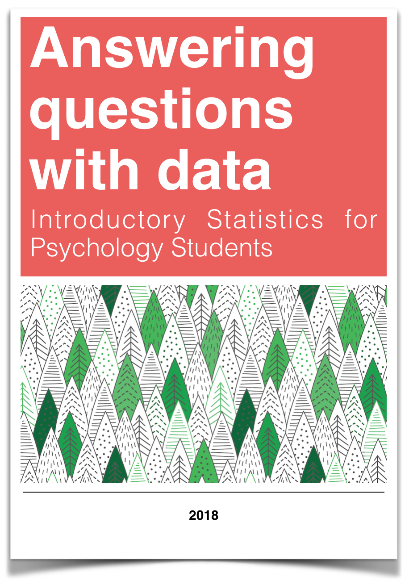

--- 
title: "Answering questions with data"
author: 
- "Lead Author: Matthew J. C. Crump"
- "Chapters 2 and 4 adapted from Navarro, D."
date: "2018 Last Compiled `r Sys.Date()`"
site: bookdown::bookdown_site
output: 
  bookdown::gitbook:
    includes:
      in_header: includeme.html
    css: tufte.css
    fontsettings:
      theme: white
      family: sans
      size: 1
documentclass: book
bibliography: [book.bib, packages.bib, MyLibrary.bib,refs.bib]
biblio-style: apalike
link-citations: yes
#github-repo: rstudio/bookdown-demo
description: "An introductory statistics textbook for psychology students"
---

```{r setup, include=FALSE}
knitr::opts_chunk$set(echo = FALSE,message=FALSE,warning=FALSE, cache=TRUE)
library(dplyr)
```

# Preface {-}

```{r,echo=F,fig.align="center",eval=T}

```

First Draft (version 0.9 = August 7th, 2018)
Last Compiled: `r Sys.Date()`

## Important notes

This is a free textbook teaching introductory statistics for undergraduates in Psychology. [There is a companion lab manual for this textbook here](https://crumplab.github.io/statisticsLab/). Both books are released under a creative commons licence [CC BY-SA 4.0](https://creativecommons.org/licenses/by-sa/4.0/). Click the link to read more about the license, or read more below in the license section.

This textbook is part of a larger OER course package for teaching undergraduate statistics in Psychology. Team members include, Matthew Crump, Alla Chavarga, Anjali Krishnan, Jeffrey Suzuki, and Stephen Volz. Jeffrey contributed the youtube videos peppered throughout the textbook. Alla Anjali, and Stephen wrote the lab manual exercises for SPSS, JAMOVI, and Excel. Matt Crump wrote the lab manual exercises for R. As this OER comes together, we will be providing a [course website](https://crumplab.github.io/psyc3400/), written in R Markdown, as well as slide decks for the lectures (these will be more fully available by the end of fall 2018). As a result, this textbook, the lab manual, the course website, and the slide decks will all be free, under a creative commons license. The source code for all material is contained in the github repositories for each, and they are a written in R-markdown, so they are relatively easy to copy and edit. Have Fun!

### Attributions

This textbook was primarily written by Matthew J. C. Crump. 

Two of the chapters were adapted from Danielle Navarro's wonderful (and bigger) free textbook, also licensed under the same creative commons license. The citation for that textbook is: Navarro, D. (2018). Learning statistics with R: A tutorial for psychology students and other beginners (version 0.6). The website is [https://compcogscisydney.org/learning-statistics-with-r/](https://compcogscisydney.org/learning-statistics-with-r/)

Chapter notes within the book are provided to indicate sections where material from Navarro was included. A short summary is here

**Chapter 1: Why statistics**, Adapated nearly verbatim with some editorial changes from Chapters 1 and 2, Navarro, D.

**Chapter 4: Probability, Sampling, and Estimation**, Adapted and expanded from Chapters 9 and 10, Navarro D.

### CC BY-SA 4.0 license

This license means that you are free to:

- Share: copy and redistribute the material in any medium or format
- Adapt: remix, transform, and build upon the material for any purpose, even commercially.

The licensor cannot revoke these freedoms as long as you follow the license terms.

Under the following terms:

- Attribution: You must give appropriate credit, provide a link to the license, and indicate if changes were made. You may do so in any reasonable manner, but not in any way that suggests the licensor endorses you or your use.
- ShareAlike: If you remix, transform, or build upon the material, you must distribute your contributions under the same license as the original.
- No additional restrictions: You may not apply legal terms or technological measures that legally restrict others from doing anything the license permits.

## Copying the textbook

This textbook was written in R-Studio, using R Markdown, and compiled into a web-book format using the bookdown package. In general, I thank the larger R community for all of the amazing tools they made, and for making those tools open, so that I could use them to make this thing.

All of the source code for compiling the book is available in the github repository for this book:

[https://github.com/CrumpLab/statistics](https://github.com/CrumpLab/statistics)

In principle, anybody could fork or otherwise download this repository. Load the Rproj file in R-studio, and then compile the entire book. Then, the individual .rmd files for each chapter could be edited for content and style to better suit your needs.

If you want to contribute to this version of the textbook, you could make pull requests on github, or discuss issues and request on the issues tab.


### Acknowledgments

Thanks to the librarians at Brooklyn College of CUNY, especially Miriam Deutch, and Emily Fairey, for their support throughout the process. Thanks to CUNY for supporting OER devlopment, and for the grant we received to develop this work. Thanks to Jenn Richler for letting me talk about Statistics all summer long.

### Why we did this

Why write another statistics textbook, aren't there already loads of those? Yes, there are. We had a couple reasons. First, we would like to make R more accesible for the undergraduate population, and we wrote this textbook around the capabilities of R. The textbook was written entirely in R-Studio, and most of the examples have associated R-code. R is not much of a focus in the textbook, but there is an introduction to using R to solve data-analysis problems in the lab manual. Many instructors still use SPSS, Excel, or newer free GUIs like JAMOVI, so we also made lab exercises for each of those as well.

This is a mildly opinionated, non-traditional introduction to statistics. It acknowledges some of the major ideas from traditional frequentist approaches, and some bayesian approaches. Much of the conceptual foundation is rooted in simulations that can be conducted in R. We us some formulas, but mostly explain things without formulas. The textbook was written with math-phobia in mind, and attempts to reduce the phobia associated with arithmetic computations. There are many things missing that should probably be added. We will do our best to add necessary things as we update the textbook.


### Hypothes.is

Hypothesis is a web-browser plug-in that lets you make comments on websites by highlighting text, and then making comments. Feel free to use hypothesis with this textbook. We will read your comments.

1. Use Hypothes.is, an amazing tool for annotating the web.
  
  a. Go to [Hypothes.is](https://web.hypothes.is/), and "get-started"
  
  b. Install the the add-on for chrome, or other browser
  
  c. That's it, turn on Hypothes.is when you are reading this textbook, and you will see all public annotations made by anyone else.
  
2. The source code for this textbook is available in my github repo [statsforpsych](https://github.com/CrumpLab/statsforpsych)
 
 a. Edit the .Rmd files, and push them back
  
  b. The edit link in the top bar of the textbook should automatically take you to the source .Rmd file

